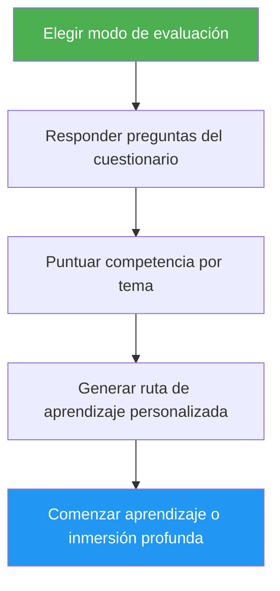

# Asesor de Autoevaluación y Ruta de Aprendizaje

> Evaluación completa de competencia en Claude Code que evalúa 10 áreas de funcionalidades, identifica brechas de habilidades y genera una ruta de aprendizaje personalizada para subir de nivel.

## Aspectos Destacados

- Dos modos de evaluación: Rápida (8 preguntas, 2 min) y Profunda (5 rondas, 5 min)
- Evalúa 10 áreas de funcionalidades: Comandos Slash, Memoria, Habilidades, Hooks, MCP, Subagentes, Checkpoints, Características Avanzadas, Plugins, CLI
- Puntuación por tema con niveles de maestría (Ninguna / Básica / Competente)
- Análisis de brechas con priorización consciente de dependencias
- Ruta de aprendizaje personalizada con ejercicios específicos y criterios de éxito
- Acciones de seguimiento: comenzar aprendizaje, inmersión profunda, proyecto de práctica, o volver a hacer

## Cuándo Usar

| Di esto... | La habilidad... |
|---|---|
| "evaluar mi nivel" | Ejecutará el cuestionario de evaluación y determinará tu nivel |
| "dónde debería empezar" | Evaluará tu experiencia y sugerirá un punto de partida |
| "verificar mis habilidades" | Producirá un perfil de habilidades detallado en las 10 áreas |
| "qué debería aprender después" | Identificará brechas y construirá una ruta de aprendizaje priorizada |

## Cómo Funciona



## Modos de Evaluación

### Evaluación Rápida (~2 min)
- 8 preguntas de sí/no sobre experiencia en 2 rondas
- Determina el nivel general: Principiante / Intermedio / Avanzado
- Lista brechas específicas con enlaces a tutoriales
- Mejor para: usuarios primerizos, verificaciones rápidas

### Evaluación Profunda (~5 min)
- 5 rondas de preguntas cubriendo 10 áreas de funcionalidades (2 temas por ronda)
- Puntuación por tema (0-2 puntos cada uno, 20 puntos total)
- Tabla de maestría con áreas de fortaleza, brechas prioritarias y elementos de revisión
- Ruta de aprendizaje consciente de dependencias con fases y estimaciones de tiempo
- Proyectos de práctica recomendados combinando temas de brecha
- Mejor para: usuarios experimentados que quieren subir de nivel, revisiones periódicas de habilidades

## Uso

```
/self-assessment
```

## Salida

### Tabla de Perfil de Habilidades
Muestra puntuación por tema, nivel de maestría y estado (Aprender / Revisar / Dominado).

### Ruta de Aprendizaje Personalizada
- Organizada en fases basado en orden de dependencias
- Cada tema incluye: enlace al tutorial, áreas de enfoque, ejercicio clave, criterio de éxito
- Estimación de tiempo ajustada para temas ya dominados
- Proyectos de práctica combinando múltiples áreas de brecha

### Acciones de Seguimiento
Después de los resultados, elegir:
- Comenzar el primer tutorial de brecha con ejercicios guiados
- Inmersión profunda en un área de brecha específica
- Configurar un proyecto de práctica cubriendo tus brechas
- Volver a hacer en un modo de evaluación diferente
