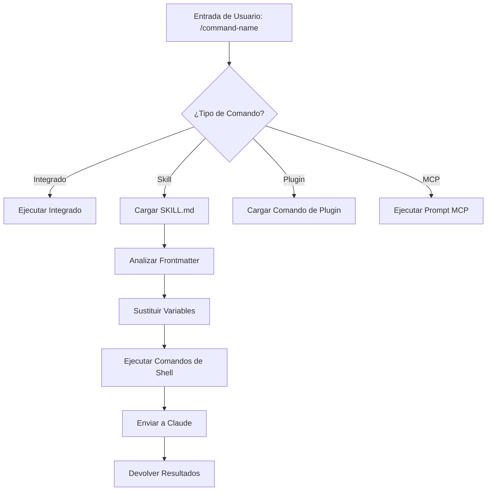
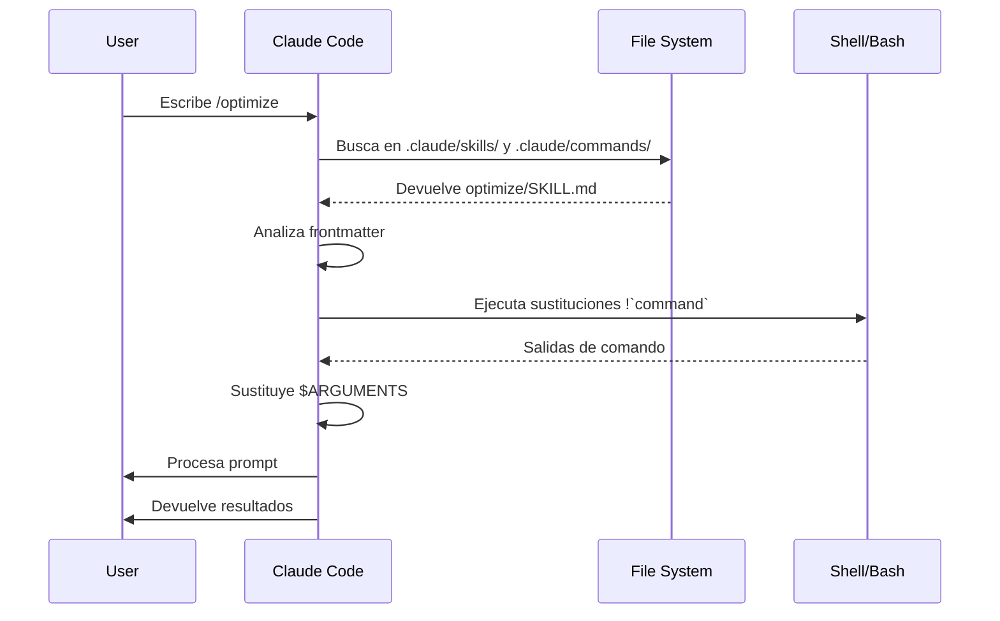

<picture>
  <source media="(prefers-color-scheme: dark)" srcset="../resources/logos/claude-howto-logo-dark.svg">
  
</picture>

# Slash Commands

## Visión General

Los Slash Commands son atajos que controlan el comportamiento de Claude durante una sesión interactiva. Vienen en varios tipos:

- **Comandos integrados**: Proporcionados por Claude Code (`/help`, `/clear`, `/model`)
- **Skills**: Comandos definidos por el usuario creados como archivos `SKILL.md` (`/optimize`, `/pr`)
- **Comandos de plugins**: Comandos de plugins instalados (`/frontend-design:frontend-design`)
- **Prompts MCP**: Comandos de servidores MCP (`/mcp__github__list_prs`)

> **Nota**: Los comandos slash personalizados se han fusionado en skills. Los archivos en `.claude/commands/` aún funcionan, pero los skills (`.claude/skills/`) son ahora el enfoque recomendado. Ambos crean atajos `/command-name`. Consulta la [Guía de Skills](../03-skills/) para la referencia completa.

## Referencia de Comandos Integrados

Los comandos integrados son atajos para acciones comunes. Hay **55+ comandos integrados** y **5 skills empaquetados** disponibles. Escribe `/` en Claude Code para ver la lista completa, o escribe `/` seguido de cualquier letra para filtrar.

| Comando | Propósito |
|---------|---------|
| `/add-dir <path>` | Agregar directorio de trabajo |
| `/agents` | Gestionar configuraciones de agentes |
| `/branch [name]` | Bifurcar conversación en una nueva sesión (alias: `/fork`). Nota: `/fork` renombrado a `/branch` en v2.1.77 |
| `/btw <question>` | Pregunta lateral sin agregar al historial |
| `/chrome` | Configurar integración del navegador Chrome |
| `/clear` | Limpiar conversación (alias: `/reset`, `/new`) |
| `/color [color\|default]` | Establecer color de la barra de prompt |
| `/compact [instructions]` | Compactar conversación con instrucciones de enfoque opcionales |
| `/config` | Abrir Configuración (alias: `/settings`) |
| `/context` | Visualizar uso de contexto como cuadrícula coloreada |
| `/copy [N]` | Copiar respuesta del asistente al portapapeles; `w` escribe a archivo |
| `/cost` | Mostrar estadísticas de uso de tokens |
| `/desktop` | Continuar en aplicación de Escritorio (alias: `/app`) |
| `/diff` | Visor interactivo de diff para cambios no confirmados |
| `/doctor` | Diagnosticar salud de la instalación |
| `/effort [low\|medium\|high\|max\|auto]` | Establecer nivel de esfuerzo. `max` requiere Opus 4.6 |
| `/exit` | Salir del REPL (alias: `/quit`) |
| `/export [filename]` | Exportar la conversación actual a un archivo o portapapeles |
| `/extra-usage` | Configurar uso extra para límites de tasa |
| `/fast [on\|off]` | Alternar modo rápido |
| `/feedback` | Enviar comentarios (alias: `/bug`) |
| `/help` | Mostrar ayuda |
| `/hooks` | Ver configuraciones de hooks |
| `/ide` | Gestionar integraciones de IDE |
| `/init` | Inicializar `CLAUDE.md`. Establece `CLAUDE_CODE_NEW_INIT=true` para flujo interactivo |
| `/insights` | Generar informe de análisis de sesión |
| `/install-github-app` | Configurar aplicación de GitHub Actions |
| `/install-slack-app` | Instalar aplicación de Slack |
| `/keybindings` | Abrir configuración de atajos de teclado |
| `/login` | Cambiar cuentas de Anthropic |
| `/logout` | Cerrar sesión de tu cuenta de Anthropic |
| `/mcp` | Gestionar servidores MCP y OAuth |
| `/memory` | Editar `CLAUDE.md`, alternar auto-memoria |
| `/mobile` | Código QR para aplicación móvil (alias: `/ios`, `/android`) |
| `/model [model]` | Seleccionar modelo con flechas izquierda/derecha para esfuerzo |
| `/passes` | Compartir semana gratis de Claude Code |
| `/permissions` | Ver/actualizar permisos (alias: `/allowed-tools`) |
| `/plan [description]` | Entrar en modo plan |
| `/plugin` | Gestionar plugins |
| `/pr-comments [PR]` | Obtener comentarios de PR de GitHub |
| `/privacy-settings` | Configuración de privacidad (solo Pro/Max) |
| `/release-notes` | Ver registro de cambios |
| `/reload-plugins` | Recargar plugins activos |
| `/remote-control` | Control remoto desde claude.ai (alias: `/rc`) |
| `/remote-env` | Configurar entorno remoto predeterminado |
| `/rename [name]` | Renombrar sesión |
| `/resume [session]` | Reanudar conversación (alias: `/continue`) |
| `/review` | **Obsoleto** — instala el plugin `code-review` en su lugar |
| `/rewind` | Rebobinar conversación y/o código (alias: `/checkpoint`) |
| `/sandbox` | Alternar modo sandbox |
| `/schedule [description]` | Crear/gestionar tareas programadas |
| `/security-review` | Analizar rama en busca de vulnerabilidades de seguridad |
| `/skills` | Listar skills disponibles |
| `/stats` | Visualizar uso diario, sesiones, rachas |
| `/status` | Mostrar versión, modelo, cuenta |
| `/statusline` | Configurar línea de estado |
| `/tasks` | Listar/gestionar tareas en segundo plano |
| `/terminal-setup` | Configurar atajos de teclado de terminal |
| `/theme` | Cambiar tema de color |
| `/vim` | Alternar modos Vim/Normal |
| `/voice` | Alternar dictación por voz push-to-talk |

### Skills Empaquetados

Estos skills vienen con Claude Code y se invocan como comandos slash:

| Skill | Propósito |
|-------|---------|
| `/batch <instruction>` | Orquestar cambios paralelos a gran escala usando worktrees |
| `/claude-api` | Cargar referencia de API de Claude para el lenguaje del proyecto |
| `/debug [description]` | Habilitar registro de depuración |
| `/loop [interval] <prompt>` | Ejecutar prompt repetidamente en intervalo |
| `/simplify [focus]` | Revisar archivos cambiados por calidad de código |

### Comandos Obsoletos

| Comando | Estado |
|---------|--------|
| `/review` | Obsoleto — reemplazado por el plugin `code-review` |
| `/output-style` | Obsoleto desde v2.1.73 |
| `/fork` | Renombrado a `/branch` (el alias aún funciona, v2.1.77) |

### Cambios Recientes

- `/fork` renombrado a `/branch` con `/fork` mantenido como alias (v2.1.77)
- `/output-style` obsoleto (v2.1.73)
- `/review` obsoleto en favor del plugin `code-review`
- Comando `/effort` agregado con nivel `max` requiriendo Opus 4.6
- Comando `/voice` agregado para dictación por voz push-to-talk
- Comando `/schedule` agregado para crear/gestionar tareas programadas
- Comando `/color` agregado para personalización de la barra de prompt
- El selector `/model` ahora muestra etiquetas legibles por humanos (ej. "Sonnet 4.6") en lugar de IDs de modelo crudos
- `/resume` soporta el alias `/continue`
- Prompts MCP disponibles como comandos `/mcp__<server>__<prompt>` (ver [Prompts MCP como Comandos](#prompts-mcp-como-comandos))

## Comandos Personalizados (Ahora Skills)

Los comandos slash personalizados se han **fusionado en skills**. Ambos enfoques crean comandos que puedes invocar con `/command-name`:

| Enfoque | Ubicación | Estado |
|----------|----------|--------|
| **Skills (Recomendado)** | `.claude/skills/<name>/SKILL.md` | Estándar actual |
| **Comandos Legacy** | `.claude/commands/<name>.md` | Aún funciona |

Si un skill y un comando comparten el mismo nombre, el **skill tiene precedencia**. Por ejemplo, cuando existen tanto `.claude/commands/review.md` como `.claude/skills/review/SKILL.md`, se usa la versión del skill.

### Ruta de Migración

Tus archivos existentes en `.claude/commands/` continúan funcionando sin cambios. Para migrar a skills:

**Antes (Comando):**
```
.claude/commands/optimize.md
```

**Después (Skill):**
```
.claude/skills/optimize/SKILL.md
```

### ¿Por qué Skills?

Los skills ofrecen características adicionales sobre los comandos legacy:

- **Estructura de directorios**: Agrupa scripts, plantillas y archivos de referencia
- **Auto-invocación**: Claude puede activar skills automáticamente cuando son relevantes
- **Control de invocación**: Elige si los usuarios, Claude, o ambos pueden invocar
- **Ejecución de subagente**: Ejecuta skills en contextos aislados con `context: fork`
- **Divulgación progresiva**: Carga archivos adicionales solo cuando se necesitan

### Crear un Comando Personalizado como Skill

Crea un directorio con un archivo `SKILL.md`:

```bash
mkdir -p .claude/skills/my-command
```

**Archivo:** `.claude/skills/my-command/SKILL.md`

```yaml
---
name: my-command
description: Lo que hace este comando y cuándo usarlo
---

# Mi Comando

Instrucciones para que Claude las siga cuando se invoque este comando.

1. Primer paso
2. Segundo paso
3. Tercer paso
```

### Referencia de Frontmatter

| Campo | Propósito | Predeterminado |
|-------|---------|---------|
| `name` | Nombre del comando (se convierte en `/name`) | Nombre del directorio |
| `description` | Breve descripción (ayuda a Claude saber cuándo usarlo) | Primer párrafo |
| `argument-hint` | Argumentos esperados para autocompletado | Ninguno |
| `allowed-tools` | Herramientas que el comando puede usar sin permiso | Hereda |
| `model` | Modelo específico a usar | Hereda |
| `disable-model-invocation` | Si `true`, solo el usuario puede invocar (no Claude) | `false` |
| `user-invocable` | Si `false`, ocultar del menú `/` | `true` |
| `context` | Establecer a `fork` para ejecutar en subagente aislado | Ninguno |
| `agent` | Tipo de agente al usar `context: fork` | `general-purpose` |
| `hooks` | Hooks con scope de skill (PreToolUse, PostToolUse, Stop) | Ninguno |

### Argumentos

Los comandos pueden recibir argumentos:

**Todos los argumentos con `$ARGUMENTS`:**

```yaml
---
name: fix-issue
description: Arreglar un issue de GitHub por número
---

Arreglar issue #$ARGUMENTS siguiendo nuestros estándares de código
```

Uso: `/fix-issue 123` → `$ARGUMENTS` se convierte en "123"

**Argumentos individuales con `$0`, `$1`, etc.:**

```yaml
---
name: review-pr
description: Revisar un PR con prioridad
---

Revisar PR #$0 con prioridad $1
```

Uso: `/review-pr 456 high` → `$0`="456", `$1`="high"

### Contexto Dinámico con Comandos de Shell

Ejecuta comandos bash antes del prompt usando `!`comando``:

```yaml
---
name: commit
description: Crear un commit de git con contexto
allowed-tools: Bash(git *)
---

## Contexto

- Estado actual de git: !`git status`
- Diff actual de git: !`git diff HEAD`
- Rama actual: !`git branch --show-current`
- Commits recientes: !`git log --oneline -5`

## Tu tarea

Basado en los cambios anteriores, crea un único commit de git.
```

### Referencias a Archivos

Incluye contenidos de archivos usando `@`:

```markdown
Revisa la implementación en @src/utils/helpers.js
Compara @src/old-version.js con @src/new-version.js
```

## Comandos de Plugins

Los plugins pueden proporcionar comandos personalizados:

```
/plugin-name:command-name
```

O simplemente `/command-name` cuando no hay conflictos de nombres.

**Ejemplos:**
```bash
/frontend-design:frontend-design
/commit-commands:commit
```

## Prompts MCP como Comandos

Los servidores MCP pueden exponer prompts como comandos slash:

```
/mcp__<server-name>__<prompt-name> [arguments]
```

**Ejemplos:**
```bash
/mcp__github__list_prs
/mcp__github__pr_review 456
/mcp__jira__create_issue "Bug title" high
```

### Sintaxis de Permisos MCP

Controla el acceso al servidor MCP en permisos:

- `mcp__github` - Acceso completo al servidor MCP de GitHub
- `mcp__github__*` - Acceso comodín a todas las herramientas
- `mcp__github__get_issue` - Acceso a herramienta específica

## Arquitectura de Comandos



## Ciclo de Vida de Comandos



## Comandos Disponibles en Esta Carpeta

Estos comandos de ejemplo pueden instalarse como skills o comandos legacy.

### 1. `/optimize` - Optimización de Código

Analiza código en busca de problemas de rendimiento, fugas de memoria y oportunidades de optimización.

**Uso:**
```
/optimize
[Pega tu código]
```

### 2. `/pr` - Preparación de Pull Request

Guía a través de una lista de verificación de preparación de PR incluyendo linting, testing y formato de commits.

**Uso:**
```
/pr
```

**Captura de pantalla:**


### 3. `/generate-api-docs` - Generador de Documentación de API

Genera documentación de API comprehensiva desde el código fuente.

**Uso:**
```
/generate-api-docs
```

### 4. `/commit` - Commit de Git con Contexto

Crea un commit de git con contexto dinámico de tu repositorio.

**Uso:**
```
/commit [mensaje opcional]
```

### 5. `/push-all` - Stage, Commit y Push

Prepara todos los cambios, crea un commit y hace push al remoto con verificaciones de seguridad.

**Uso:**
```
/push-all
```

**Verificaciones de Seguridad:**
- Secretos: `.env*`, `*.key`, `*.pem`, `credentials.json`
- Claves de API: Detecta claves reales vs. marcadores de posición
- Archivos grandes: `>10MB` sin Git LFS
- Artefactos de build: `node_modules/`, `dist/`, `__pycache__/`

### 6. `/doc-refactor` - Reestructuración de Documentación

Reestructura la documentación del proyecto para claridad y accesibilidad.

**Uso:**
```
/doc-refactor
```

### 7. `/setup-ci-cd` - Configuración de Pipeline CI/CD

Implementa hooks de pre-commit y GitHub Actions para aseguramiento de calidad.

**Uso:**
```
/setup-ci-cd
```

### 8. `/unit-test-expand` - Expansión de Cobertura de Tests

Incrementa la cobertura de tests apuntando a ramas no testeadas y casos borde.

**Uso:**
```
/unit-test-expand
```

## Instalación

### Como Skills (Recomendado)

Copia a tu directorio de skills:

```bash
# Crear directorio de skills
mkdir -p .claude/skills

# Para cada archivo de comando, crear un directorio de skill
for cmd in optimize pr commit; do
  mkdir -p .claude/skills/$cmd
  cp 01-slash-commands/$cmd.md .claude/skills/$cmd/SKILL.md
done
```

### Como Comandos Legacy

Copia a tu directorio de comandos:

```bash
# Para todo el proyecto (equipo)
mkdir -p .claude/commands
cp 01-slash-commands/*.md .claude/commands/

# Uso personal
mkdir -p ~/.claude/commands
cp 01-slash-commands/*.md ~/.claude/commands/
```

## Crear Tus Propios Comandos

### Plantilla de Skill (Recomendado)

Crea `.claude/skills/my-command/SKILL.md`:

```yaml
---
name: my-command
description: Lo que hace este comando. Usar cuando [condiciones de activación].
argument-hint: [args-opcionales]
allowed-tools: Bash(npm *), Read, Grep
---

# Título del Comando

## Contexto

- Rama actual: !`git branch --show-current`
- Archivos relacionados: @package.json

## Instrucciones

1. Primer paso
2. Segundo paso con argumento: $ARGUMENTS
3. Tercer paso

## Formato de Salida

- Cómo formatear la respuesta
- Qué incluir
```

### Comando Solo de Usuario (Sin Auto-Invocación)

Para comandos con efectos secundarios que Claude no debería activar automáticamente:

```yaml
---
name: deploy
description: Desplegar a producción
disable-model-invocation: true
allowed-tools: Bash(npm *), Bash(git *)
---

Desplegar la aplicación a producción:

1. Ejecutar tests
2. Construir aplicación
3. Push al objetivo de despliegue
4. Verificar despliegue
```

## Mejores Prácticas

| Hacer | No Hacer |
|------|---------|
| Usar nombres claros y orientados a la acción | Crear comandos para tareas de una sola vez |
| Incluir `description` con condiciones de activación | Construir lógica compleja en comandos |
| Mantener comandos enfocados en una sola tarea | Hardcodear información sensible |
| Usar `disable-model-invocation` para efectos secundarios | Omitir el campo de descripción |
| Usar prefijo `!` para contexto dinámico | Asumir que Claude conoce el estado actual |
| Organizar archivos relacionados en directorios de skills | Poner todo en un solo archivo |

## Solución de Problemas

### Comando No Encontrado

**Soluciones:**
- Verifica que el archivo esté en `.claude/skills/<name>/SKILL.md` o `.claude/commands/<name>.md`
- Verifica que el campo `name` en el frontmatter coincida con el nombre de comando esperado
- Reinicia la sesión de Claude Code
- Ejecuta `/help` para ver comandos disponibles

### Comando No Se Ejecuta Como Se Espera

**Soluciones:**
- Agrega instrucciones más específicas
- Incluye ejemplos en el archivo del skill
- Verifica `allowed-tools` si usas comandos bash
- Prueba con entradas simples primero

### Conflicto entre Skill y Comando

Si ambos existen con el mismo nombre, el **skill tiene precedencia**. Elimina uno o renómbralo.

## Guías Relacionadas

- **[Skills](../03-skills/)** - Referencia completa para skills (capacidades de auto-invocación)
- **[Memory](../02-memory/)** - Contexto persistente con CLAUDE.md
- **[Subagents](../04-subagents/)** - Agentes de IA delegados
- **[Plugins](../07-plugins/)** - Colecciones de comandos empaquetados
- **[Hooks](../06-hooks/)** - Automatización dirigida por eventos

## Recursos Adicionales

- [Documentación Oficial de Modo Interactivo](https://code.claude.com/docs/en/interactive-mode) - Referencia de comandos integrados
- [Documentación Oficial de Skills](https://code.claude.com/docs/en/skills) - Referencia completa de skills
- [Referencia de CLI](https://code.claude.com/docs/en/cli-reference) - Opciones de línea de comandos

---

*Parte de la serie de guías [Claude How To](../)*
