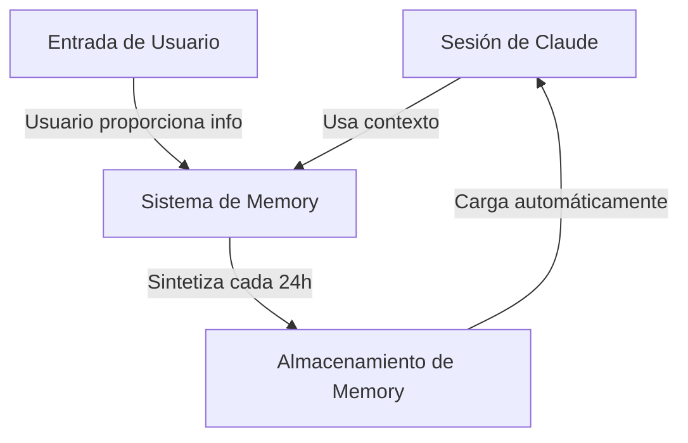
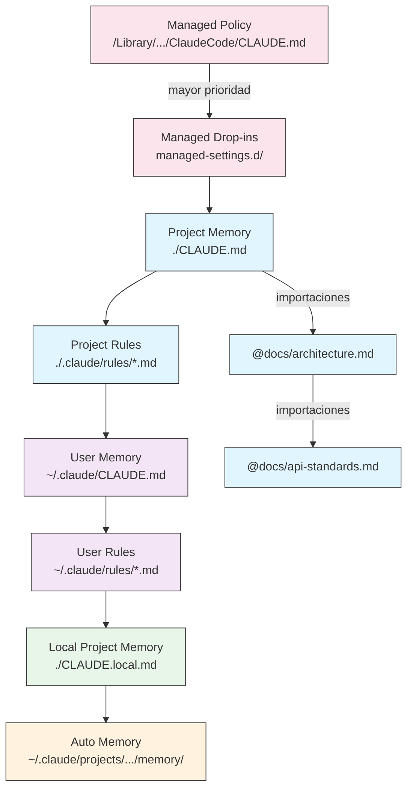
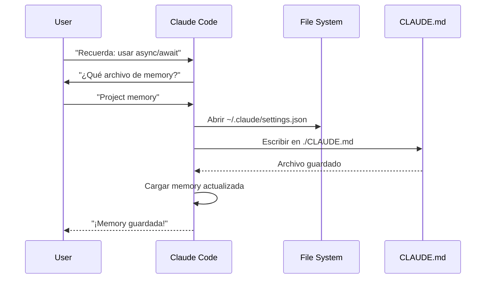
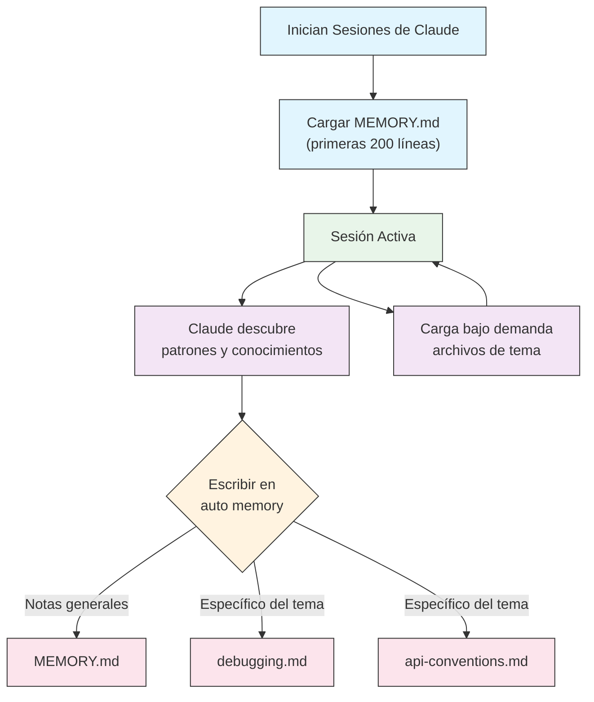
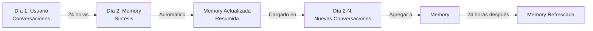

<picture>
  <source media="(prefers-color-scheme: dark)" srcset="../resources/logos/domina-claude-code-logo-dark.svg">
  
</picture>

# Guía de Memory

Memory permite que Claude retenga contexto entre sesiones y conversaciones. Existe en dos formas: síntesis automática en claude.ai, y CLAUDE.md basado en el sistema de archivos en Claude Code.

## Visión General

Memory en Claude Code proporciona contexto persistente que se mantiene a través de múltiples sesiones y conversaciones. A diferencia de las ventanas de contexto temporales, los archivos de memory te permiten:

- Compartir estándares de proyecto en tu equipo
- Almacenar preferencias personales de desarrollo
- Mantener reglas y configuraciones específicas de directorio
- Importar documentación externa
- Control de versiones de memory como parte de tu proyecto

El sistema de memory opera en múltiples niveles, desde preferencias personales globales hasta subdirectorios específicos, permitiendo un control detallado sobre lo que Claude recuerda y cómo aplica ese conocimiento.

## Referencia Rápida de Comandos de Memory

| Comando | Propósito | Uso | Cuándo Usar |
|---------|---------|-------|-------------|
| `/init` | Inicializar memory del proyecto | `/init` | Iniciando nuevo proyecto, configuración inicial de CLAUDE.md |
| `/memory` | Editar archivos de memory en editor | `/memory` | Actualizaciones extensas, reorganización, revisión de contenido |
| prefijo `#` | Adición rápida de memory de una línea | `# Tu regla aquí` | Agregando reglas rápidas durante la conversación |
| `# new rule into memory` | Adición explícita de memory | `# new rule into memory<br/>Tu regla detallada` | Agregando reglas complejas de múltiples líneas |
| `# remember this` | Memory de lenguaje natural | `# remember this<br/>Tu instrucción` | Actualizaciones conversacionales de memory |
| `@ruta/al/archivo` | Importar contenido externo | `@README.md` o `@docs/api.md` | Referenciando documentación existente en CLAUDE.md |

## Inicio Rápido: Inicializando Memory

### El Comando `/init`

El comando `/init` es la forma más rápida de configurar project memory en Claude Code. Inicializa un archivo CLAUDE.md con documentación fundamental del proyecto.

**Uso:**

```bash
/init
```

**Lo que hace:**

- Crea un nuevo archivo CLAUDE.md en tu proyecto (típicamente en `./CLAUDE.md` o `./.claude/CLAUDE.md`)
- Establece convenciones y directrices del proyecto
- Configura la base para la persistencia de contexto entre sesiones
- Proporciona una estructura de plantilla para documentar los estándares de tu proyecto

**Modo interactivo mejorado:** Establece `CLAUDE_CODE_NEW_INIT=true` para habilitar un flujo interactivo de múltiples fases que te guía paso a paso en la configuración del proyecto:

```bash
CLAUDE_CODE_NEW_INIT=true claude
/init
```

**Cuándo usar `/init`:**

- Iniciando un nuevo proyecto con Claude Code
- Estableciendo estándares y convenciones de codificación del equipo
- Creando documentación sobre la estructura de tu código
- Configurando la jerarquía de memory para desarrollo colaborativo

**Flujo de trabajo de ejemplo:**

```markdown
# En tu directorio de proyecto
/init

# Claude crea CLAUDE.md con una estructura como:
# Configuración del Proyecto
## Visión General del Proyecto
- Nombre: Tu Proyecto
- Tech Stack: [Tus tecnologías]
- Tamaño del Equipo: [Número de desarrolladores]

## Estándares de Desarrollo
- Preferencias de estilo de código
- Requisitos de testing
- Convenciones de flujo de Git
```

### Actualizaciones Rápidas de Memory con `#`

Puedes agregar información rápidamente a memory durante cualquier conversación comenzando tu mensaje con `#`:

**Sintaxis:**

```markdown
# Tu regla o instrucción de memory aquí
```

**Ejemplos:**

```markdown
# Siempre usar modo estricto de TypeScript en este proyecto

# Preferir async/await sobre cadenas de promesas

# Ejecutar npm test antes de cada commit

# Usar kebab-case para nombres de archivos
```

**Cómo funciona:**

1. Comienza tu mensaje con `#` seguido de tu regla
2. Claude reconoce esto como una solicitud de actualización de memory
3. Claude pregunta qué archivo de memory actualizar (proyecto o personal)
4. La regla se agrega al archivo CLAUDE.md apropiado
5. Las sesiones futuras cargan automáticamente este contexto

**Patrones alternativos:**

```markdown
# new rule into memory
Siempre validar entrada de usuario con esquemas Zod

# remember this
Usar versionamiento semántico para todos los lanzamientos

# add to memory
Las migraciones de base de datos deben ser reversibles
```

### El Comando `/memory`

El comando `/memory` proporciona acceso directo para editar tus archivos de memory CLAUDE.md dentro de las sesiones de Claude Code. Abre tus archivos de memory en tu editor del sistema para una edición integral.

**Uso:**

```bash
/memory
```

**Lo que hace:**

- Abre tus archivos de memory en el editor predeterminado de tu sistema
- Te permite realizar adiciones, modificaciones y reorganizaciones extensas
- Proporciona acceso directo a todos los archivos de memory en la jerarquía
- Te permite gestionar el contexto persistente entre sesiones

**Cuándo usar `/memory`:**

- Revisando contenido de memory existente
- Realizando actualizaciones extensas a estándares de proyecto
- Reorganizando la estructura de memory
- Agregando documentación o directrices detalladas
- Manteniendo y actualizando memory a medida que tu proyecto evoluciona

**Comparación: `/memory` vs `/init`**

| Aspecto | `/memory` | `/init` |
|--------|-----------|---------|
| **Propósito** | Editar archivos de memory existentes | Inicializar nuevo CLAUDE.md |
| **Cuándo usar** | Actualizar/modificar contexto del proyecto | Iniciar nuevos proyectos |
| **Acción** | Abre el editor para cambios | Genera plantilla inicial |
| **Flujo de trabajo** | Mantenimiento continuo | Configuración única |

**Flujo de trabajo de ejemplo:**

```markdown
# Abrir memory para editar
/memory

# Claude presenta opciones:
# 1. Managed Policy Memory
# 2. Project Memory (./CLAUDE.md)
# 3. User Memory (~/.claude/CLAUDE.md)
# 4. Local Project Memory

# Elegir opción 2 (Project Memory)
# Tu editor predeterminado se abre con el contenido de ./CLAUDE.md

# Realizar cambios, guardar y cerrar el editor
# Claude recarga automáticamente la memory actualizada
```

**Usando Importaciones de Memory:**

Los archivos CLAUDE.md soportan la sintaxis `@ruta/al/archivo` para incluir contenido externo:

```markdown
# Documentación del Proyecto
Ver @README.md para visión general del proyecto
Ver @package.json para comandos npm disponibles
Ver @docs/architecture.md para diseño del sistema

# Importar desde directorio home usando ruta absoluta
@~/.claude/my-project-instructions.md
```

**Características de importación:**

- Se admiten rutas relativas y absolutas (ej. `@docs/api.md` o `@~/.claude/my-project-instructions.md`)
- Las importaciones recursivas se admiten con una profundidad máxima de 5
- Las importaciones desde ubicaciones externas por primera vez activan un diálogo de aprobación por seguridad
- Las directivas de importación no se evalúan dentro de spans de código markdown o bloques de código (por lo que documentarlas en ejemplos es seguro)
- Ayuda a evitar duplicación referenciando documentación existente
- Incluye automáticamente el contenido referenciado en el contexto de Claude

## Arquitectura de Memory

Memory en Claude Code sigue un sistema jerárquico donde diferentes ámbitos sirven para diferentes propósitos:



## Jerarquía de Memory en Claude Code

Claude Code usa un sistema de memory jerárquico de múltiples niveles. Los archivos de memory se cargan automáticamente cuando Claude Code se inicia, con los archivos de nivel superior teniendo precedencia.

**Jerarquía Completa de Memory (en orden de precedencia):**

1. **Managed Policy** - Instrucciones a nivel de organización
   - macOS: `/Library/Application Support/ClaudeCode/CLAUDE.md`
   - Linux/WSL: `/etc/claude-code/CLAUDE.md`
   - Windows: `C:\Program Files\ClaudeCode\CLAUDE.md`

2. **Managed Drop-ins** - Archivos de política fusionados alfabéticamente (v2.1.83+)
   - Directorio `managed-settings.d/` junto al managed policy CLAUDE.md
   - Los archivos se fusionan en orden alfabético para gestión modular de políticas

3. **Project Memory** - Contexto compartido por el equipo (controlado por versión)
   - `./.claude/CLAUDE.md` o `./CLAUDE.md` (en la raíz del repositorio)

4. **Project Rules** - Instrucciones modulares de proyecto específicas por tema
   - `./.claude/rules/*.md`

5. **User Memory** - Preferencias personales (todos los proyectos)
   - `~/.claude/CLAUDE.md`

6. **User-Level Rules** - Reglas personales (todos los proyectos)
   - `~/.claude/rules/*.md`

7. **Local Project Memory** - Preferencias personales específicas del proyecto
   - `./CLAUDE.local.md`

> **Nota**: `CLAUDE.local.md` no se menciona en la [documentación oficial](https://code.claude.com/docs/en/memory) a partir de marzo de 2026. Puede seguir funcionando como una característica heredada. Para nuevos proyectos, considera usar `~/.claude/CLAUDE.md` (nivel de usuario) o `.claude/rules/` (nivel de proyecto, con ámbito de ruta) en su lugar.

8. **Auto Memory** - Notas y aprendizajes automáticos de Claude
   - `~/.claude/projects/<project>/memory/`

**Comportamiento de Descubrimiento de Memory:**

Claude busca archivos de memory en este orden, con las ubicaciones anteriores teniendo precedencia:



## Excluyendo Archivos CLAUDE.md con `claudeMdExcludes`

En monorepos grandes, algunos archivos CLAUDE.md pueden ser irrelevantes para tu trabajo actual. La configuración `claudeMdExcludes` te permite omitir archivos CLAUDE.md específicos para que no se carguen en el contexto:

```jsonc
// En ~/.claude/settings.json o .claude/settings.json
{
  "claudeMdExcludes": [
    "packages/legacy-app/CLAUDE.md",
    "vendors/**/CLAUDE.md"
  ]
}
```

Los patrones se comparan con rutas relativas a la raíz del proyecto. Esto es particularmente útil para:

- Monorepos con muchos subproyectos, donde solo algunos son relevantes
- Repositorios que contienen archivos CLAUDE.md de terceros o con código empaquetado
- Reducir el ruido en la ventana de contexto de Claude excluyendo instrucciones obsoletas o no relacionadas

## Jerarquía de Archivos de Configuración

Las configuraciones de Claude Code (incluyendo `autoMemoryDirectory`, `claudeMdExcludes`, y otras configuraciones) se resuelven desde una jerarquía de cinco niveles, con los niveles superiores teniendo precedencia:

| Nivel | Ubicación | Ámbito |
|-------|----------|-------|
| 1 (Más alto) | Managed policy (nivel de sistema) | Aplicación a toda la organización |
| 2 | `managed-settings.d/` (v2.1.83+) | Drop-ins modulares de políticas, fusionados alfabéticamente |
| 3 | `~/.claude/settings.json` | Preferencias de usuario |
| 4 | `.claude/settings.json` | Nivel de proyecto (confirmado en git) |
| 5 (Más bajo) | `.claude/settings.local.json` | Anulaciones locales (ignorado por git) |

**Configuración específica de plataforma (v2.1.51+):**

Las configuraciones también se pueden configurar mediante:
- **macOS**: Archivos property list (plist)
- **Windows**: Windows Registry

Estos mecanismos nativos de plataforma se leen junto con los archivos de configuración JSON y siguen las mismas reglas de precedencia.

## Sistema de Reglas Modulares

Crea reglas organizadas y específicas de ruta usando la estructura de directorios `.claude/rules/`. Las reglas se pueden definir tanto a nivel de proyecto como a nivel de usuario:

```
tu-proyecto/
├── .claude/
│   ├── CLAUDE.md
│   └── rules/
│       ├── code-style.md
│       ├── testing.md
│       ├── security.md
│       └── api/                  # Se admiten subdirectorios
│           ├── conventions.md
│           └── validation.md

~/.claude/
├── CLAUDE.md
└── rules/                        # Reglas a nivel de usuario (todos los proyectos)
    ├── personal-style.md
    └── preferred-patterns.md
```

Las reglas se descubren recursivamente dentro del directorio `rules/`, incluyendo cualquier subdirectorio. Las reglas a nivel de usuario en `~/.claude/rules/` se cargan antes que las reglas a nivel de proyecto, permitiendo valores predeterminados personales que los proyectos pueden anular.

### Reglas Específicas de Ruta con YAML Frontmatter

Define reglas que se aplican solo a rutas de archivo específicas:

```markdown
---
paths: src/api/**/*.ts
---

# Reglas de Desarrollo de API

- Todos los endpoints de API deben incluir validación de entrada
- Usar Zod para validación de esquemas
- Documentar todos los parámetros y tipos de respuesta
- Incluir manejo de errores para todas las operaciones
```

**Ejemplos de Patrones Glob:**

- `**/*.ts` - Todos los archivos TypeScript
- `src/**/*` - Todos los archivos bajo src/
- `src/**/*.{ts,tsx}` - Múltiples extensiones
- `{src,lib}/**/*.ts, tests/**/*.test.ts` - Múltiples patrones

### Subdirectorios y Symlinks

Las reglas en `.claude/rules/` admiten dos características de organización:

- **Subdirectorios**: Las reglas se descubren recursivamente, por lo que puedes organizarlas en carpetas basadas en temas (ej. `rules/api/`, `rules/testing/`, `rules/security/`)
- **Symlinks**: Se admiten symlinks para compartir reglas entre múltiples proyectos. Por ejemplo, puedes vincular un archivo de regla compartido desde una ubicación central en el directorio `.claude/rules/` de cada proyecto

## Tabla de Ubicaciones de Memory

| Ubicación | Ámbito | Prioridad | Compartido | Acceso | Mejor Para |
|----------|-------|----------|--------|--------|----------|
| `/Library/Application Support/ClaudeCode/CLAUDE.md` (macOS) | Managed Policy | 1 (Más alto) | Organización | Sistema | Políticas de toda la empresa |
| `/etc/claude-code/CLAUDE.md` (Linux/WSL) | Managed Policy | 1 (Más alto) | Organización | Sistema | Estándares de organización |
| `C:\Program Files\ClaudeCode\CLAUDE.md` (Windows) | Managed Policy | 1 (Más alto) | Organización | Sistema | Directrices corporativas |
| `managed-settings.d/*.md` (junto a la política) | Managed Drop-ins | 1.5 | Organización | Sistema | Archivos de política modulares (v2.1.83+) |
| `./CLAUDE.md` o `./.claude/CLAUDE.md` | Project Memory | 2 | Equipo | Git | Estándares de equipo, arquitectura compartida |
| `./.claude/rules/*.md` | Project Rules | 3 | Equipo | Git | Reglas modulares, específicas de ruta |
| `~/.claude/CLAUDE.md` | User Memory | 4 | Individual | Sistema de archivos | Preferencias personales (todos los proyectos) |
| `~/.claude/rules/*.md` | User Rules | 5 | Individual | Sistema de archivos | Reglas personales (todos los proyectos) |
| `./CLAUDE.local.md` | Project Local | 6 | Individual | Git (ignorado) | Preferencias personales específicas del proyecto |
| `~/.claude/projects/<project>/memory/` | Auto Memory | 7 (Más bajo) | Individual | Sistema de archivos | Notas y aprendizajes automáticos de Claude |

## Ciclo de Vida de Actualización de Memory

Así es como fluyen las actualizaciones de memory a través de tus sesiones de Claude Code:



## Auto Memory

Auto memory es un directorio persistente donde Claude registra automáticamente aprendizajes, patrones y conocimientos mientras trabaja con tu proyecto. A diferencia de los archivos CLAUDE.md que escribes y mantienes manualmente, auto memory es escrito por el propio Claude durante las sesiones.

### Cómo Funciona Auto Memory

- **Ubicación**: `~/.claude/projects/<project>/memory/`
- **Punto de entrada**: `MEMORY.md` sirve como archivo principal en el directorio de auto memory
- **Archivos de tema**: Archivos adicionales opcionales para temas específicos (ej. `debugging.md`, `api-conventions.md`)
- **Comportamiento de carga**: Las primeras 200 líneas de `MEMORY.md` se cargan en el system prompt al inicio de la sesión. Los archivos de tema se cargan bajo demanda, no al inicio.
- **Lectura/escritura**: Claude lee y escribe archivos de memory durante las sesiones a medida que descubre patrones y conocimiento específico del proyecto

### Arquitectura de Auto Memory



### Estructura del Directorio de Auto Memory

```
~/.claude/projects/<project>/memory/
├── MEMORY.md              # Punto de entrada (primeras 200 líneas cargadas al inicio)
├── debugging.md           # Archivo de tema (cargado bajo demanda)
├── api-conventions.md     # Archivo de tema (cargado bajo demanda)
└── testing-patterns.md    # Archivo de tema (cargado bajo demanda)
```

### Requisito de Versión

Auto memory requiere **Claude Code v2.1.59 o posterior**. Si estás en una versión anterior, actualiza primero:

```bash
npm install -g @anthropic-ai/claude-code@latest
```

### Directorio de Auto Memory Personalizado

Por defecto, auto memory se almacena en `~/.claude/projects/<project>/memory/`. Puedes cambiar esta ubicación usando la configuración `autoMemoryDirectory` (disponible desde **v2.1.74**):

```jsonc
// En ~/.claude/settings.json o .claude/settings.local.json (solo configuraciones de usuario/local)
{
  "autoMemoryDirectory": "/ruta/al/directorio/personalizado/de/memory"
}
```

> **Nota**: `autoMemoryDirectory` solo se puede establecer en configuraciones a nivel de usuario (`~/.claude/settings.json`) o configuraciones locales (`.claude/settings.local.json`), no en configuraciones de proyecto o managed policy.

Esto es útil cuando quieres:

- Almacenar auto memory en una ubicación compartida o sincronizada
- Separar auto memory del directorio de configuración predeterminado de Claude
- Usar una ruta específica del proyecto fuera de la jerarquía predeterminada

### Uso Compartido de Worktree y Repositorio

Todos los worktrees y subdirectorios dentro del mismo repositorio git comparten un único directorio de auto memory. Esto significa que cambiar entre worktrees o trabajar en diferentes subdirectorios del mismo repo leerá y escribirá en los mismos archivos de memory.

### Subagent Memory

Los subagentes (creados mediante herramientas como Task o ejecución paralela) pueden tener su propio contexto de memory. Usa el campo `memory` frontmatter en la definición del subagente para especificar qué ámbitos de memory cargar:

```yaml
memory: user      # Cargar solo memory a nivel de usuario
memory: project   # Cargar solo memory a nivel de proyecto
memory: local     # Cargar solo memory local
```

Esto permite que los subagentes operen con un contexto enfocado en lugar de heredar la jerarquía completa de memory.

### Controlando Auto Memory

Auto memory se puede controlar mediante la variable de entorno `CLAUDE_CODE_DISABLE_AUTO_MEMORY`:

| Valor | Comportamiento |
|-------|----------|
| `0` | Forzar auto memory **encendido** |
| `1` | Forzar auto memory **apagado** |
| *(no establecido)* | Comportamiento predeterminado (auto memory habilitado) |

```bash
# Deshabilitar auto memory para una sesión
CLAUDE_CODE_DISABLE_AUTO_MEMORY=1 claude

# Forzar auto memory encendido explícitamente
CLAUDE_CODE_DISABLE_AUTO_MEMORY=0 claude
```

## Directorios Adicionales con `--add-dir`

La bandera `--add-dir` permite que Claude Code cargue archivos CLAUDE.md desde directorios adicionales más allá del directorio de trabajo actual. Esto es útil para monorepos o configuraciones de múltiples proyectos donde el contexto de otros directorios es relevante.

Para habilitar esta función, establece la variable de entorno:

```bash
CLAUDE_CODE_ADDITIONAL_DIRECTORIES_CLAUDE_MD=1
```

Luego inicia Claude Code con la bandera:

```bash
claude --add-dir /ruta/a/otro/proyecto
```

Claude cargará CLAUDE.md desde el directorio adicional especificado junto con los archivos de memory de tu directorio de trabajo actual.

## Ejemplos Prácticos

### Ejemplo 1: Estructura de Project Memory

**Archivo:** `./CLAUDE.md`

```markdown
# Project Configuration

## Project Overview
- **Name**: E-commerce Platform
- **Tech Stack**: Node.js, PostgreSQL, React 18, Docker
- **Team Size**: 5 developers
- **Deadline**: Q4 2025

## Architecture
@docs/architecture.md
@docs/api-standards.md
@docs/database-schema.md

## Development Standards

### Code Style
- Use Prettier for formatting
- Use ESLint with airbnb config
- Maximum line length: 100 characters
- Use 2-space indentation

### Naming Conventions
- **Files**: kebab-case (user-controller.js)
- **Classes**: PascalCase (UserService)
- **Functions/Variables**: camelCase (getUserById)
- **Constants**: UPPER_SNAKE_CASE (API_BASE_URL)
- **Database Tables**: snake_case (user_accounts)

### Git Workflow
- Branch names: `feature/description` or `fix/description`
- Commit messages: Follow conventional commits
- PR required before merge
- All CI/CD checks must pass
- Minimum 1 approval required

### Testing Requirements
- Minimum 80% code coverage
- All critical paths must have tests
- Use Jest for unit tests
- Use Cypress for E2E tests
- Test filenames: `*.test.ts` or `*.spec.ts`

### API Standards
- RESTful endpoints only
- JSON request/response
- Use HTTP status codes correctly
- Version API endpoints: `/api/v1/`
- Document all endpoints with examples

### Database
- Use migrations for schema changes
- Never hardcode credentials
- Use connection pooling
- Enable query logging in development
- Regular backups required

### Deployment
- Docker-based deployment
- Kubernetes orchestration
- Blue-green deployment strategy
- Automatic rollback on failure
- Database migrations run before deploy

## Common Commands

| Command | Purpose |
|---------|---------|
| `npm run dev` | Start development server |
| `npm test` | Run test suite |
| `npm run lint` | Check code style |
| `npm run build` | Build for production |
| `npm run migrate` | Run database migrations |

## Team Contacts
- Tech Lead: Sarah Chen (@sarah.chen)
- Product Manager: Mike Johnson (@mike.j)
- DevOps: Alex Kim (@alex.k)

## Known Issues & Workarounds
- PostgreSQL connection pooling limited to 20 during peak hours
- Workaround: Implement query queuing
- Safari 14 compatibility issues with async generators
- Workaround: Use Babel transpiler

## Related Projects
- Analytics Dashboard: `/projects/analytics`
- Mobile App: `/projects/mobile`
- Admin Panel: `/projects/admin`
```

### Ejemplo 2: Memory Específica de Directorio

**Archivo:** `./src/api/CLAUDE.md`

```markdown
# API Module Standards

This file overrides root CLAUDE.md for everything in /src/api/

## API-Specific Standards

### Request Validation
- Use Zod for schema validation
- Always validate input
- Return 400 with validation errors
- Include field-level error details

### Authentication
- All endpoints require JWT token
- Token in Authorization header
- Token expires after 24 hours
- Implement refresh token mechanism

### Response Format

All responses must follow this structure:

```json
{
  "success": true,
  "data": { /* actual data */ },
  "timestamp": "2025-11-06T10:30:00Z",
  "version": "1.0"
}
```

Error responses:
```json
{
  "success": false,
  "error": {
    "code": "VALIDATION_ERROR",
    "message": "User message",
    "details": { /* field errors */ }
  },
  "timestamp": "2025-11-06T10:30:00Z"
}
```

### Pagination
- Use cursor-based pagination (not offset)
- Include `hasMore` boolean
- Limit max page size to 100
- Default page size: 20

### Rate Limiting
- 1000 requests per hour for authenticated users
- 100 requests per hour for public endpoints
- Return 429 when exceeded
- Include retry-after header

### Caching
- Use Redis for session caching
- Cache duration: 5 minutes default
- Invalidate on write operations
- Tag cache keys with resource type
```

### Ejemplo 3: Personal Memory

**Archivo:** `~/.claude/CLAUDE.md`

```markdown
# My Development Preferences

## About Me
- **Experience Level**: 8 years full-stack development
- **Preferred Languages**: TypeScript, Python
- **Communication Style**: Direct, with examples
- **Learning Style**: Visual diagrams with code

## Code Preferences

### Error Handling
I prefer explicit error handling with try-catch blocks and meaningful error messages.
Avoid generic errors. Always log errors for debugging.

### Comments
Use comments for WHY, not WHAT. Code should be self-documenting.
Comments should explain business logic or non-obvious decisions.

### Testing
I prefer TDD (test-driven development).
Write tests first, then implementation.
Focus on behavior, not implementation details.

### Architecture
I prefer modular, loosely-coupled design.
Use dependency injection for testability.
Separate concerns (Controllers, Services, Repositories).

## Debugging Preferences
- Use console.log with prefix: `[DEBUG]`
- Include context: function name, relevant variables
- Use stack traces when available
- Always include timestamps in logs

## Communication
- Explain complex concepts with diagrams
- Show concrete examples before explaining theory
- Include before/after code snippets
- Summarize key points at the end

## Project Organization
I organize my projects as:
```
project/
  ├── src/
  │   ├── api/
  │   ├── services/
  │   ├── models/
  │   └── utils/
  ├── tests/
  ├── docs/
  └── docker/
```

## Tooling
- **IDE**: VS Code with vim keybindings
- **Terminal**: Zsh with Oh-My-Zsh
- **Format**: Prettier (100 char line length)
- **Linter**: ESLint with airbnb config
- **Test Framework**: Jest with React Testing Library
```

_My Test_
Ask Claude to save a new rule


Claude has not save the rule because I did not have any `Claude.md` file anywhere. Then asked Claude to confirm the location.


### Ejemplo 4: Actualización de Memory Durante la Sesión

Puedes agregar nuevas reglas a memory durante una sesión activa de Claude Code. Hay dos formas de hacer esto:

#### Método 1: Solicitud Directa

```markdown
Usuario: Recuerda que prefiero usar React hooks en lugar de componentes de clase
     para todos los nuevos componentes.

Claude: Estoy agregando eso a tu memory. ¿En qué archivo de memory debería ir?
        1. Project memory (./CLAUDE.md)
        2. Personal memory (~/.claude/CLAUDE.md)

Usuario: Project memory

Claude: ✅ ¡Memory guardada!

Agregado a ./CLAUDE.md:
---

### Desarrollo de Componentes
- Usar componentes funcionales con React Hooks
- Preferir hooks sobre componentes de clase
- Custom hooks para lógica reutilizable
- Usar useCallback para manejadores de eventos
- Usar useMemo para computaciones costosas
```

#### Método 2: Usando el Patrón "# new rule into memory"

También puedes usar el patrón explícito "# new rule into memory" para activar actualizaciones de memory:

```markdown
Usuario: # new rule into memory
      Siempre validar la entrada del usuario con esquemas Zod antes de procesar.

Claude: Estoy guardando esta regla en memory. ¿Qué archivo de memory debo usar?
        1. Project memory (./CLAUDE.md)
        2. Personal memory (~/.claude/CLAUDE.md)

Usuario: Project memory

Claude: ✅ ¡Memory guardada!

Agregado a ./CLAUDE.md:
---

### Validación de Entrada
- Siempre validar la entrada del usuario con esquemas Zod antes de procesar
- Definir esquemas en la parte superior de cada archivo de API handler
- Devolver estado 400 con errores de validación
```

#### Consejos para Agregar Memory

- Sé específico y accionable en tus reglas
- Agrupa reglas relacionadas juntas bajo un encabezado de sección
- Actualiza secciones existentes en lugar de duplicar contenido
- Elige el ámbito de memory apropiado (proyecto vs. personal)

## Comparación de Funciones de Memory

| Función | Claude Web/Desktop | Claude Code (CLAUDE.md) |
|---------|-------------------|------------------------|
| Auto-síntesis | ✅ Cada 24h | ❌ Manual |
| Entre proyectos | ✅ Compartido | ❌ Específico del proyecto |
| Acceso de equipo | ✅ Proyectos compartidos | ✅ Rastreable por git |
| Buscable | ✅ Integrado | ✅ A través de `/memory` |
| Editable | ✅ En chat | ✅ Edición directa de archivo |
| Importar/Exportar | ✅ Sí | ✅ Copiar/pegar |
| Persistente | ✅ 24h+ | ✅ Indefinido |

### Memory en Claude Web/Desktop

#### Línea de Tiempo de Síntesis de Memory



**Ejemplo de Resumen de Memory:**

```markdown
## Memory de Claude sobre el Usuario

### Antecedentes Profesionales
- Desarrollador full-stack senior con 8 años de experiencia
- Enfoque en backends TypeScript/Node.js y frontends React
- Contribuyente activo de código abierto
- Interesado en IA y aprendizaje automático

### Contexto del Proyecto
- Actualmente construyendo plataforma de comercio electrónico
- Tech stack: Node.js, PostgreSQL, React 18, Docker
- Trabajando con equipo de 5 desarrolladores
- Usando CI/CD y despliegues blue-green

### Preferencias de Comunicación
- Prefiere explicaciones directas y concisas
- Le gustan los diagramas visuales y ejemplos
- Aprecia los fragmentos de código
- Explica la lógica de negocio en comentarios

### Objetivos Actuales
- Mejorar el rendimiento de la API
- Aumentar la cobertura de pruebas al 90%
- Implementar estrategia de caché
- Documentar arquitectura
```

## Mejores Prácticas

### Lo Que Se Debe Hacer - Qué Incluir

- **Sé específico y detallado**: Usa instrucciones claras y detalladas en lugar de orientación vaga
  - ✅ Bueno: "Usar indentación de 2 espacios para todos los archivos JavaScript"
  - ❌ Evitar: "Seguir las mejores prácticas"

- **Mantente organizado**: Estructura los archivos de memory con secciones y encabezados markdown claros

- **Usa niveles de jerarquía apropiados**:
  - **Managed policy**: Políticas de empresa, estándares de seguridad, requisitos de cumplimiento
  - **Project memory**: Estándares de equipo, arquitectura, convenciones de codificación (confirmar en git)
  - **User memory**: Preferencias personales, estilo de comunicación, elecciones de herramientas
  - **Directory memory**: Reglas específicas de módulo y anulaciones

- **Aprovecha las importaciones**: Usa la sintaxis `@ruta/al/archivo` para referenciar documentación existente
  - Admite hasta 5 niveles de anidamiento recursivo
  - Evita la duplicación entre archivos de memory
  - Ejemplo: `Ver @README.md para visión general del proyecto`

- **Documenta comandos frecuentes**: Incluye comandos que usas repetidamente para ahorrar tiempo

- **Control de versiones de project memory**: Confirma archivos CLAUDE.md a nivel de proyecto en git para beneficio del equipo

- **Revisa periódicamente**: Actualiza memory regularmente a medida que los proyectos evolucionan y los requisitos cambian

- **Proporciona ejemplos concretos**: Incluye fragmentos de código y escenarios específicos

### Lo Que No Se Debe Hacer - Qué Evitar

- **No almacenes secretos**: Nunca incluyas claves de API, contraseñas, tokens o credenciales

- **No incluyas datos sensibles**: No PII, información privada o secretos propietarios

- **No dupliques contenido**: Usa importaciones (`@ruta`) para referenciar documentación existente en su lugar

- **No seas vago**: Evita declaraciones genéricas como "seguir las mejores prácticas" o "escribir buen código"

- **No lo hagas demasiado largo**: Mantén los archivos de memory individuales enfocados y bajo 500 líneas

- **No sobre-organices**: Usa la jerarquía estratégicamente; no creas anulaciones excesivas de subdirectorios

- **No olvides actualizar**: La memory obsoleta puede causar confusión y prácticas desactualizadas

- **No excedas los límites de anidamiento**: Las importaciones de memory admiten hasta 5 niveles de anidamiento

### Consejos de Gestión de Memory

**Elige el nivel de memory correcto:**

| Caso de Uso | Nivel de Memory | Justificación |
|----------|-------------|-----------|
| Política de seguridad de la empresa | Managed Policy | Se aplica a todos los proyectos de toda la organización |
| Guía de estilo de código del equipo | Project | Compartido con el equipo vía git |
| Tus atajos de editor preferidos | User | Preferencia personal, no compartida |
| Estándares de módulo de API | Directory | Específico de ese módulo solamente |

**Flujo de trabajo de actualización rápida:**

1. Para reglas individuales: Usa el prefijo `#` en la conversación
2. Para múltiples cambios: Usa `/memory` para abrir el editor
3. Para configuración inicial: Usa `/init` para crear una plantilla

**Mejores prácticas de importación:**

```markdown
# Bueno: Referenciar documentación existente
@README.md
@docs/architecture.md
@package.json

# Evitar: Copiar contenido que existe en otra parte
# En lugar de copiar el contenido de README en CLAUDE.md, solo impórtalo
```

## Instrucciones de Instalación

### Configurar Project Memory

#### Método 1: Usando el Comando `/init` (Recomendado)

La forma más rápida de configurar project memory:

1. **Navega a tu directorio de proyecto:**
   ```bash
   cd /ruta/a/tu/proyecto
   ```

2. **Ejecuta el comando init en Claude Code:**
   ```bash
   /init
   ```

3. **Claude creará y poblará CLAUDE.md** con una estructura de plantilla

4. **Personaliza el archivo generado** para que coincida con las necesidades de tu proyecto

5. **Confirma en git:**
   ```bash
   git add CLAUDE.md
   git commit -m "Inicializar project memory con /init"
   ```

#### Método 2: Creación Manual

Si prefieres configuración manual:

1. **Crea un CLAUDE.md en la raíz de tu proyecto:**
   ```bash
   cd /ruta/a/tu/proyecto
   touch CLAUDE.md
   ```

2. **Agrega estándares de proyecto:**
   ```bash
   cat > CLAUDE.md << 'EOF'
   # Project Configuration

   ## Project Overview
   - **Name**: Your Project Name
   - **Tech Stack**: List your technologies
   - **Team Size**: Number of developers

   ## Development Standards
   - Your coding standards
   - Naming conventions
   - Testing requirements
   EOF
   ```

3. **Confirma en git:**
   ```bash
   git add CLAUDE.md
   git commit -m "Agregar configuración de project memory"
   ```

#### Método 3: Actualizaciones Rápidas con `#`

Una vez que CLAUDE.md existe, agrega reglas rápidamente durante las conversaciones:

```markdown
# Usar versionamiento semántico para todos los lanzamientos

# Siempre ejecutar pruebas antes de confirmar

# Preferir composición sobre herencia
```

Claude te pedirá que elijas qué archivo de memory actualizar.

### Configurar Personal Memory

1. **Crea el directorio ~/.claude:**
   ```bash
   mkdir -p ~/.claude
   ```

2. **Crea CLAUDE.md personal:**
   ```bash
   touch ~/.claude/CLAUDE.md
   ```

3. **Agrega tus preferencias:**
   ```bash
   cat > ~/.claude/CLAUDE.md << 'EOF'
   # My Development Preferences

   ## About Me
   - Experience Level: [Your level]
   - Preferred Languages: [Your languages]
   - Communication Style: [Your style]

   ## Code Preferences
   - [Your preferences]
   EOF
   ```

### Configurar Directory-Specific Memory

1. **Crea memory para directorios específicos:**
   ```bash
   mkdir -p /ruta/al/directorio/.claude
   touch /ruta/al/directorio/CLAUDE.md
   ```

2. **Agrega reglas específicas del directorio:**
   ```bash
   cat > /ruta/al/directorio/CLAUDE.md << 'EOF'
   # [Nombre del Directorio] Standards

   This file overrides root CLAUDE.md for this directory.

   ## [Specific Standards]
   EOF
   ```

3. **Confirma en el control de versiones:**
   ```bash
   git add /ruta/al/directorio/CLAUDE.md
   git commit -m "Agregar configuración de memory del [directorio]"
   ```

### Verificar Configuración

1. **Verifica las ubicaciones de memory:**
   ```bash
   # Project root memory
   ls -la ./CLAUDE.md

   # Personal memory
   ls -la ~/.claude/CLAUDE.md
   ```

2. **Claude Code cargará automáticamente** estos archivos al iniciar una sesión

3. **Prueba con Claude Code** iniciando una nueva sesión en tu proyecto

## Documentación Oficial

Para obtener la información más actualizada, consulta la documentación oficial de Claude Code:

- **[Documentación de Memory](https://code.claude.com/docs/en/memory)** - Referencia completa del sistema de memory
- **[Referencia de Slash Commands](https://code.claude.com/docs/en/interactive-mode)** - Todos los comandos integrados incluyendo `/init` y `/memory`
- **[Referencia de CLI](https://code.claude.com/docs/en/cli-reference)** - Documentación de la interfaz de línea de comandos

### Detalles Técnicos Clave de la Documentación Oficial

**Carga de Memory:**

- Todos los archivos de memory se cargan automáticamente cuando Claude Code se inicia
- Claude recorre hacia arriba desde el directorio de trabajo actual para descubrir archivos CLAUDE.md
- Los archivos de subárbol se descubren y cargan contextualmente al acceder a esos directorios

**Sintaxis de Importación:**

- Usa `@ruta/al/archivo` para incluir contenido externo (ej. `@~/.claude/my-project-instructions.md`)
- Admite rutas relativas y absolutas
- Importaciones recursivas admitidas con una profundidad máxima de 5
- Las importaciones externas por primera vez activan un diálogo de aprobación
- No se evalúa dentro de spans de código markdown o bloques de código
- Incluye automáticamente el contenido referenciado en el contexto de Claude

**Precedencia de Jerarquía de Memory:**

1. Managed Policy (mayor precedencia)
2. Managed Drop-ins (`managed-settings.d/`, v2.1.83+)
3. Project Memory
4. Project Rules (`.claude/rules/`)
5. User Memory
6. User-Level Rules (`~/.claude/rules/`)
7. Local Project Memory
8. Auto Memory (menor precedencia)

## Enlaces de Conceptos Relacionados

### Puntos de Integración
- [Protocolo MCP](../05-mcp/) - Acceso a datos en vivo junto con memory
- [Slash Commands](../01-slash-commands/) - Atajos específicos de sesión
- [Skills](../03-skills/) - Flujos de trabajo automatizados con contexto de memory

### Funciones Relacionadas de Claude
- [Claude Web Memory](https://claude.ai) - Síntesis automática
- [Documentación Oficial de Memory](https://code.claude.com/docs/en/memory) - Documentación de Anthropic
