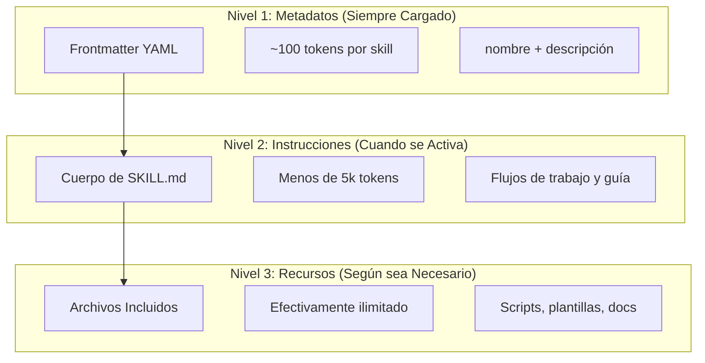
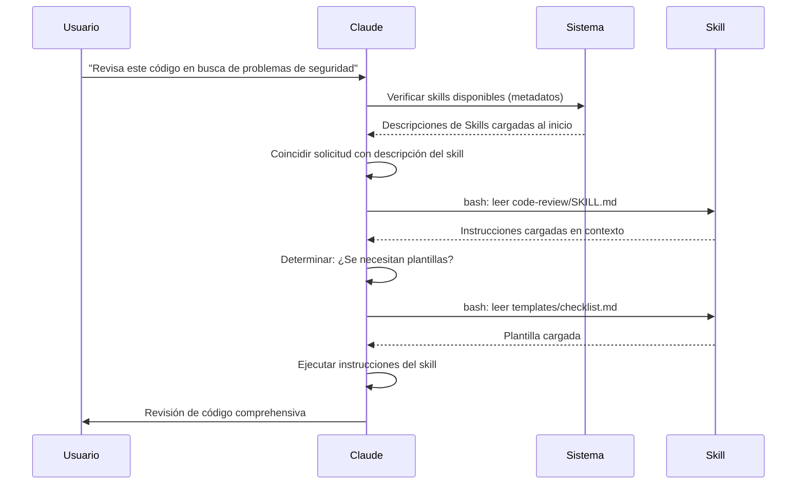

<picture>
  <source media="(prefers-color-scheme: dark)" srcset="../resources/logos/claude-howto-logo-dark.svg">
  
</picture>

# Guía de Agent Skills

Agent Skills son capacidades reutilizables basadas en el sistema de archivos que extienden la funcionalidad de Claude. Empaquetan experiencia específica de dominio, flujos de trabajo y mejores prácticas en componentes descubribles que Claude usa automáticamente cuando son relevantes.

## Visión General

**Agent Skills** son módulos de capacidad que transforman agentes de propósito general en especialistas. A diferencia de los prompts (instrucciones a nivel de conversación para tareas únicas), los Skills se cargan bajo demanda y eliminan la necesidad de proporcionar repetidamente la misma guía a través de múltiples conversaciones.

### Beneficios Clave

- **Especializar Claude**: Adapta capacidades para tareas específicas de dominio
- **Reducir repetición**: Crea una vez, usa automáticamente a través de conversaciones
- **Componer capacidades**: Combina Skills para construir flujos de trabajo complejos
- **Escalar flujos de trabajo**: Reutiliza skills a través de múltiples proyectos y equipos
- **Mantener calidad**: Incrusta mejores prácticas directamente en tu flujo de trabajo

Los Skills siguen el estándar abierto [Agent Skills](https://agentskills.io), que funciona a través de múltiples herramientas de IA. Claude Code extiende el estándar con características adicionales como control de invocación, ejecución de subagentes e inyección dinámica de contexto.

> **Nota**: Los comandos slash personalizados se han fusionado en skills. Los archivos en `.claude/commands/` aún funcionan y soportan los mismos campos de frontmatter. Los Skills se recomiendan para nuevo desarrollo. Cuando ambos existen en la misma ruta (ej. `.claude/commands/review.md` y `.claude/skills/review/SKILL.md`), el skill tiene precedencia.

## Cómo Funcionan los Skills: Divulgación Progresiva

Los Skills aprovechan una arquitectura de **divulgación progresiva**—Claude carga información en etapas según sea necesario, en lugar de consumir contexto por adelantado. Esto permite una gestión eficiente del contexto mientras mantiene escalabilidad ilimitada.

### Tres Niveles de Carga



| Nivel | Cuándo se Carga | Costo de Tokens | Contenido |
|-------|----------------|----------------|-----------|
| **Nivel 1: Metadatos** | Siempre (al inicio) | ~100 tokens por Skill | `name` y `description` del frontmatter YAML |
| **Nivel 2: Instrucciones** | Cuando se activa el Skill | Menos de 5k tokens | Cuerpo de SKILL.md con instrucciones y guía |
| **Nivel 3+: Recursos** | Según sea necesario | Efectivamente ilimitado | Archivos incluidos ejecutados vía bash sin cargar el contenido en contexto |

Esto significa que puedes instalar muchos Skills sin penalización de contexto—Claude solo sabe que cada Skill existe y cuándo usarlo hasta que realmente se activa.

## Proceso de Carga de Skills



## Tipos de Skills y Ubicaciones

| Tipo | Ubicación | Alcance | Compartido | Mejor Para |
|------|----------|-------|--------|----------|
| **Empresarial** | Configuración administrada | Todos los usuarios de la org | Sí | Estándares de toda la organización |
| **Personal** | `~/.claude/skills/<nombre-skill>/SKILL.md` | Individual | No | Flujos de trabajo personales |
| **Proyecto** | `.claude/skills/<nombre-skill>/SKILL.md` | Equipo | Sí (vía git) | Estándares del equipo |
| **Plugin** | `<plugin>/skills/<nombre-skill>/SKILL.md` | Donde esté habilitado | Depende | Incluido con plugins |

Cuando los skills comparten el mismo nombre a través de niveles, las ubicaciones de mayor prioridad ganan: **empresarial > personal > proyecto**. Los skills de plugins usan un espacio de nombres `nombre-plugin:nombre-skill`, por lo que no pueden entrar en conflicto.

### Descubrimiento Automático

**Directorios anidados**: Cuando trabajas con archivos en subdirectorios, Claude Code descubre automáticamente skills desde directorios `.claude/skills/` anidados. Por ejemplo, si estás editando un archivo en `packages/frontend/`, Claude Code también busca skills en `packages/frontend/.claude/skills/`. Esto soporta configuraciones monorepo donde los paquetes tienen sus propios skills.

**Directorios `--add-dir`**: Los skills de directorios agregados vía `--add-dir` se cargan automáticamente con detección de cambios en vivo. Cualquier edición a archivos de skill en esos directorios tiene efecto inmediatamente sin reiniciar Claude Code.

**Presupuesto de descripción**: Las descripciones de Skills (metadatos de Nivel 1) están limitadas a **2% de la ventana de contexto** (fallback: **16,000 caracteres**). Si tienes muchos skills instalados, algunos pueden ser excluidos. Ejecuta `/context` para verificar advertencias. Sobrescribe el presupuesto con la variable de entorno `SLASH_COMMAND_TOOL_CHAR_BUDGET`.

## Creando Skills Personalizados

### Estructura Básica de Directorios

```
mi-skill/
├── SKILL.md           # Instrucciones principales (requerido)
├── plantilla.md       # Plantilla para que Claude la complete
├── ejemplos/
│   └── muestra.md     # Ejemplo de salida mostrando el formato esperado
└── scripts/
    └── validar.sh     # Script que Claude puede ejecutar
```

### Formato de SKILL.md

```yaml
---
name: nombre-de-tu-skill
description: Breve descripción de lo que hace este Skill y cuándo usarlo
---

# Nombre de tu Skill

## Instrucciones
Proporciona guía clara, paso a paso para Claude.

## Ejemplos
Muestra ejemplos concretos de usar este Skill.
```

### Campos Requeridos

- **name**: solo letras minúsculas, números, guiones (máx 64 caracteres). No puede contener "anthropic" o "claude".
- **description**: qué hace el Skill Y cuándo usarlo (máx 1024 caracteres). Esto es crítico para que Claude sepa cuándo activar el skill.

### Campos Opcionales de Frontmatter

```yaml
---
name: mi-skill
description: Qué hace este skill y cuándo usarlo
argument-hint: "[archivo] [formato]"        # Pista para autocompletado
disable-model-invocation: true              # Solo el usuario puede invocar
user-invocable: false                       # Ocultar del menú slash
allowed-tools: Read, Grep, Glob             # Restringir acceso a herramientas
model: opus                                 # Modelo específico a usar
effort: high                                # Nivel de esfuerzo (low, medium, high, max)
context: fork                               # Ejecutar en subagente aislado
agent: Explore                              # Qué tipo de agente (con context: fork)
shell: bash                                 # Shell para comandos: bash (default) o powershell
hooks:                                      # Hooks con scope de este skill
  PreToolUse:
    - matcher: "Bash"
      hooks:
        - type: command
          command: "./scripts/validate.sh"
---
```

| Campo | Descripción |
|-------|-------------|
| `name` | Solo letras minúsculas, números, guiones (máx 64 caracteres). No puede contener "anthropic" o "claude". |
| `description` | Qué hace el Skill Y cuándo usarlo (máx 1024 caracteres). Crítico para coincidencia de auto-invocación. |
| `argument-hint` | Pista mostrada en el menú de autocompletado `/` (ej. `"[archivo] [formato]"`). |
| `disable-model-invocation` | `true` = solo el usuario puede invocar vía `/nombre`. Claude nunca auto-invocará. |
| `user-invocable` | `false` = oculto del menú `/`. Solo Claude puede invocarlo automáticamente. |
| `allowed-tools` | Lista separada por comas de herramientas que el skill puede usar sin prompts de permiso. |
| `model` | Override de modelo mientras el skill está activo (ej. `opus`, `sonnet`). |
| `effort` | Override de nivel de esfuerzo mientras el skill está activo: `low`, `medium`, `high`, o `max`. |
| `context` | `fork` para ejecutar el skill en un contexto de subagente bifurcado con su propia ventana de contexto. |
| `agent` | Tipo de subagente cuando `context: fork` (ej. `Explore`, `Plan`, `general-purpose`). |
| `shell` | Shell usada para sustituciones `!`comando`` y scripts: `bash` (default) o `powershell`. |
| `hooks` | Hooks con scope del lifecycle de este skill (mismo formato que hooks globales). |

## Tipos de Contenido de Skills

Los Skills pueden contener dos tipos de contenido, cada uno adecuado para diferentes propósitos:

### Contenido de Referencia

Añade conocimiento que Claude aplica a tu trabajo actual—convenciones, patrones, guías de estilo, conocimiento de dominio. Se ejecuta en línea con tu contexto de conversación.

```yaml
---
name: convenciones-api
description: Patrones de diseño API para este codebase
---

Cuando escribas endpoints de API:
- Usa convenciones de nombres RESTful
- Retorna formatos de error consistentes
- Incluye validación de requests
```

### Contenido de Tarea

Instrucciones paso a paso para acciones específicas. A menudo invocado directamente con `/nombre-skill`.

```yaml
---
name: deploy
description: Desplegar la aplicación a producción
context: fork
disable-model-invocation: true
---

Despliega la aplicación:
1. Ejecuta la suite de tests
2. Construye la aplicación
3. Push al objetivo de despliegue
```

## Controlando la Invocación de Skills

Por defecto, tanto tú como Claude pueden invocar cualquier skill. Dos campos de frontmatter controlan los tres modos de invocación:

| Frontmatter | Tú puedes invocar | Claude puede invocar |
|---|---|---|
| (default) | Sí | Sí |
| `disable-model-invocation: true` | Sí | No |
| `user-invocable: false` | No | Sí |

**Usa `disable-model-invocation: true`** para flujos de trabajo con efectos secundarios: `/commit`, `/deploy`, `/send-slack-message`. No quieres que Claude decida desplegar porque tu código parece listo.

**Usa `user-invocable: false`** para conocimiento de fondo que no es accionable como un comando. Un skill `legacy-system-context` explica cómo funciona un sistema antiguo—útil para Claude, pero no una acción significativa para usuarios.

## Sustituciones de Strings

Los Skills soportan valores dinámicos que se resuelven antes de que el contenido del skill llegue a Claude:

| Variable | Descripción |
|----------|-------------|
| `$ARGUMENTS` | Todos los argumentos pasados al invocar el skill |
| `$ARGUMENTS[N]` o `$N` | Acceder a argumento específico por índice (base 0) |
| `${CLAUDE_SESSION_ID}` | ID de sesión actual |
| `${CLAUDE_SKILL_DIR}` | Directorio que contiene el archivo SKILL.md del skill |
| `` !`comando` `` | Inyección dinámica de contexto — ejecuta un comando shell e inserta la salida |

**Ejemplo:**

```yaml
---
name: fix-issue
description: Arreglar un issue de GitHub
---

Arregla el issue de GitHub $ARGUMENTS siguiendo nuestros estándares de código.
1. Lee la descripción del issue
2. Implementa el fix
3. Escribe tests
4. Crea un commit
```

Ejecutar `/fix-issue 123` reemplaza `$ARGUMENTS` con `123`.

## Inyectando Contexto Dinámico

La sintaxis `!`comando`` ejecuta comandos shell antes de que el contenido del skill sea enviado a Claude:

```yaml
---
name: pr-summary
description: Resumir cambios en un pull request
context: fork
agent: Explore
---

## Contexto del pull request
- Diff del PR: !`gh pr diff`
- Comentarios del PR: !`gh pr view --comments`
- Archivos cambiados: !`gh pr diff --name-only`

## Tu tarea
Resume este pull request...
```

Los comandos se ejecutan inmediatamente; Claude solo ve la salida final. Por defecto, los comandos se ejecutan en `bash`. Establece `shell: powershell` en el frontmatter para usar PowerShell en su lugar.

## Ejecutando Skills en Subagentes

Añade `context: fork` para ejecutar un skill en un contexto de subagente aislado. El contenido del skill se convierte en la tarea para un subagente dedicado con su propia ventana de contexto, manteniendo la conversación principal sin desorden.

El campo `agent` especifica qué tipo de agente usar:

| Tipo de Agente | Mejor Para |
|---|---|
| `Explore` | Investigación solo lectura, análisis de codebase |
| `Plan` | Crear planes de implementación |
| `general-purpose` | Tareas amplias que requieren todas las herramientas |
| Agentes personalizados | Agentes especializados definidos en tu configuración |

**Ejemplo de frontmatter:**

```yaml
---
context: fork
agent: Explore
---
```

**Ejemplo completo de skill:**

```yaml
---
name: deep-research
description: Investigar un tema a fondo
context: fork
agent: Explore
---

Investiga $ARGUMENTS a fondo:
1. Encuentra archivos relevantes usando Glob y Grep
2. Lee y analiza el código
3. Resume hallazgos con referencias específicas a archivos
```

## Ejemplos Prácticos

### Ejemplo 1: Skill de Code Review

**Estructura de Directorios:**

```
~/.claude/skills/code-review/
├── SKILL.md
├── templates/
│   ├── review-checklist.md
│   └── finding-template.md
└── scripts/
    ├── analyze-metrics.py
    └── compare-complexity.py
```

**Archivo:** `~/.claude/skills/code-review/SKILL.md`

```yaml
---
name: code-review-specialist
description: Revisión de código comprehensiva con análisis de seguridad, rendimiento y calidad. Usa cuando los usuarios pidan revisar código, analizar calidad de código, evaluar pull requests, o mencionen code review, análisis de seguridad, o optimización de rendimiento.
---

# Skill de Code Review

Este skill proporciona capacidades comprehensivas de code review enfocándose en:

1. **Análisis de Seguridad**
   - Problemas de autenticación/autorización
   - Riesgos de exposición de datos
   - Vulnerabilidades de inyección
   - Debilidades criptográficas

2. **Revisión de Rendimiento**
   - Eficiencia de algoritmos (análisis Big O)
   - Optimización de memoria
   - Optimización de queries de base de datos
   - Oportunidades de caching

3. **Calidad de Código**
   - Principios SOLID
   - Patrones de diseño
   - Convenciones de nombres
   - Cobertura de tests

4. **Mantenibilidad**
   - Legibilidad de código
   - Tamaño de funciones (debería ser < 50 líneas)
   - Complejidad ciclomática
   - Seguridad de tipos

## Plantilla de Review

Para cada pieza de código revisada, proporciona:

### Resumen
- Evaluación de calidad general (1-5)
- Cantidad de hallazgos clave
- Áreas de prioridad recomendadas

### Issues Críticos (si los hay)
- **Issue**: Descripción clara
- **Ubicación**: Archivo y número de línea
- **Impacto**: Por qué esto importa
- **Severidad**: Crítico/Alto/Medio
- **Fix**: Ejemplo de código

Para checklists detallados, ver [templates/review-checklist.md](templates/review-checklist.md).
```

### Ejemplo 2: Skill de Visualizador de Codebase

Un skill que genera visualizaciones HTML interactivas:

**Estructura de Directorios:**

```
~/.claude/skills/codebase-visualizer/
├── SKILL.md
└── scripts/
    └── visualize.py
```

**Archivo:** `~/.claude/skills/codebase-visualizer/SKILL.md`

```yaml
---
name: codebase-visualizer
description: Generar una visualización de árbol colapsable interactiva de tu codebase. Usa cuando explores un nuevo repo, entiendas la estructura del proyecto, o identifiques archivos grandes.
allowed-tools: Bash(python *)
---

# Visualizador de Codebase

Genera una vista de árbol HTML interactiva mostrando la estructura de archivos de tu proyecto.

## Uso

Ejecuta el script de visualización desde la raíz de tu proyecto:

```bash
python ~/.claude/skills/codebase-visualizer/scripts/visualize.py .
```

Esto crea `codebase-map.html` y lo abre en tu navegador por defecto.

## Qué muestra la visualización

- **Directorios colapsables**: Click en carpetas para expandir/colapsar
- **Tamaños de archivo**: Mostrados junto a cada archivo
- **Colores**: Diferentes colores para diferentes tipos de archivo
- **Totales de directorio**: Muestra el tamaño agregado de cada carpeta
```

El script de Python incluido hace el trabajo pesado mientras Claude maneja la orquestación.

### Ejemplo 3: Skill de Deploy (Solo Invocado por Usuario)

```yaml
---
name: deploy
description: Desplegar la aplicación a producción
disable-model-invocation: true
allowed-tools: Bash(npm *), Bash(git *)
---

Despliega $ARGUMENTS a producción:

1. Ejecuta la suite de tests: `npm test`
2. Construye la aplicación: `npm run build`
3. Push al objetivo de despliegue
4. Verifica que el despliegue succeeded
5. Reporta el estado del despliegue
```

### Ejemplo 4: Skill de Brand Voice (Conocimiento de Fondo)

```yaml
---
name: brand-voice
description: Asegurar que toda comunicación coincida con las guías de voz y tono de marca. Usa cuando crees copy de marketing, comunicaciones con clientes, o contenido público.
user-invocable: false
---

## Tono de Voz
- **Amigable pero profesional** - accesible sin ser casual
- **Claro y conciso** - evita jerga
- **Confidente** - sabemos lo que hacemos
- **Empático** - entiende las necesidades del usuario

## Guías de Escritura
- Usa "tú" cuando te dirijas a lectores
- Usa voz activa
- Mantén oraciones bajo 20 palabras
- Comienza con la propuesta de valor

Para plantillas, ver [templates/](templates/).
```

### Ejemplo 5: Skill de Generador de CLAUDE.md

```yaml
---
name: claude-md
description: Crear o actualizar archivos CLAUDE.md siguiendo mejores prácticas para onboarding óptimo de agentes de IA. Usa cuando los usuarios mencionen CLAUDE.md, documentación de proyecto, o onboarding de IA.
---

## Principios Fundamentales

**Los LLMs son stateless**: CLAUDE.md es el único archivo automáticamente incluido en cada conversación.

### Las Reglas de Oro

1. **Menos es Más**: Mantén bajo 300 líneas (idealmente bajo 100)
2. **Aplicabilidad Universal**: Solo incluye información relevante para CADA sesión
3. **No Uses a Claude como un Linter**: Usa herramientas deterministas en su lugar
4. **Nunca Auto-Generes**: Elabóralo manualmente con cuidadosa consideración

## Secciones Esenciales

- **Nombre del Proyecto**: Breve descripción de una línea
- **Tech Stack**: Lenguaje primario, frameworks, base de datos
- **Comandos de Desarrollo**: Comandos de install, test, build
- **Convenciones Críticas**: Solo convenciones no obvias, de alto impacto
- **Known Issues / Gotchas**: Cosas que confunden a desarrolladores
```

### Ejemplo 6: Skill de Refactoring con Scripts

**Estructura de Directorios:**

```
refactor/
├── SKILL.md
├── references/
│   ├── code-smells.md
│   └── refactoring-catalog.md
├── templates/
│   └── refactoring-plan.md
└── scripts/
    ├── analyze-complexity.py
    └── detect-smells.py
```

**Archivo:** `refactor/SKILL.md`

```yaml
---
name: code-refactor
description: Refactoring sistemático de código basado en la metodología de Martin Fowler. Usa cuando los usuarios pidan refactorizar código, mejorar estructura de código, reducir deuda técnica, o eliminar code smells.
---

# Skill de Refactoring de Código

Un enfoque por fases enfatizando cambios incrementales seguros respaldados por tests.

## Flujo de Trabajo

Fase 1: Investigación y Análisis → Fase 2: Evaluación de Cobertura de Tests →
Fase 3: Identificación de Code Smells → Fase 4: Creación de Plan de Refactoring →
Fase 5: Implementación Incremental → Fase 6: Revisión e Iteración

## Principios Fundamentales

1. **Preservación de Comportamiento**: El comportamiento externo debe permanecer sin cambios
2. **Pasos Pequeños**: Haz cambios pequeños y testeables
3. **Test-Driven**: Los tests son la red de seguridad
4. **Continuo**: El refactoring es continuo, no un evento único

Para el catálogo de code smells, ver [references/code-smells.md](references/code-smells.md).
Para técnicas de refactoring, ver [references/refactoring-catalog.md](references/refactoring-catalog.md).
```

## Archivos de Soporte

Los Skills pueden incluir múltiples archivos en su directorio más allá de `SKILL.md`. Estos archivos de soporte (plantillas, ejemplos, scripts, documentos de referencia) te permiten mantener el archivo principal del skill enfocado mientras proporcionas a Claude recursos adicionales que puede cargar según sea necesario.

```
mi-skill/
├── SKILL.md              # Instrucciones principales (requerido, mantener bajo 500 líneas)
├── templates/            # Plantillas para que Claude complete
│   └── formato-salida.md
├── ejemplos/             # Ejemplos de salidas mostrando el formato esperado
│   └── muestra-salida.md
├── references/           # Conocimiento de dominio y especificaciones
│   └── api-spec.md
└── scripts/              # Scripts que Claude puede ejecutar
    └── validar.sh
```

Guías para archivos de soporte:

- Mantén `SKILL.md` bajo **500 líneas**. Mueve material de referencia detallado, ejemplos grandes y especificaciones a archivos separados.
- Referencia archivos adicionales desde `SKILL.md` usando **rutas relativas** (ej. `[Referencia API](references/api-spec.md)`).
- Los archivos de soporte se cargan en Nivel 3 (según sea necesario), por lo que no consumen contexto hasta que Claude realmente los lee.

## Gestionando Skills

### Viendo Skills Disponibles

Pregunta a Claude directamente:
```
¿Qué Skills están disponibles?
```

O verifica el sistema de archivos:
```bash
# Listar skills personales
ls ~/.claude/skills/

# Listar skills de proyecto
ls .claude/skills/
```

### Probando un Skill

Dos formas de probar:

**Deja que Claude lo invoque automáticamente** preguntando algo que coincida con la descripción:
```
¿Puedes ayudarme a revisar este código en busca de problemas de seguridad?
```

**O invócalo directamente** con el nombre del skill:
```
/code-review src/auth/login.ts
```

### Actualizando un Skill

Edita el archivo `SKILL.md` directamente. Los cambios tienen efecto en el próximo inicio de Claude Code.

```bash
# Skill personal
code ~/.claude/skills/mi-skill/SKILL.md

# Skill de proyecto
code .claude/skills/mi-skill/SKILL.md
```

### Restringiendo el Acceso de Claude a Skills

Tres formas de controlar qué skills puede invocar Claude:

**Deshabilitar todos los skills** en `/permissions`:
```
# Añadir a reglas de deny:
Skill
```

**Permitir o denegar skills específicos**:
```
# Permitir solo skills específicos
Skill(commit)
Skill(review-pr *)

# Denegar skills específicos
Skill(deploy *)
```

**Ocultar skills individuales** añadiendo `disable-model-invocation: true` a su frontmatter.

## Mejores Prácticas

### 1. Haz Descripciones Específicas

- **Malo (Vago)**: "Ayuda con documentos"
- **Bueno (Específico)**: "Extraer texto y tablas de archivos PDF, rellenar formularios, fusionar documentos. Usa cuando trabajes con archivos PDF o cuando el usuario mencione PDFs, formularios, o extracción de documentos."

### 2. Mantén los Skills Enfocados

- Un Skill = una capacidad
- ✅ "Relleno de formularios PDF"
- ❌ "Procesamiento de documentos" (demasiado amplio)

### 3. Incluye Términos de Activación

Añade keywords en descripciones que coincidan con solicitudes de usuario:
```yaml
description: Analizar hojas de cálculo de Excel, generar tablas dinámicas, crear gráficos. Usa cuando trabajes con archivos de Excel, hojas de cálculo, o archivos .xlsx.
```

### 4. Mantén SKILL.md Bajo 500 Líneas

Mueve material de referencia detallado a archivos separados que Claude carga según sea necesario.

### 5. Referencia Archivos de Soporte

```markdown
## Recursos adicionales

- Para detalles completos de la API, ver [reference.md](reference.md)
- Para ejemplos de uso, ver [examples.md](examples.md)
```

### Do's

- Usa nombres claros y descriptivos
- Incluye instrucciones comprehensivas
- Añade ejemplos concretos
- Empaqueta scripts y plantillas relacionados
- Prueba con escenarios reales
- Documenta dependencias

### Don'ts

- No crees skills para tareas de una sola vez
- No dupliques funcionalidad existente
- No hagas skills demasiado amplios
- No saltes el campo de descripción
- No instales skills de fuentes no confiables sin auditar

## Troubleshooting

### Referencia Rápida

| Issue | Solución |
|-------|----------|
| Claude no usa el Skill | Haz la descripción más específica con términos de activación |
| Archivo de Skill no encontrado | Verifica la ruta: `~/.claude/skills/nombre/SKILL.md` |
| Errores de YAML | Verifica marcadores `---`, indentación, sin tabs |
| Conflictos de Skills | Usa términos de activación distintos en descripciones |
| Scripts no se ejecutan | Verifica permisos: `chmod +x scripts/*.py` |
| Claude no ve todos los skills | Demasiados skills; verifica `/context` por advertencias |

### Skill No se Activa

Si Claude no usa tu skill cuando se espera:

1. Verifica que la descripción incluya keywords que los usuarios dirían naturalmente
2. Verifica que el skill aparezca al preguntar "¿Qué skills están disponibles?"
3. Intenta reformular tu solicitud para que coincida con la descripción
4. Invoca directamente con `/nombre-skill` para probar

### Skill se Activa Demasiado a Menudo

Si Claude usa tu skill cuando no lo quieres:

1. Haz la descripción más específica
2. Añade `disable-model-invocation: true` para invocación solo manual

### Claude No Ve Todos los Skills

Las descripciones de Skills se cargan al **2% de la ventana de contexto** (fallback: **16,000 caracteres**). Ejecuta `/context` para verificar advertencias sobre skills excluidos. Sobrescribe el presupuesto con la variable de entorno `SLASH_COMMAND_TOOL_CHAR_BUDGET`.

## Consideraciones de Seguridad

**Usa solo Skills de fuentes confiables.** Los Skills proporcionan a Claude capacidades a través de instrucciones y código—un Skill malicioso puede dirigir a Claude a invocar herramientas o ejecutar código de manera dañina.

**Consideraciones clave de seguridad:**

- **Audita minuciosamente**: Revisa todos los archivos en el directorio del Skill
- **Fuentes externas son riesgosas**: Skills que obtienen de URLs externas pueden ser comprometidos
- **Mal uso de herramientas**: Skills maliciosos pueden invocar herramientas de manera dañina
- **Trata como instalar software**: Usa solo Skills de fuentes confiables

## Skills vs Otras Características

| Característica | Invocación | Mejor Para |
|---------|------------|----------|
| **Skills** | Auto o `/nombre` | Experiencia reutilizable, flujos de trabajo |
| **Slash Commands** | Iniciado por usuario `/nombre` | Atajos rápidos (fusionados en skills) |
| **Subagentes** | Auto-delegado | Ejecución de tareas aisladas |
| **Memoria (CLAUDE.md)** | Siempre cargado | Contexto persistente de proyecto |
| **MCP** | Tiempo real | Acceso a datos/servicios externos |
| **Hooks** | Dirigido por eventos | Efectos secundarios automatizados |

## Skills Incluidos

Claude Code viene con varios skills incorporados que siempre están disponibles sin instalación:

| Skill | Descripción |
|-------|-------------|
| `/simpli... [truncado]
