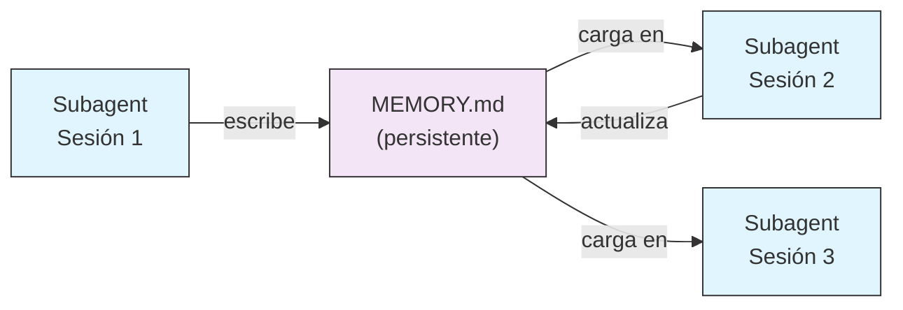
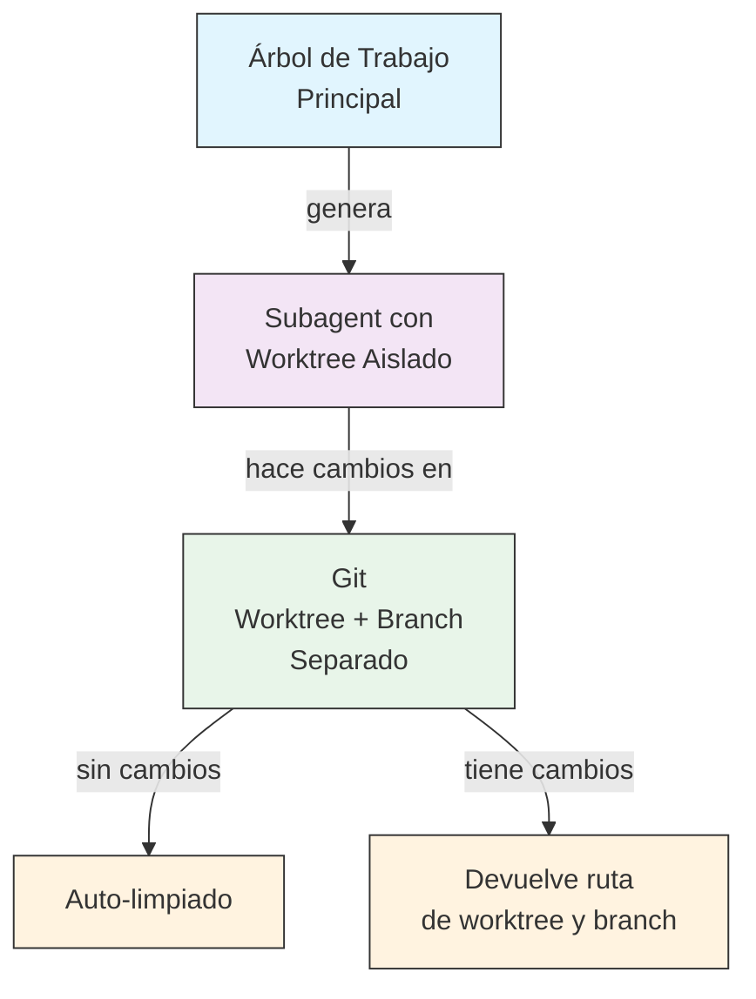
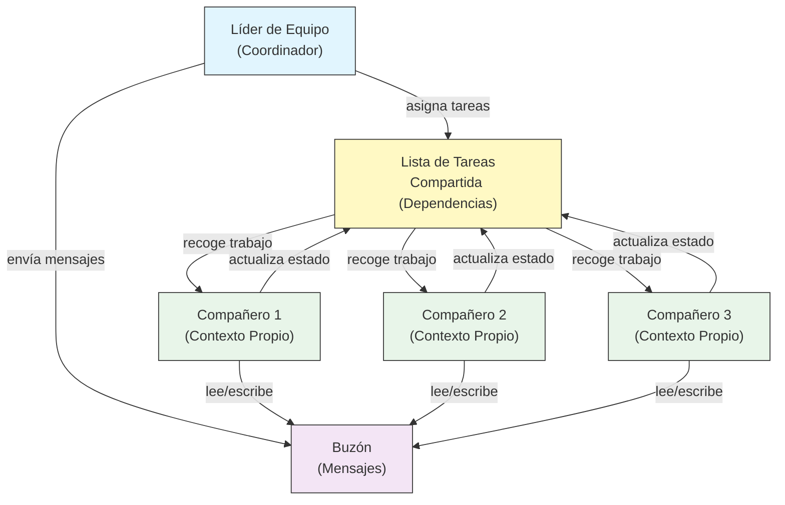
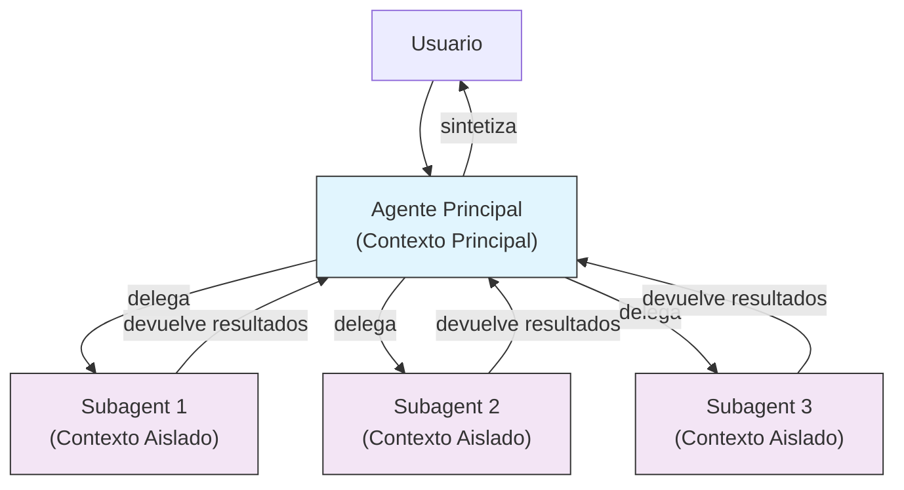

<picture>
  <source media="(prefers-color-scheme: dark)" srcset="../resources/logos/domina-claude-code-logo-dark.svg">
  
</picture>

# Subagents - Guía de Referencia Completa

Subagents son asistentes de IA especializados a los que Claude Code puede delegar tareas. Cada subagent tiene un propósito específico, usa su propia ventana de contexto separada de la conversación principal, y puede configurarse con herramientas específicas y un prompt de sistema personalizado.

## Tabla de Contenidos

1. [Descripción General](#descripción-general)
2. [Beneficios Clave](#beneficios-clave)
3. [Ubicaciones de Archivos](#ubicaciones-de-archivos)
4. [Configuración](#configuración)
5. [Subagents Integrados](#subagents-integrados)
6. [Gestión de Subagents](#gestión-de-subagents)
7. [Uso de Subagents](#uso-de-subagents)
8. [Agentes Resumibles](#agentes-resumibles)
9. [Encadenamiento de Subagents](#encadenamiento-de-subagents)
10. [Memoria Persistente para Subagents](#memoria-persistente-para-subagents)
11. [Subagents en Segundo Plano](#subagents-en-segundo-plano)
12. [Aislamiento Worktree](#aislamiento-worktree)
13. [Restringir Subagents Spawnables](#restringir-subagents-spawnables)
14. [Comando CLI `claude agents`](#comando-cli-claude-agents)
15. [Equipos de Agentes (Experimental)](#equipos-de-agentes-experimental)
16. [Seguridad de Plugin Subagent](#seguridad-de-plugin-subagent)
17. [Arquitectura](#arquitectura)
18. [Gestión de Contexto](#gestión-de-contexto)
19. [Cuándo Usar Subagents](#cuándo-usar-subagents)
20. [Mejores Prácticas](#mejores-prácticas)
21. [Ejemplos de Subagents en Esta Carpeta](#ejemplos-de-subagents-en-esta-carpeta)
22. [Instrucciones de Instalación](#instrucciones-de-instalación)
23. [Conceptos Relacionados](#conceptos-relacionados)

---

## Descripción General

Subagents permiten la ejecución delegada de tareas en Claude Code mediante:

- Creación de **asistentes de IA aislados** con ventanas de contexto separadas
- Provisión de **prompts de sistema personalizados** para experiencia especializada
- Aplicación de **control de acceso a herramientas** para limitar capacidades
- Prevención de **contaminación de contexto** por tareas complejas
- Habilitación de **ejecución paralela** de múltiples tareas especializadas

Cada subagent opera independientemente con un estado limpio, recibiendo solo el contexto específico necesario para su tarea, y luego devuelve resultados al agente principal para síntesis.

**Inicio Rápido**: Usa el comando `/agents` para crear, ver, editar y gestionar tus subagents interactivamente.

---

## Beneficios Clave

| Beneficio | Descripción |
|-----------|-------------|
| **Preservación de contexto** | Opera en contexto separado, previniendo contaminación de la conversación principal |
| **Experiencia especializada** | Optimizado para dominios específicos con mayores tasas de éxito |
| **Reutilización** | Uso en diferentes proyectos y compartir con equipos |
| **Permisos flexibles** | Diferentes niveles de acceso a herramientas para diferentes tipos de subagent |
| **Escalabilidad** | Múltiples agentes trabajan en diferentes aspectos simultáneamente |

---

## Ubicaciones de Archivos

Los archivos de subagent pueden almacenarse en múltiples ubicaciones con diferentes alcances:

| Prioridad | Tipo | Ubicación | Alcance |
|-----------|------|----------|---------|
| 1 (más alta) | **Definido por CLI** | Vía flag `--agents` (JSON) | Solo sesión |
| 2 | **Subagents de proyecto** | `.claude/agents/` | Proyecto actual |
| 3 | **Subagents de usuario** | `~/.claude/agents/` | Todos los proyectos |
| 4 (más baja) | **Agentes de plugin** | Directorio `agents/` del plugin | Vía plugins |

Cuando existen nombres duplicados, las fuentes de mayor prioridad tienen precedencia.

---

## Configuración

### Formato de Archivo

Los subagents se definen en frontmatter YAML seguido del prompt de sistema en markdown:

```yaml
---
name: nombre-de-tu-sub-agent
description: Descripción de cuándo debe invocarse este subagent
tools: tool1, tool2, tool3  # Opcional - hereda todas las herramientas si se omite
disallowedTools: tool4  # Opcional - herramientas explícitamente no permitidas
model: sonnet  # Opcional - sonnet, opus, haiku, o inherit
permissionMode: default  # Opcional - modo de permisos
maxTurns: 20  # Opcional - limitar giros agénticos
skills: skill1, skill2  # Opcional - skills para precargar en contexto
mcpServers: server1  # Opcional - servidores MCP para hacer disponibles
memory: user  # Opcional - alcance de memoria persistente (user, project, local)
background: false  # Opcional - ejecutar como tarea en segundo plano
effort: high  # Opcional - esfuerzo de razonamiento (low, medium, high, max)
isolation: worktree  # Opcional - aislamiento git worktree
initialPrompt: "Comienza analizando la base de código"  # Opcional - primer turno auto-enviado
hooks:  # Opcional - hooks de ámbito de componente
  PreToolUse:
    - matcher: "Bash"
      hooks:
        - type: command
          command: "./scripts/security-check.sh"
---

El prompt de sistema de tu subagent va aquí. Puede ser de múltiples párrafos
y debe definir claramente el rol del subagent, capacidades, y enfoque
para resolver problemas.
```

### Campos de Configuración

| Campo | Requerido | Descripción |
|-------|-----------|-------------|
| `name` | Sí | Identificador único (letras minúsculas y guiones) |
| `description` | Sí | Descripción en lenguaje natural del propósito. Incluye "use PROACTIVELY" para alentar invocación automática |
| `tools` | No | Lista separada por comas de herramientas específicas. Omite para heredar todas las herramientas. Soporta sintaxis `Agent(nombre_agente)` para restringir subagents spawnables |
| `disallowedTools` | No | Lista separada por comas de herramientas que el subagent no debe usar |
| `model` | No | Modelo a usar: `sonnet`, `opus`, `haiku`, ID completo de modelo, o `inherit`. Por defecto al modelo de subagent configurado |
| `permissionMode` | No | `default`, `acceptEdits`, `dontAsk`, `bypassPermissions`, `plan` |
| `maxTurns` | No | Número máximo de giros agénticos que el subagent puede tomar |
| `skills` | No | Lista separada por comas de skills para precargar. Inyecta el contenido completo de la skill en el contexto del subagent al inicio |
| `mcpServers` | No | Servidores MCP para hacer disponibles al subagent |
| `hooks` | No | Hooks de ámbito de componente (PreToolUse, PostToolUse, Stop) |
| `memory` | No | Alcance de directorio de memoria persistente: `user`, `project`, o `local` |
| `background` | No | Establece a `true` para ejecutar siempre este subagent como tarea en segundo plano |
| `effort` | No | Nivel de esfuerzo de razonamiento: `low`, `medium`, `high`, o `max` |
| `isolation` | No | Establece a `worktree` para dar al subagent su propio git worktree |
| `initialPrompt` | No | Primer turno auto-enviado cuando el subagent se ejecuta como agente principal |

### Opciones de Configuración de Herramientas

**Opción 1: Heredar Todas las Herramientas (omitir el campo)**
```yaml
---
name: agente-acceso-completo
description: Agente con todas las herramientas disponibles
---
```

**Opción 2: Especificar Herramientas Individuales**
```yaml
---
name: agente-limitado
description: Agente solo con herramientas específicas
tools: Read, Grep, Glob, Bash
---
```

**Opción 3: Acceso Condicional a Herramientas**
```yaml
---
name: agente-condicional
description: Agente con acceso filtrado a herramientas
tools: Read, Bash(npm:*), Bash(test:*)
---
```

### Configuración Basada en CLI

Define subagents para una sola sesión usando el flag `--agents` con formato JSON:

```bash
claude --agents '{
  "code-reviewer": {
    "description": "Revisor de código experto. Use proactivamente después de cambios de código.",
    "prompt": "Eres un revisor de código senior. Enfócate en calidad de código, seguridad, y mejores prácticas.",
    "tools": ["Read", "Grep", "Glob", "Bash"],
    "model": "sonnet"
  }
}'
```

**Formato JSON para el flag `--agents`:**

```json
{
  "nombre-agente": {
    "description": "Requerido: cuándo invocar este agente",
    "prompt": "Requerido: prompt de sistema para el agente",
    "tools": ["Opcional", "array", "de", "herramientas"],
    "model": "opcional: sonnet|opus|haiku"
  }
}
```

**Prioridad de Definiciones de Agente:**

Las definiciones de agente se cargan con este orden de prioridad (la primera coincidencia gana):
1. **Definido por CLI** - flag `--agents` (solo sesión, JSON)
2. **Nivel de proyecto** - `.claude/agents/` (proyecto actual)
3. **Nivel de usuario** - `~/.claude/agents/` (todos los proyectos)
4. **Nivel de plugin** - Directorio `agents/` del plugin

Esto permite que las definiciones de CLI anulen todas las demás fuentes para una sola sesión.

---

## Subagents Integrados

Claude Code incluye varios subagents integrados que están siempre disponibles:

| Agente | Modelo | Propósito |
|--------|--------|-----------|
| **general-purpose** | Hereda | Tareas complejas de múltiples pasos |
| **Plan** | Hereda | Investigación para modo plan |
| **Explore** | Haiku | Exploración de solo lectura de base de código (rápida/media/muy exhaustiva) |
| **Bash** | Hereda | Comandos de terminal en contexto separado |
| **statusline-setup** | Sonnet | Configurar línea de estado |
| **Claude Code Guide** | Haiku | Responder preguntas sobre características de Claude Code |

### Subagent General-Purpose

| Propiedad | Valor |
|-----------|-------|
| **Modelo** | Hereda del padre |
| **Herramientas** | Todas las herramientas |
| **Propósito** | Tareas de investigación complejas, operaciones de múltiples pasos, modificaciones de código |

**Cuándo se usa**: Tareas que requieren tanto exploración como modificación con razonamiento complejo.

### Subagent Plan

| Propiedad | Valor |
|-----------|-------|
| **Modelo** | Hereda del padre |
| **Herramientas** | Read, Glob, Grep, Bash |
| **Propósito** | Usado automáticamente en modo plan para investigar la base de código |

**Cuándo se usa**: Cuando Claude necesita entender la base de código antes de presentar un plan.

### Subagent Explore

| Propiedad | Valor |
|-----------|-------|
| **Modelo** | Haiku (rápido, baja latencia) |
| **Modo** | Estrictamente solo lectura |
| **Herramientas** | Glob, Grep, Read, Bash (solo comandos de solo lectura) |
| **Propósito** | Búsqueda y análisis rápido de base de código |

**Cuándo se usa**: Cuando se busca/entiende código sin hacer cambios.

**Niveles de Exhaustividad** - Especifica la profundidad de exploración:
- **"quick"** - Búsquedas rápidas con mínima exploración, bueno para encontrar patrones específicos
- **"medium"** - Exploración moderada, equilibrio entre velocidad y exhaustividad, enfoque por defecto
- **"very thorough"** - Análisis exhaustivo a través de múltiples ubicaciones y convenciones de nomenclatura, puede tomar más tiempo

### Subagent Bash

| Propiedad | Valor |
|-----------|-------|
| **Modelo** | Hereda del padre |
| **Herramientas** | Bash |
| **Propósito** | Ejecutar comandos de terminal en una ventana de contexto separada |

**Cuándo se usa**: Cuando se ejecutan comandos de shell que se benefician de contexto aislado.

### Subagent Statusline Setup

| Propiedad | Valor |
|-----------|-------|
| **Modelo** | Sonnet |
| **Herramientas** | Read, Write, Bash |
| **Propósito** | Configurar la visualización de la línea de estado de Claude Code |

**Cuándo se usa**: Cuando se configura o personaliza la línea de estado.

### Subagent Claude Code Guide

| Propiedad | Valor |
|-----------|-------|
| **Modelo** | Haiku (rápido, baja latencia) |
| **Herramientas** | Solo lectura |
| **Propósito** | Responder preguntas sobre características y uso de Claude Code |

**Cuándo se usa**: Cuando los usuarios hacen preguntas sobre cómo funciona Claude Code o cómo usar características específicas.

---

## Gestión de Subagents

### Usando el Comando `/agents` (Recomendado)

```bash
/agents
```

Esto proporciona un menú interactivo para:
- Ver todos los subagents disponibles (integrados, de usuario, y de proyecto)
- Crear nuevos subagents con configuración guiada
- Editar subagents personalizados existentes y acceso a herramientas
- Eliminar subagents personalizados
- Ver qué subagents están activos cuando existen duplicados

### Gestión Directa de Archivos

```bash
# Crear un subagent de proyecto
mkdir -p .claude/agents
cat > .claude/agents/test-runner.md << 'EOF'
---
name: test-runner
description: Use proactivamente para ejecutar pruebas y corregir fallos
---

Eres un experto en automatización de pruebas. Cuando veas cambios de código, proactivamente
ejecuta las pruebas apropiadas. Si las pruebas fallan, analiza los fallos y corrígelos
mientras preservas la intención original de la prueba.
EOF

# Crear un subagent de usuario (disponible en todos los proyectos)
mkdir -p ~/.claude/agents
```

---

## Uso de Subagents

### Delegación Automática

Claude delega proactivamente tareas basándose en:
- Descripción de la tarea en tu solicitud
- El campo `description` en configuraciones de subagent
- Contexto actual y herramientas disponibles

Para alentar el uso proactivo, incluye "use PROACTIVELY" o "MUST BE USED" en tu campo `description`:

```yaml
---
name: code-reviewer
description: Especialista experto en revisión de código. Use PROACTIVELY después de escribir o modificar código.
---
```

### Invocación Explícita

Puedes solicitar explícitamente un subagent específico:

```
> Usa el subagent test-runner para corregir pruebas fallidas
> Haz que el subagent code-reviewer revise mis cambios recientes
> Pide al subagent debugger que investigue este error
```

### Invocación @-Mention

Usa el prefijo `@` para garantizar que se invoque un subagent específico (omite las heurísticas de delegación automática):

```
> @"code-reviewer (agent)" revisa el módulo de autenticación
```

### Agente de Sesión Completa

Ejecuta una sesión completa usando un agente específico como agente principal:

```bash
# Vía flag CLI
claude --agent code-reviewer

# Vía settings.json
{
  "agent": "code-reviewer"
}
```

### Listar Agentes Disponibles

Usa el comando `claude agents` para listar todos los agentes configurados de todas las fuentes:

```bash
claude agents
```

---

## Agentes Resumibles

Los subagents pueden continuar conversaciones previas con el contexto completo preservado:

```bash
# Invocación inicial
> Usa el agente code-analyzer para comenzar a revisar el módulo de autenticación
# Devuelve agentId: "abc123"

> Resume el agente abc123 y ahora analiza también la lógica de autorización
```

**Casos de uso**:
- Investigación de larga duración a través de múltiples sesiones
- Refinamiento iterativo sin perder contexto
- Flujos de trabajo de múltiples pasos manteniendo contexto

---

## Encadenamiento de Subagents

Ejecuta múltiples subagents en secuencia:

```bash
> Primero usa el subagent code-analyzer para encontrar problemas de rendimiento,
  luego usa el subagent optimizer para corregirlos
```

Esto permite flujos de trabajo complejos donde la salida de un subagent alimenta a otro.

---

## Memoria Persistente para Subagents

El campo `memory` da a los subagents un directorio persistente que sobrevive a través de conversaciones. Esto permite a los subagents construir conocimiento con el tiempo, almacenando notas, hallazgos, y contexto que persisten entre sesiones.

### Alcances de Memoria

| Alcance | Directorio | Caso de Uso |
|---------|-----------|-------------|
| `user` | `~/.claude/agent-memory/<name>/` | Notas personales y preferencias en todos los proyectos |
| `project` | `.claude/agent-memory/<name>/` | Conocimiento específico del proyecto compartido con el equipo |
| `local` | `.claude/agent-memory-local/<name>/` | Conocimiento local del proyecto no comprometido al control de versiones |

### Cómo Funciona

- Las primeras 200 líneas de `MEMORY.md` en el directorio de memoria se cargan automáticamente en el prompt de sistema del subagent
- Las herramientas `Read`, `Write`, y `Edit` se habilitan automáticamente para el subagent para gestionar sus archivos de memoria
- El subagent puede crear archivos adicionales en su directorio de memoria según sea necesario

### Ejemplo de Configuración

```yaml
---
name: researcher
memory: user
---

Eres un asistente de investigación. Usa tu directorio de memoria para almacenar hallazgos,
seguir el progreso a través de sesiones, y construir conocimiento con el tiempo.

Revisa tu archivo MEMORY.md al inicio de cada sesión para recordar el contexto previo.
```



---

## Subagents en Segundo Plano

Los subagents pueden ejecutarse en segundo plano, liberando la conversación principal para otras tareas.

### Configuración

Establece `background: true` en el frontmatter para ejecutar siempre el subagent como tarea en segundo plano:

```yaml
---
name: long-runner
background: true
description: Realiza tareas de análisis de larga duración en segundo plano
---
```

### Atajos de Teclado

| Atajo | Acción |
|-------|--------|
| `Ctrl+B` | Pasa a segundo plano una tarea de subagent en ejecución actual |
| `Ctrl+F` | Mata todos los agentes en segundo plano (presiona dos veces para confirmar) |

### Deshabilitar Tareas en Segundo Plano

Establece la variable de entorno para deshabilitar completamente el soporte de tareas en segundo plano:

```bash
export CLAUDE_CODE_DISABLE_BACKGROUND_TASKS=1
```

---

## Aislamiento Worktree

La configuración `isolation: worktree` da a un subagent su propio git worktree, permitiéndole hacer cambios independientemente sin afectar el árbol de trabajo principal.

### Configuración

```yaml
---
name: feature-builder
isolation: worktree
description: Implementa características en un git worktree aislado
tools: Read, Write, Edit, Bash, Grep, Glob
---
```

### Cómo Funciona



- El subagent opera en su propio git worktree en una rama separada
- Si el subagent no hace cambios, el worktree se limpia automáticamente
- Si existen cambios, la ruta del worktree y el nombre de la rama se devuelven al agente principal para revisión o fusión

---

## Restringir Subagents Spawnables

Puedes controlar qué subagents puede generar un subagent dado usando la sintaxis `Agent(tipo_agente)` en el campo `tools`. Esto proporciona una forma de permitir lista blanca de subagents específicos para delegación.

> **Nota**: En v2.1.63, la herramienta `Task` fue renombrada a `Agent`. Las referencias existentes a `Task(...)` aún funcionan como alias.

### Ejemplo

```yaml
---
name: coordinator
description: Coordina el trabajo entre agentes especializados
tools: Agent(worker, researcher), Read, Bash
---

Eres un agente coordinador. Puedes delegar trabajo a los subagents "worker" y
"researcher" únicamente. Usa Read y Bash para tu propia exploración.
```

En este ejemplo, el subagent `coordinator` solo puede generar los subagents `worker` y `researcher`. No puede generar ningún otro subagent, incluso si están definidos en otro lugar.

---

## Comando CLI `claude agents`

El comando `claude agents` lista todos los agentes configurados agrupados por fuente (integrado, nivel de usuario, nivel de proyecto):

```bash
claude agents
```

Este comando:
- Muestra todos los agentes disponibles de todas las fuentes
- Agrupa agentes por su ubicación de origen
- Indica **overrides** cuando un agente en un nivel de prioridad más alto anula uno en un nivel de prioridad más bajo (por ejemplo, un agente de nivel de proyecto con el mismo nombre que un agente de nivel de usuario)

---

## Equipos de Agentes (Experimental)

Agent Teams coordinan múltiples instancias de Claude Code trabajando juntas en tareas complejas. A diferencia de los subagents (que son subtareas delegadas que devuelven resultados), los compañeros de equipo trabajan independientemente con su propio contexto y se comunican directamente a través de un sistema de buzón compartido.

> **Nota**: Agent Teams es experimental y requiere Claude Code v2.1.32+. Habilítalo antes de usar.

### Subagents vs Agent Teams

| Aspecto | Subagents | Agent Teams |
|---------|-----------|-------------|
| **Modelo de delegación** | Padre delega subtarea, espera resultado | Líder de equipo asigna trabajo, compañeros ejecutan independientemente |
| **Contexto** | Contexto fresco por subtarea, resultados destilados de vuelta | Cada compañero mantiene su propio contexto persistente |
| **Coordinación** | Secuencial o paralelo, gestionado por padre | Lista de tareas compartida con gestión automática de dependencias |
| **Comunicación** | Solo valores de retorno | Mensajería entre agentes vía buzón |
| **Resumen de sesión** | Soportado | No soportado con compañeros en proceso |
| **Mejor para** | Subtareas enfocadas y bien definidas | Proyectos grandes de múltiples archivos que requieren trabajo paralelo |

### Habilitar Agent Teams

Establece la variable de entorno o agrégala a tu `settings.json`:

```bash
export CLAUDE_CODE_EXPERIMENTAL_AGENT_TEAMS=1
```

O en `settings.json`:

```json
{
  "env": {
    "CLAUDE_CODE_EXPERIMENTAL_AGENT_TEAMS": "1"
  }
}
```

### Iniciar un equipo

Una vez habilitado, pide a Claude que trabaje con compañeros de equipo en tu prompt:

```
Usuario: Construye el módulo de autenticación. Usa un equipo — un compañero para los endpoints de API,
      uno para el esquema de base de datos, y uno para la suite de pruebas.
```

Claude creará el equipo, asignará tareas, y coordinará el trabajo automáticamente.

### Modos de visualización

Controla cómo se muestra la actividad de los compañeros de equipo:

| Modo | Flag | Descripción |
|------|------|-------------|
| **Auto** | `--teammate-mode auto` | Elige automáticamente el mejor modo de visualización para tu terminal |
| **En proceso** | `--teammate-mode in-process` | Muestra la salida del compañero en línea en la terminal actual (por defecto) |
| **Paneles divididos** | `--teammate-mode tmux` | Abre cada compañero en un panel separado de tmux o iTerm2 |

```bash
claude --teammate-mode tmux
```

También puedes establecer el modo de visualización en `settings.json`:

```json
{
  "teammateMode": "tmux"
}
```

> **Nota**: El modo de paneles divididos requiere tmux o iTerm2. No está disponible en la terminal de VS Code, Windows Terminal, o Ghostty.

### Navegación

Usa `Shift+Abajo` para navegar entre compañeros de equipo en modo de paneles divididos.

### Configuración de Equipo

Las configuraciones de equipo se almacenan en `~/.claude/teams/{nombre-equipo}/config.json`.

### Arquitectura



**Componentes clave**:

- **Líder de Equipo**: La sesión principal de Claude Code que crea el equipo, asigna tareas, y coordina
- **Lista de Tareas Compartida**: Una lista sincronizada de tareas con seguimiento automático de dependencias
- **Buzón**: Un sistema de mensajería entre agentes para que los compañeros se comuniquen estado y coordinen
- **Compañeros**: Instancias independientes de Claude Code, cada una con su propia ventana de contexto

### Asignación de tareas y mensajería

El líder del equipo divide el trabajo en tareas y las asigna a los compañeros. La lista de tareas compartida maneja:

- **Gestión automática de dependencias** — las tareas esperan a que sus dependencias se completen
- **Seguimiento de estado** — los compañeros actualizan el estado de la tarea mientras trabajan
- **Mensajería entre agentes** — los compañeros envían mensajes vía el buzón para coordinación (por ejemplo, "El esquema de base de datos está listo, puedes comenzar a escribir consultas")

### Flujo de trabajo de aprobación de plan

Para tareas complejas, el líder del equipo crea un plan de ejecución antes de que los compañeros comiencen el trabajo. El usuario revisa y aprueba el plan, asegurando que el enfoque del equipo se alinee con las expectativas antes de que se hagan cambios de código.

### Eventos de hook para equipos

Agent Teams introduce dos [eventos de hook](../06-hooks/) adicionales:

| Evento | Se Dispara Cuando | Caso de Uso |
|--------|-------------------|-------------|
| `TeammateIdle` | Un compañero termina su tarea actual y no tiene trabajo pendiente | Activar notificaciones, asignar tareas de seguimiento |
| `TaskCompleted` | Una tarea en la lista de tareas compartida se marca como completada | Ejecutar validación, actualizar paneles, encadenar trabajo dependiente |

### Mejores prácticas

- **Tamaño del equipo**: Mantén los equipos en 3-5 compañeros para una coordinación óptima
- **Dimensionamiento de tareas**: Divide el trabajo en tareas que tomen 5-15 minutos cada una — lo suficientemente pequeñas para paralelizar, lo suficientemente grandes para ser significativas
- **Evita conflictos de archivos**: Asigna diferentes archivos o directorios a diferentes compañeros para prevenir conflictos de fusión
- **Comienza simple**: Usa el modo en proceso para tu primer equipo; cambia a paneles divididos una vez que te sientas cómodo
- **Descripciones claras de tareas**: Proporciona descripciones de tareas específicas y accionables para que los compañeros puedan trabajar independientemente

### Limitaciones

- **Experimental**: El comportamiento de la característica puede cambiar en versiones futuras
- **Sin resumen de sesión**: Los compañeros en proceso no pueden resumirse después de que termina una sesión
- **Un equipo por sesión**: No se pueden crear equipos anidados o múltiples equipos en una sola sesión
- **Liderazgo fijo**: El rol de líder de equipo no puede transferirse a un compañero
- **Restricciones de paneles divididos**: Se requiere tmux/iTerm2; no disponible en terminal de VS Code, Windows Terminal, o Ghostty
- **Sin equipos entre sesiones**: Los compañeros existen solo dentro de la sesión actual

> **Advertencia**: Agent Teams es experimental. Pruébalo con trabajo no crítico primero y monitorea la coordinación de compañeros para comportamiento inesperado.

---

## Seguridad de Plugin Subagent

Los subagents proporcionados por plugins tienen capacidades de frontmatter restringidas por seguridad. Los siguientes campos **no están permitidos** en definiciones de plugin subagent:

- `hooks` - No puede definir lifecycle hooks
- `mcpServers` - No puede configurar servidores MCP
- `permissionMode` - No puede anular configuraciones de permisos

Esto previene que los plugins escalen privilegios o inyecten hooks maliciosos.

---

## Arquitectura



**Flujo de delegación**:
1. El usuario solicita una tarea compleja
2. El agente principal identifica subtasks apropiadas
3. Los subagents se generan con contexto fresco y herramientas específicas
4. Cada subagent completa su tarea independientemente
5. Los resultados se devuelven al agente principal
6. El agente principal sintetiza todos los resultados en una respuesta coherente

---

## Gestión de Contexto

Cada subagent opera con su propia ventana de contexto, separada del agente principal. Esto proporciona:

- **Aislamiento**: Las operaciones complejas no contaminan el contexto principal
- **Enfoque**: Los subagents reciben solo el contexto relevante para su tarea
- **Eficiencia**: El uso de tokens se optimiza al no cargar contexto innecesario
- **Paralelismo**: Múltiples subagents pueden trabajar simultáneamente sin interferencia

### Límites de Contexto

| Agente | Ventana de Contexto |
|--------|---------------------|
| Agente Principal | 200K tokens (varía por modelo) |
| Subagent | Ventana separada de 200K tokens |

---

## Cuándo Usar Subagents

Usa subagents cuando:

✅ **Tareas complejas de múltiples pasos** que beneficiarían de contexto aislado
✅ **Experiencia especializada** requerida (revisión de seguridad, pruebas, etc.)
✅ **Prevención de contaminación de contexto** de operaciones extensas
✅ **Trabajo paralelo** en aspectos independientes de una tarea
✅ **Reutilización** de patrones de trabajo a través de proyectos

Evita subagents cuando:

❌ **Tareas simples** que pueden completarse en unos pocos pasos
❌ **Trabajo altamente interdependiente** que requiere contexto compartido constante
❌ **Operaciones rápidas** donde la sobrecarga de delegación no vale la pena

---

## Mejores Prácticas

### Diseño de Subagents

- **Nombres descriptivos**: Usa nombres que comuniquen claramente el propósito
- **Descripciones específicas**: Incluye "use PROACTIVELY" para alentar invocación automática
- **Herramientas mínimas**: Concede solo las herramientas necesarias para la tarea
- **Prompts claros**: Define explícitamente el rol, responsabilidades, y formato de salida

### Gestión de Contexto

- **Precarga de contexto**: Usa el campo `skills` para inyectar conocimiento relevante
- **Memoria persistente**: Usa `memory` para subagents que construyen conocimiento con el tiempo
- **Aislamiento**: Usa `isolation: worktree` para subagents que hacen cambios de código

### Orquestación

- **Encadenamiento**: Secuencia subagents para flujos de trabajo complejos
- **Delegación explícita**: Usa `@agent-name` para invocaciones garantizadas
- **Resumen**: Resume agentes de larga duración para continuar trabajo

---

## Ejemplos de Subagents en Esta Carpeta

Esta carpeta contiene ejemplos de subagents especializados:

| Archivo | Propósito |
|---------|-----------|
| `code-reviewer.md` | Revisión de código para calidad y seguridad |
| `test-engineer.md` | Escritura y ejecución de pruebas |
| `documentation-writer.md` | Creación de documentación técnica |
| `secure-reviewer.md` | Auditorías de seguridad de solo lectura |
| `implementation-agent.md` | Desarrollo de características full-stack |
| `debugger.md` | Depuración y análisis de causa raíz |
| `data-scientist.md` | Análisis de datos SQL y BigQuery |
| `clean-code-reviewer.md` | Aplicación de principios Clean Code |

---

## Instrucciones de Instalación

Para instalar estos subagents de ejemplo en tu proyecto:

```bash
# Copiar al directorio de agentes de tu proyecto
cp 04-subagents/*.md .claude/agents/

# O crear un enlace simbólico a subagents de usuario
mkdir -p ~/.claude/agents
ln -s $(pwd)/04-subagents/*.md ~/.claude/agents/
```

---

## Conceptos Relacionados

- [Skills](../03-skills/) - Scripts reutilizables que extienden capacidades de Claude Code
- [Hooks](../06-hooks/) - Callbacks que se ejecutan en eventos del ciclo de vida
- [Model Context Protocol](../05-mcp/) - Protocolo para conectar fuentes de datos externas
- [Permisos](../02-permissions/) - Control de acceso a herramientas y comandos

---

<div align="center">

**¿Encontraste útil esta guía?** ⭐ [Danos una estrella en GitHub](https://github.com/ajinabraham/domina-claude-code)

</div>
