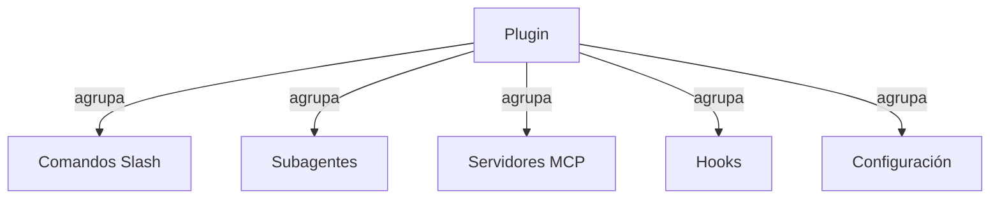
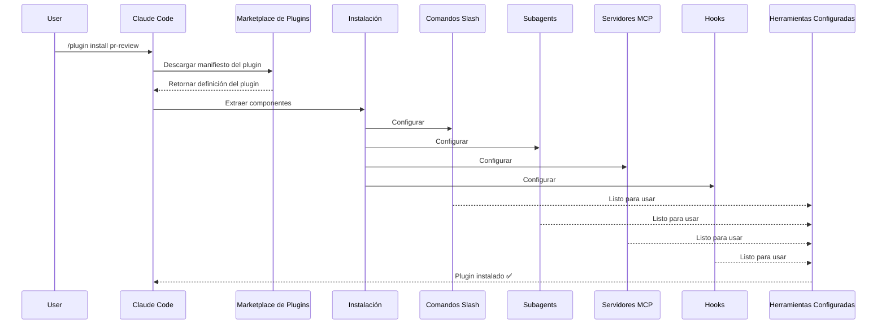
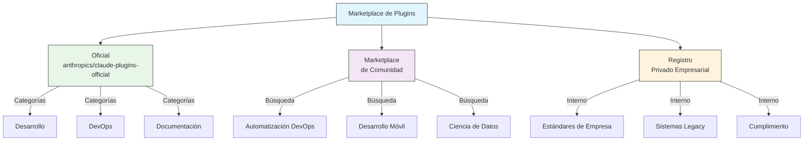
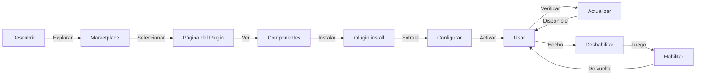
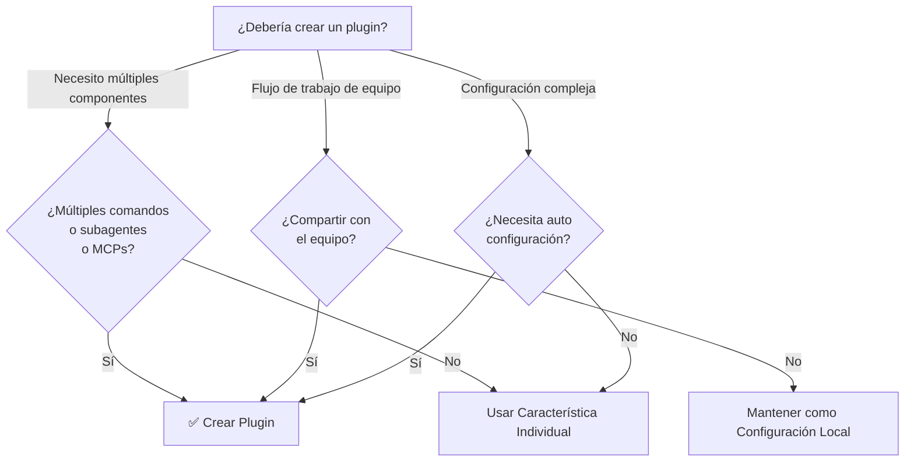

<picture>
  <source media="(prefers-color-scheme: dark)" srcset="../resources/logos/claude-howto-logo-dark.svg">
  
</picture>

# Plugins de Claude Code

Esta carpeta contiene ejemplos completos de plugins que agrupan múltiples características de Claude Code en paquetes cohesivos e instalables.

## Visión General

Los Plugins de Claude Code son colecciones agrupadas de personalizaciones (comandos slash, subagentes, servidores MCP y hooks) que se instalan con un solo comando. Representan el mecanismo de extensión de más alto nivel, combinando múltiples características en paquetes cohesivos y compartibles.

## Arquitectura de Plugins



## Proceso de Carga de Plugins



## Tipos de Plugins y Distribución

| Tipo | Alcance | Compartido | Autoridad | Ejemplos |
|------|-------|--------|-----------|----------|
| Oficial | Global | Todos los usuarios | Anthropic | Revisión de PR, Guía de Seguridad |
| Comunidad | Público | Todos los usuarios | Comunidad | DevOps, Ciencia de Datos |
| Organización | Interno | Miembros del equipo | Empresa | Estándares internos, herramientas |
| Personal | Individual | Único usuario | Desarrollador | Flujos de trabajo personalizados |

## Estructura de Definición de Plugin

El manifiesto del plugin usa formato JSON en `.claude-plugin/plugin.json`:

```json
{
  "name": "my-first-plugin",
  "description": "Un plugin de saludo",
  "version": "1.0.0",
  "author": {
    "name": "Tu Nombre"
  },
  "homepage": "https://example.com",
  "repository": "https://github.com/user/repo",
  "license": "MIT"
}
```

## Ejemplo de Estructura de Plugin

```
my-plugin/
├── .claude-plugin/
│   └── plugin.json       # Manifiesto (nombre, descripción, versión, autor)
├── commands/             # Habilidades como archivos Markdown
│   ├── task-1.md
│   ├── task-2.md
│   └── workflows/
├── agents/               # Definiciones de agentes personalizados
│   ├── specialist-1.md
│   ├── specialist-2.md
│   └── configs/
├── skills/               # Habilidades de Agente con archivos SKILL.md
│   ├── skill-1.md
│   └── skill-2.md
├── hooks/                # Manejadores de eventos en hooks.json
│   └── hooks.json
├── .mcp.json             # Configuraciones de servidores MCP
├── .lsp.json             # Configuraciones de servidores LSP
├── settings.json         # Configuraciones predeterminadas
├── templates/
│   └── issue-template.md
├── scripts/
│   ├── helper-1.sh
│   └── helper-2.py
├── docs/
│   ├── README.md
│   └── USAGE.md
└── tests/
    └── plugin.test.js
```

### Configuración de servidor LSP

Los plugins pueden incluir soporte de Protocolo de Servidor de Lenguaje (LSP) para inteligencia de código en tiempo real. Los servidores LSP proporcionan diagnósticos, navegación de código e información de símbolos mientras trabajas.

**Ubicaciones de configuración**:
- Archivo `.lsp.json` en el directorio raíz del plugin
- Clave `lsp` en línea en `plugin.json`

#### Referencia de campos

| Campo | Requerido | Descripción |
|-------|----------|-------------|
| `command` | Sí | Binario del servidor LSP (debe estar en PATH) |
| `extensionToLanguage` | Sí | Mapea extensiones de archivo a IDs de lenguaje |
| `args` | No | Argumentos de línea de comandos para el servidor |
| `transport` | No | Método de comunicación: `stdio` (predeterminado) o `socket` |
| `env` | No | Variables de entorno para el proceso del servidor |
| `initializationOptions` | No | Opciones enviadas durante la inicialización LSP |
| `settings` | No | Configuración del espacio de trabajo pasada al servidor |
| `workspaceFolder` | No | Sobrescribir la ruta de la carpeta del espacio de trabajo |
| `startupTimeout` | No | Tiempo máximo (ms) para esperar el inicio del servidor |
| `shutdownTimeout` | No | Tiempo máximo (ms) para apagado graceful |
| `restartOnCrash` | No | Reiniciar automáticamente si el servidor falla |
| `maxRestarts` | No | Máximo de intentos de reinicio antes de rendirse |

#### Ejemplos de configuración

**Go (gopls)**:

```json
{
  "go": {
    "command": "gopls",
    "args": ["serve"],
    "extensionToLanguage": {
      ".go": "go"
    }
  }
}
```

**Python (pyright)**:

```json
{
  "python": {
    "command": "pyright-langserver",
    "args": ["--stdio"],
    "extensionToLanguage": {
      ".py": "python",
      ".pyi": "python"
    }
  }
}
```

**TypeScript**:

```json
{
  "typescript": {
    "command": "typescript-language-server",
    "args": ["--stdio"],
    "extensionToLanguage": {
      ".ts": "typescript",
      ".tsx": "typescriptreact",
      ".js": "javascript",
      ".jsx": "javascriptreact"
    }
  }
}
```

#### Plugins LSP disponibles

El marketplace oficial incluye plugins LSP preconfigurados:

| Plugin | Lenguaje | Binario del Servidor | Comando de Instalación |
|--------|----------|---------------|----------------|
| `pyright-lsp` | Python | `pyright-langserver` | `pip install pyright` |
| `typescript-lsp` | TypeScript/JavaScript | `typescript-language-server` | `npm install -g typescript-language-server typescript` |
| `rust-lsp` | Rust | `rust-analyzer` | Instalar vía `rustup component add rust-analyzer` |

#### Capacidades LSP

Una vez configurados, los servidores LSP proporcionan:

- **Diagnósticos instantáneos** — errores y advertencias aparecen inmediatamente después de las ediciones
- **Navegación de código** — ir a definición, encontrar referencias, implementaciones
- **Información al pasar el cursor** — firmas de tipos y documentación al pasar el cursor
- **Listado de símbolos** — explorar símbolos en el archivo o espacio de trabajo actual

## Opciones de Plugin (v2.1.83+)

Los plugins pueden declarar opciones configurables por el usuario en el manifiesto vía `userConfig`. Los valores marcados con `sensitive: true` se almacenan en el llavero del sistema en lugar de archivos de configuración en texto plano:

```json
{
  "name": "my-plugin",
  "version": "1.0.0",
  "userConfig": {
    "apiKey": {
      "description": "Clave API para el servicio",
      "sensitive": true
    },
    "region": {
      "description": "Región de despliegue",
      "default": "us-east-1"
    }
  }
}
```

## Datos Persistentes de Plugin (`${CLAUDE_PLUGIN_DATA}`) (v2.1.78+)

Los plugins tienen acceso a un directorio de estado persistente vía la variable de entorno `${CLAUDE_PLUGIN_DATA}`. Este directorio es único por plugin y sobrevive entre sesiones, haciéndolo adecuado para cachés, bases de datos y otro estado persistente:

```json
{
  "hooks": {
    "PostToolUse": [
      {
        "command": "node ${CLAUDE_PLUGIN_DATA}/track-usage.js"
      }
    ]
  }
}
```

El directorio se crea automáticamente cuando se instala el plugin. Los archivos almacenados aquí persisten hasta que el plugin se desinstala.

## Plugin en Línea vía Settings (`source: 'settings'`) (v2.1.80+)

Los plugins pueden definirse en línea en archivos de configuración como entradas de marketplace usando el campo `source: 'settings'`. Esto permite incrustar una definición de plugin directamente sin requerir un repositorio o marketplace separado:

```json
{
  "pluginMarketplaces": [
    {
      "name": "inline-tools",
      "source": "settings",
      "plugins": [
        {
          "name": "quick-lint",
          "source": "./local-plugins/quick-lint"
        }
      ]
    }
  ]
}
```

## Configuración de Plugins

Los plugins pueden incluir un archivo `settings.json` para proporcionar configuración predeterminada. Esto actualmente soporta la clave `agent`, que establece el agente principal del hilo para el plugin:

```json
{
  "agent": "agents/specialist-1.md"
}
```

Cuando un plugin incluye `settings.json`, sus valores predeterminados se aplican en la instalación. Los usuarios pueden sobrescribir estas configuraciones en su propia configuración de proyecto o usuario.

## Enfoque Standalone vs Plugin

| Enfoque | Nombres de Comandos | Configuración | Mejor Para |
|----------|---------------|---|---|
| **Standalone** | `/hello` | Configuración manual en CLAUDE.md | Personal, específico del proyecto |
| **Plugins** | `/plugin-name:hello` | Automatizado vía plugin.json | Compartir, distribución, uso en equipo |

Usa **comandos slash standalone** para flujos de trabajo personales rápidos. Usa **plugins** cuando quieras agrupar múltiples características, compartir con un equipo o publicar para distribución.

## Ejemplos Prácticos

### Ejemplo 1: Plugin de Revisión de PR

**Archivo:** `.claude-plugin/plugin.json`

```json
{
  "name": "pr-review",
  "version": "1.0.0",
  "description": "Flujo de trabajo completo de revisión de PR con seguridad, pruebas y docs",
  "author": {
    "name": "Anthropic"
  },
  "repository": "https://github.com/anthropic/pr-review",
  "license": "MIT"
}
```

**Archivo:** `commands/review-pr.md`

```markdown
---
name: Review PR
description: Iniciar revisión completa de PR con verificaciones de seguridad y pruebas
---

# Revisión de PR

Este comando inicia una revisión completa de pull request incluyendo:

1. Análisis de seguridad
2. Verificación de cobertura de pruebas
3. Actualizaciones de documentación
4. Verificaciones de calidad de código
5. Evaluación de impacto en el rendimiento
```

**Archivo:** `agents/security-reviewer.md`

```yaml
---
name: security-reviewer
description: Revisión de código enfocada en seguridad
tools: read, grep, diff
---

# Revisor de Seguridad

Se especializa en encontrar vulnerabilidades de seguridad:
- Problemas de autenticación/autorización
- Exposición de datos
- Ataques de inyección
- Configuración segura
```

**Instalación:**

```bash
/plugin install pr-review

# Resultado:
# ✅ 3 comandos slash instalados
# ✅ 3 subagentes configurados
# ✅ 2 servidores MCP conectados
# ✅ 4 hooks registrados
# ✅ ¡Listo para usar!
```

### Ejemplo 2: Plugin de DevOps

**Componentes:**

```
devops-automation/
├── commands/
│   ├── deploy.md
│   ├── rollback.md
│   ├── status.md
│   └── incident.md
├── agents/
│   ├── deployment-specialist.md
│   ├── incident-commander.md
│   └── alert-analyzer.md
├── mcp/
│   ├── github-config.json
│   ├── kubernetes-config.json
│   └── prometheus-config.json
├── hooks/
│   ├── pre-deploy.js
│   ├── post-deploy.js
│   └── on-error.js
└── scripts/
    ├── deploy.sh
    ├── rollback.sh
    └── health-check.sh
```

### Ejemplo 3: Plugin de Documentación

**Componentes Agrupados:**

```
documentation/
├── commands/
│   ├── generate-api-docs.md
│   ├── generate-readme.md
│   ├── sync-docs.md
│   └── validate-docs.md
├── agents/
│   ├── api-documenter.md
│   ├── code-commentator.md
│   └── example-generator.md
├── mcp/
│   ├── github-docs-config.json
│   └── slack-announce-config.json
└── templates/
    ├── api-endpoint.md
    ├── function-docs.md
    └── adr-template.md
```

## Marketplace de Plugins

El directorio oficial de plugins gestionado por Anthropic es `anthropics/claude-plugins-official`. Los administradores empresariales también pueden crear marketplaces de plugins privados para distribución interna.



### Configuración del Marketplace

Los usuarios empresariales y avanzados pueden controlar el comportamiento del marketplace a través de configuraciones:

| Configuración | Descripción |
|---------|-------------|
| `extraKnownMarketplaces` | Agregar fuentes de marketplace adicionales más allá de las predeterminadas |
| `strictKnownMarketplaces` | Controlar qué marketplaces pueden agregar los usuarios |
| `deniedPlugins` | Lista de bloqueo gestionada por admin para prevenir que se instalen plugins específicos |

### Características Adicionales del Marketplace

- **Timeout de git predeterminado**: Aumentado de 30s a 120s para repositorios de plugins grandes
- **Registros npm personalizados**: Los plugins pueden especificar URLs de registro npm personalizadas para resolución de dependencias
- **Fijación de versión**: Bloquear plugins a versiones específicas para entornos reproducibles

### Esquema de definición de marketplace

Los marketplaces de plugins se definen en `.claude-plugin/marketplace.json`:

```json
{
  "name": "my-team-plugins",
  "owner": "my-org",
  "plugins": [
    {
      "name": "code-standards",
      "source": "./plugins/code-standards",
      "description": "Aplicar estándares de codificación del equipo",
      "version": "1.2.0",
      "author": "platform-team"
    },
    {
      "name": "deploy-helper",
      "source": {
        "source": "github",
        "repo": "my-org/deploy-helper",
        "ref": "v2.0.0"
      },
      "description": "Flujos de trabajo de automatización de despliegue"
    }
  ]
}
```

| Campo | Requerido | Descripción |
|-------|----------|-------------|
| `name` | Sí | Nombre del marketplace en kebab-case |
| `owner` | Sí | Organización o usuario que mantiene el marketplace |
| `plugins` | Sí | Array de entradas de plugin |
| `plugins[].name` | Sí | Nombre del plugin (kebab-case) |
| `plugins[].source` | Sí | Fuente del plugin (string de ruta u objeto source) |
| `plugins[].description` | No | Breve descripción del plugin |
| `plugins[].version` | No | String de versión semántica |
| `plugins[].author` | No | Nombre del autor del plugin |

### Tipos de fuente de plugin

Los plugins pueden provenir de múltiples ubicaciones:

| Fuente | Sintaxis | Ejemplo |
|--------|--------|---------|
| **Ruta relativa** | String de ruta | `"./plugins/my-plugin"` |
| **GitHub** | `{ "source": "github", "repo": "owner/repo" }` | `{ "source": "github", "repo": "acme/lint-plugin", "ref": "v1.0" }` |
| **URL Git** | `{ "source": "url", "url": "..." }` | `{ "source": "url", "url": "https://git.internal/plugin.git" }` |
| **Subdirectorio git** | `{ "source": "git-subdir", "url": "...", "path": "..." }` | `{ "source": "git-subdir", "url": "https://github.com/org/monorepo.git", "path": "packages/plugin" }` |
| **npm** | `{ "source": "npm", "package": "..." }` | `{ "source": "npm", "package": "@acme/claude-plugin", "version": "^2.0" }` |
| **pip** | `{ "source": "pip", "package": "..." }` | `{ "source": "pip", "package": "claude-data-plugin", "version": ">=1.0" }` |

Las fuentes GitHub y git soportan campos opcionales `ref` (rama/tag) y `sha` (hash de commit) para fijación de versión.

### Métodos de distribución

**GitHub (recomendado)**:
```bash
# Los usuarios agregan tu marketplace
/plugin marketplace add owner/repo-name
```

**Otros servicios git** (se requiere URL completa):
```bash
/plugin marketplace add https://gitlab.com/org/marketplace-repo.git
```

**Repositorios privados**: Soportados vía helpers de credenciales git o tokens de entorno. Los usuarios deben tener acceso de lectura al repositorio.

**Envío al marketplace oficial**: Enviar plugins al marketplace curado por Anthropic para distribución más amplia.

### Modo estricto

Controlar cómo las definiciones de marketplace interactúan con archivos `plugin.json` locales:

| Configuración | Comportamiento |
|---------|----------|
| `strict: true` (predeterminado) | `plugin.json` local es autoritativo; la entrada del marketplace lo complementa |
| `strict: false` | La entrada del marketplace es toda la definición del plugin |

**Restricciones de organización** con `strictKnownMarketplaces`:

| Valor | Efecto |
|-------|--------|
| No establecido | Sin restricciones — los usuarios pueden agregar cualquier marketplace |
| Array vacío `[]` | Bloqueo — no se permiten marketplaces |
| Array de patrones | Lista de permitidos — solo se pueden agregar marketplaces coincidentes |

```json
{
  "strictKnownMarketplaces": [
    "my-org/*",
    "github.com/trusted-vendor/*"
  ]
}
```

> **Advertencia**: En modo estricto con `strictKnownMarketplaces`, los usuarios solo pueden instalar plugins de marketplaces en la lista de permitidos. Esto es útil para entornos empresariales que requieren distribución controlada de plugins.

## Instalación y Ciclo de Vida de Plugins



## Comparación de Características de Plugins

| Característica | Comando Slash | Skill | Subagente | Plugin |
|---------|---------------|-------|----------|--------|
| **Instalación** | Copia manual | Copia manual | Configuración manual | Un comando |
| **Tiempo de Configuración** | 5 minutos | 10 minutos | 15 minutos | 2 minutos |
| **Agrupación** | Archivo único | Archivo único | Archivo único | Múltiple |
| **Versionado** | Manual | Manual | Manual | Automático |
| **Compartir en Equipo** | Copiar archivo | Copiar archivo | Copiar archivo | ID de instalación |
| **Actualizaciones** | Manual | Manual | Manual | Auto-disponible |
| **Dependencias** | Ninguna | Ninguna | Ninguna | Puede incluir |
| **Marketplace** | No | No | No | Sí |
| **Distribución** | Repositorio | Repositorio | Repositorio | Marketplace |

## Comandos CLI de Plugins

Todas las operaciones de plugins están disponibles como comandos CLI:

```bash
claude plugin install <name>@<marketplace>   # Instalar desde un marketplace
claude plugin uninstall <name>               # Eliminar un plugin
claude plugin list                           # Listar plugins instalados
claude plugin enable <name>                  # Habilitar un plugin deshabilitado
claude plugin disable <name>                 # Deshabilitar un plugin
claude plugin validate                       # Validar estructura del plugin
```

## Métodos de Instalación

### Desde Marketplace
```bash
/plugin install plugin-name
# o desde CLI:
claude plugin install plugin-name@marketplace-name
```

### Habilitar / Deshabilitar (con alcance auto-detectado)
```bash
/plugin enable plugin-name
/plugin disable plugin-name
```

### Plugin Local (para desarrollo)
```bash
# Flag CLI para testing local (repetible para múltiples plugins)
claude --plugin-dir ./path/to/plugin
claude --plugin-dir ./plugin-a --plugin-dir ./plugin-b
```

### Desde Repositorio Git
```bash
/plugin install github:username/repo
```

## Cuándo Crear un Plugin



### Casos de Uso de Plugins

| Caso de Uso | Recomendación | Por qué |
|----------|-----------------|-----|
| **Onboarding de Equipo** | ✅ Usar Plugin | Configuración instantánea, todas las configuraciones |
| **Configuración de Framework** | ✅ Usar Plugin | Agrupa comandos específicos del framework |
| **Estándares Empresariales** | ✅ Usar Plugin | Distribución centralizada, control de versiones |
| **Automatización de Tarea Rápida** | ❌ Usar Comando | Complejidad excesiva |
| **Experiencia de Dominio Único** | ❌ Usar Skill | Demasiado pesado, usar skill en su lugar |
| **Análisis Especializado** | ❌ Usar Subagente | Crear manualmente o usar skill |
| **Acceso a Datos en Vivo** | ❌ Usar MCP | Standalone, no agrupar |

## Testing de un Plugin

Antes de publicar, prueba tu plugin localmente usando el flag CLI `--plugin-dir` (repetible para múltiples plugins):

```bash
claude --plugin-dir ./my-plugin
claude --plugin-dir ./my-plugin --plugin-dir ./another-plugin
```

Esto lanza Claude Code con tu plugin cargado, permitiéndote:
- Verificar que todos los comandos slash están disponibles
- Probar que los subagentes y agentes funcionan correctamente
- Confirmar que los servidores MCP se conectan apropiadamente
- Validar la ejecución de hooks
- Verificar configuraciones de servidores LSP
- Verificar errores de configuración

## Hot-Reload

Los plugins soportan hot-reload durante el desarrollo. Cuando modificas archivos del plugin, Claude Code puede detectar cambios automáticamente. También puedes forzar una recarga con:

```bash
/reload-plugins
```

Esto vuelve a leer todos los manifiestos de plugins, comandos, agentes, skills, hooks y configuraciones MCP/LSP sin reiniciar la sesión.

## Configuración Gestionada para Plugins

Los administradores pueden controlar el comportamiento de plugins en toda una organización usando configuración gestionada:

| Configuración | Descripción |
|---------|-------------|
| `enabledPlugins` | Lista de permitidos de plugins que están habilitados por defecto |
| `deniedPlugins` | Lista de bloqueo de plugins que no pueden instalarse |
| `extraKnownMarketplaces` | Agregar fuentes de marketplace adicionales más allá de las predeterminadas |
| `strictKnownMarketplaces` | Restringir qué marketplaces pueden agregar los usuarios |
| `allowedChannelPlugins` | Controlar qué plugins están permitidos por canal de release |

Estas configuraciones pueden aplicarse a nivel de organización vía archivos de configuración gestionados y tienen precedencia sobre configuraciones a nivel de usuario.

## Seguridad de Plugins

Los subagentes de plugins se ejecutan en un sandbox restringido. Las siguientes claves de frontmatter **no están permitidas** en definiciones de subagente de plugin:

- `hooks` -- Los subagentes no pueden registrar manejadores de eventos
- `mcpServers` -- Los subagentes no pueden configurar servidores MCP
- `permissionMode` -- Los subagentes no pueden sobrescribir el modelo de permisos

Esto asegura que los plugins no puedan escalar privilegios o modificar el entorno host más allá de su alcance declarado.

## Publicar un Plugin

**Pasos para publicar:**

1. Crear estructura de plugin con todos los componentes
2. Escribir manifiesto `.claude-plugin/plugin.json`
3. Crear `README.md` con documentación
4. Probar localmente con `claude --plugin-dir ./my-plugin`
5. Enviar al marketplace de plugins
6. Obtener revisión y aprobación
7. Publicado en el marketplace
8. Los usuarios pueden instalar con un comando

**Ejemplo de envío:**

```markdown
# Plugin de Revisión de PR

## Descripción
Flujo de trabajo completo de revisión de PR con verificaciones de seguridad, pruebas y documentación.

## Qué está Incluido
- 3 comandos slash para diferentes tipos de revisión
- 3 subagentes especializados
- Integración MCP con GitHub y CodeQL
- Hooks de escaneo de seguridad automatizado

## Instalación
```bash
/plugin install pr-review
```

## Características
✅ Análisis de seguridad
✅ Verificación de cobertura de pruebas
✅ Verificación de documentación
✅ Evaluación de calidad de código
✅ Análisis de impacto en el rendimiento

## Uso
```bash
/review-pr
/check-security
/check-tests
```

## Requisitos
- Claude Code 1.0+
- Acceso a GitHub
- CodeQL (opcional)
```

## Plugin vs Configuración Manual

**Configuración Manual (2+ horas):**
- Instalar comandos slash uno por uno
- Crear subagentes individualmente
- Configurar MCPs por separado
- Configurar hooks manualmente
- Documentar todo
- Compartir con el equipo (esperar que configuren correctamente)

**Con Plugin (2 minutos):**
```bash
/plugin install pr-review
# ✅ Todo instalado y configurado
# ✅ Listo para usar inmediatamente
# ✅ El equipo puede reproducir la configuración exacta
```

## Mejores Prácticas

### Hacer ✅
- Usar nombres de plugin claros y descriptivos
- Incluir README comprehensivo
- Versionar tu plugin apropiadamente (semver)
- Probar todos los componentes juntos
- Documentar requisitos claramente
- Proporcionar ejemplos de uso
- Incluir manejo de errores
- Etiquetar apropiadamente para descubrimiento
- Mantener compatibilidad hacia atrás
- Mantener plugins enfocados y cohesivos
- Incluir tests comprehensivos
- Documentar todas las dependencias

### No Hacer ❌
- No agrupar características no relacionadas
- No hardcodear credenciales
- No saltar testing
- No olvidar documentación
- No crear plugins redundantes
- No ignorar versionado
- No sobrecomplicar dependencias de componentes
- No olvidar manejar errores gracefulmente

## Instrucciones de Instalación

### Instalar desde Marketplace

1. **Explorar plugins disponibles:**
   ```bash
   /plugin list
   ```

2. **Ver detalles del plugin:**
   ```bash
   /plugin info plugin-name
   ```

3. **Instalar un plugin:**
   ```bash
   /plugin install plugin-name
   ```

### Instalar desde Ruta Local

```bash
/plugin install ./path/to/plugin-directory
```

### Instalar desde GitHub

```bash
/plugin install github:username/repo
```

### Listar Plugins Instalados

```bash
/plugin list --installed
```

### Actualizar un Plugin

```bash
/plugin update plugin-name
```

### Deshabilitar/Habilitar un Plugin

```bash
# Deshabilitar temporalmente
/plugin disable plugin-name

# Re-habilitar
/plugin enable plugin-name
```

### Desinstalar un Plugin

```bash
/plugin uninstall plugin-name
```

## Conceptos Relacionados

Las siguientes características de Claude Code trabajan junto con plugins:

- **[Comandos Slash](../01-slash-commands/)** - Comandos individuales agrupados en plugins
- **[Memoria](../02-memory/)** - Contexto persistente para plugins
- **[Skills](../03-skills/)** - Experiencia de dominio que puede envolverse en plugins
- **[Subagentes](../04-subagents/)** - Agentes especializados incluidos como componentes de plugin
- **[Servidores MCP](../05-mcp/)** - Integraciones de Model Context Protocol agrupadas en plugins
- **[Hooks](../06-hooks/)** - Manejadores de eventos que activan flujos de trabajo de plugins

## Flujo de Trabajo de Ejemplo Completo

### Flujo de Trabajo Completo del Plugin de Revisión de PR
... [truncado]
