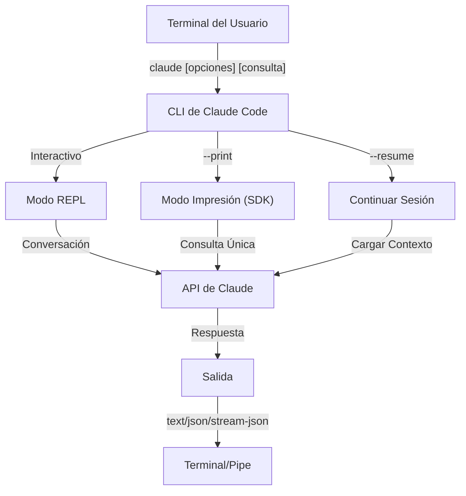
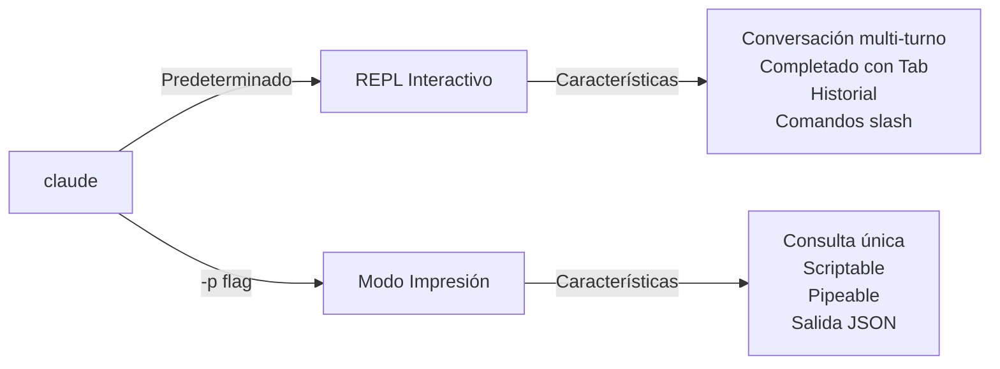

<picture>
  <source media="(prefers-color-scheme: dark)" srcset="../resources/logos/claude-howto-logo-dark.svg">
  
</picture>

# Referencia de CLI

## Descripción General

La CLI de Claude Code (Interfaz de Línea de Comandos) es la forma principal de interactuar con Claude Code. Proporciona opciones potentes para ejecutar consultas, gestionar sesiones, configurar modelos e integrar Claude en tus flujos de trabajo de desarrollo.

## Arquitectura



## Comandos de CLI

| Comando | Descripción | Ejemplo |
|---------|-------------|---------|
| `claude` | Iniciar REPL interactivo | `claude` |
| `claude "consulta"` | Iniciar REPL con prompt inicial | `claude "explica este proyecto"` |
| `claude -p "consulta"` | Modo impresión - consulta y sale | `claude -p "explica esta función"` |
| `cat archivo \| claude -p "consulta"` | Procesar contenido pipeado | `cat logs.txt \| claude -p "explica"` |
| `claude -c` | Continuar conversación más reciente | `claude -c` |
| `claude -c -p "consulta"` | Continuar en modo impresión | `claude -c -p "verifica errores de tipo"` |
| `claude -r "<sesión>" "consulta"` | Continuar sesión por ID o nombre | `claude -r "auth-refactor" "termina este PR"` |
| `claude update` | Actualizar a la última versión | `claude update` |
| `claude mcp` | Configurar servidores MCP | Ver [documentación de MCP](../05-mcp/) |
| `claude mcp serve` | Ejecutar Claude Code como servidor MCP | `claude mcp serve` |
| `claude agents` | Listar todos los subagentes configurados | `claude agents` |
| `claude auto-mode defaults` | Imprimir reglas predeterminadas de modo automático como JSON | `claude auto-mode defaults` |
| `claude remote-control` | Iniciar servidor de Control Remoto | `claude remote-control` |
| `claude plugin` | Gestionar plugins (instalar, habilitar, deshabilitar) | `claude plugin install my-plugin` |
| `claude auth login` | Iniciar sesión (soporta `--email`, `--sso`) | `claude auth login --email user@example.com` |
| `claude auth logout` | Cerrar sesión de la cuenta actual | `claude auth logout` |
| `claude auth status` | Verificar estado de autenticación (sale 0 si conectado, 1 si no) | `claude auth status` |

## Flags Principales

| Flag | Descripción | Ejemplo |
|------|-------------|---------|
| `-p, --print` | Imprimir respuesta sin modo interactivo | `claude -p "consulta"` |
| `-c, --continue` | Cargar conversación más reciente | `claude --continue` |
| `-r, --resume` | Continuar sesión específica por ID o nombre | `claude --resume auth-refactor` |
| `-v, --version` | Mostrar número de versión | `claude -v` |
| `-w, --worktree` | Iniciar en worktree de git aislado | `claude -w` |
| `-n, --name` | Nombre para mostrar de la sesión | `claude -n "auth-refactor"` |
| `--from-pr <number>` | Continuar sesiones vinculadas a PR de GitHub | `claude --from-pr 42` |
| `--remote "tarea"` | Crear sesión web en claude.ai | `claude --remote "implementar API"` |
| `--remote-control, --rc` | Sesión interactiva con Control Remoto | `claude --rc` |
| `--teleport` | Continuar sesión web localmente | `claude --teleport` |
| `--teammate-mode` | Modo de visualización de equipo de agentes | `claude --teammate-mode tmux` |
| `--bare` | Modo mínimo (omite hooks, skills, plugins, MCP, auto memoria, CLAUDE.md) | `claude --bare` |
| `--enable-auto-mode` | Desbloquear modo de permiso automático | `claude --enable-auto-mode` |
| `--channels` | Suscribirse a plugins de canales MCP | `claude --channels discord,telegram` |
| `--chrome` / `--no-chrome` | Habilitar/deshabilitar integración con navegador Chrome | `claude --chrome` |
| `--effort` | Establecer nivel de esfuerzo de pensamiento | `claude --effort high` |
| `--init` / `--init-only` | Ejecutar hooks de inicialización | `claude --init` |
| `--maintenance` | Ejecutar hooks de mantenimiento y salir | `claude --maintenance` |
| `--disable-slash-commands` | Deshabilitar todos los skills y comandos slash | `claude --disable-slash-commands` |
| `--no-session-persistence` | Deshabilitar guardado de sesión (modo impresión) | `claude -p --no-session-persistence "consulta"` |

### Modo Interactivo vs Modo Impresión



**Modo Interactivo** (predeterminado):
```bash
# Iniciar sesión interactiva
claude

# Iniciar con prompt inicial
claude "explica el flujo de autenticación"
```

**Modo Impresión** (no interactivo):
```bash
# Consulta única, luego sale
claude -p "¿qué hace esta función?"

# Procesar contenido de archivo
cat error.log | claude -p "explica este error"

# Encadenar con otras herramientas
claude -p "lista todos" | grep "URGENTE"
```

## Modelo y Configuración

| Flag | Descripción | Ejemplo |
|------|-------------|---------|
| `--model` | Establecer modelo (sonnet, opus, haiku, o nombre completo) | `claude --model opus` |
| `--fallback-model` | Fallback automático de modelo cuando hay sobrecarga | `claude -p --fallback-model sonnet "consulta"` |
| `--agent` | Especificar agente para la sesión | `claude --agent my-custom-agent` |
| `--agents` | Definir subagentes personalizados vía JSON | Ver [Configuración de Agentes](#configuración-de-agentes) |
| `--effort` | Establecer nivel de esfuerzo (low, medium, high, max) | `claude --effort high` |

### Ejemplos de Selección de Modelo

```bash
# Usar Opus 4.6 para tareas complejas
claude --model opus "diseña una estrategia de caché"

# Usar Haiku 4.5 para tareas rápidas
claude --model haiku -p "formatea este JSON"

# Nombre completo del modelo
claude --model claude-sonnet-4-6-20250929 "revisa este código"

# Con fallback para confiabilidad
claude -p --model opus --fallback-model sonnet "analiza la arquitectura"

# Usar opusplan (Opus planea, Sonnet ejecuta)
claude --model opusplan "diseña e implementa la capa de caché"
```

## Personalización del System Prompt

| Flag | Descripción | Ejemplo |
|------|-------------|---------|
| `--system-prompt` | Reemplazar todo el prompt predeterminado | `claude --system-prompt "Eres un experto en Python"` |
| `--system-prompt-file` | Cargar prompt desde archivo (modo impresión) | `claude -p --system-prompt-file ./prompt.txt "consulta"` |
| `--append-system-prompt` | Añadir al prompt predeterminado | `claude --append-system-prompt "Siempre usa TypeScript"` |

### Ejemplos de System Prompt

```bash
# Persona personalizado completo
claude --system-prompt "Eres un ingeniero de seguridad senior. Enfócate en vulnerabilidades."

# Añadir instrucciones específicas
claude --append-system-prompt "Siempre incluye tests unitarios con ejemplos de código"

# Cargar prompt complejo desde archivo
claude -p --system-prompt-file ./prompts/code-reviewer.txt "revisa main.py"
```

### Comparación de Flags de System Prompt

| Flag | Comportamiento | Interactivo | Impresión |
|------|----------|-------------|-------|
| `--system-prompt` | Reemplaza todo el system prompt predeterminado | ✅ | ✅ |
| `--system-prompt-file` | Reemplaza con prompt desde archivo | ❌ | ✅ |
| `--append-system-prompt` | Añade al system prompt predeterminado | ✅ | ✅ |

**Usa `--system-prompt-file` solo en modo impresión. Para modo interactivo, usa `--system-prompt` o `--append-system-prompt`.**

## Gestión de Herramientas y Permisos

| Flag | Descripción | Ejemplo |
|------|-------------|---------|
| `--tools` | Restringir herramientas integradas disponibles | `claude -p --tools "Bash,Edit,Read" "consulta"` |
| `--allowedTools` | Herramientas que se ejecutan sin preguntar | `"Bash(git log:*)" "Read"` |
| `--disallowedTools` | Herramientas eliminadas del contexto | `"Bash(rm:*)" "Edit"` |
| `--dangerously-skip-permissions` | Omitir todos los prompts de permiso | `claude --dangerously-skip-permissions` |
| `--permission-mode` | Iniciar en modo de permiso especificado | `claude --permission-mode auto` |
| `--permission-prompt-tool` | Herramienta MCP para gestión de permisos | `claude -p --permission-prompt-tool mcp_auth "consulta"` |
| `--enable-auto-mode` | Desbloquear modo de permiso automático | `claude --enable-auto-mode` |

### Ejemplos de Permisos

```bash
# Modo solo lectura para revisión de código
claude --permission-mode plan "revisa este código"

# Restringir solo a herramientas seguras
claude --tools "Read,Grep,Glob" -p "encuentra todos los comentarios TODO"

# Permitir comandos git específicos sin prompts
claude --allowedTools "Bash(git status:*)" "Bash(git log:*)"

# Bloquear operaciones peligrosas
claude --disallowedTools "Bash(rm -rf:*)" "Bash(git push --force:*)"
```

## Salida y Formato

| Flag | Descripción | Opciones | Ejemplo |
|------|-------------|---------|---------|
| `--output-format` | Especificar formato de salida (modo impresión) | `text`, `json`, `stream-json` | `claude -p --output-format json "consulta"` |
| `--input-format` | Especificar formato de entrada (modo impresión) | `text`, `stream-json` | `claude -p --input-format stream-json` |
| `--verbose` | Habilitar logging detallado | | `claude --verbose` |
| `--include-partial-messages` | Incluir eventos de streaming | Requiere `stream-json` | `claude -p --output-format stream-json --include-partial-messages "consulta"` |
| `--json-schema` | Obtener JSON validado que coincide con el schema | | `claude -p --json-schema '{"type":"object"}' "consulta"` |
| `--max-budget-usd` | Gasto máximo para modo impresión | | `claude -p --max-budget-usd 5.00 "consulta"` |

### Ejemplos de Formato de Salida

```bash
# Texto plano (predeterminado)
claude -p "explica este código"

# JSON para uso programático
claude -p --output-format json "lista todas las funciones en main.py"

# JSON streaming para procesamiento en tiempo real
claude -p --output-format stream-json "genera un reporte largo"

# Salida estructurada con validación de schema
claude -p --json-schema '{"type":"object","properties":{"bugs":{"type":"array"}}}' \
  "encuentra bugs en este código y devuelve como JSON"
```

## Espacio de Trabajo y Directorio

| Flag | Descripción | Ejemplo |
|------|-------------|---------|
| `--add-dir` | Añadir directorios de trabajo adicionales | `claude --add-dir ../apps ../lib` |
| `--setting-sources` | Fuentes de configuración separadas por comas | `claude --setting-sources user,project` |
| `--settings` | Cargar configuración desde archivo o JSON | `claude --settings ./settings.json` |
| `--plugin-dir` | Cargar plugins desde directorio (repetible) | `claude --plugin-dir ./my-plugin` |

### Ejemplo de Multi-Directorio

```bash
# Trabajar a través de múltiples directorios del proyecto
claude --add-dir ../frontend ../backend ../shared "encuentra todos los endpoints de API"

# Cargar configuración personalizada
claude --settings '{"model":"opus","verbose":true}' "tarea compleja"
```

## Configuración de MCP

| Flag | Descripción | Ejemplo |
|------|-------------|---------|
| `--mcp-config` | Cargar servidores MCP desde JSON | `claude --mcp-config ./mcp.json` |
| `--strict-mcp-config` | Usar solo la configuración MCP especificada | `claude --strict-mcp-config --mcp-config ./mcp.json` |
| `--channels` | Suscribirse a plugins de canales MCP | `claude --channels discord,telegram` |

### Ejemplos de MCP

```bash
# Cargar servidor MCP de GitHub
claude --mcp-config ./github-mcp.json "lista PRs abiertos"

# Modo estricto - solo servidores especificados
claude --strict-mcp-config --mcp-config ./production-mcp.json "despliega a staging"
```

## Gestión de Sesiones

| Flag | Descripción | Ejemplo |
|------|-------------|---------|
| `--session-id` | Usar ID de sesión específica (UUID) | `claude --session-id "550e8400-..."` |
| `--fork-session` | Crear nueva sesión al continuar | `claude --resume abc123 --fork-session` |

### Ejemplos de Sesión

```bash
# Continuar última conversación
claude -c

# Continuar sesión con nombre
claude -r "feature-auth" "continúa implementando login"

# Bifurcar sesión para experimentación
claude --resume feature-auth --fork-session "prueba enfoque alternativo"

# Usar ID de sesión específica
claude --session-id "550e8400-e29b-41d4-a716-446655440000" "continúa"
```

### Bifurcación de Sesión

Crea una rama desde una sesión existente para experimentación:

```bash
# Bifurcar una sesión para probar un enfoque diferente
claude --resume abc123 --fork-session "prueba implementación alternativa"

# Bifurcar con un mensaje personalizado
claude -r "feature-auth" --fork-session "prueba con diferente arquitectura"
```

**Casos de Uso:**
- Probar implementaciones alternativas sin perder la sesión original
- Experimentar con diferentes enfoques en paralelo
- Crear ramas desde trabajo exitoso para variaciones
- Probar cambios disruptivos sin afectar la sesión principal

La sesión original permanece sin cambios, y la bifurcación se convierte en una nueva sesión independiente.

## Características Avanzadas

| Flag | Descripción | Ejemplo |
|------|-------------|---------|
| `--chrome` | Habilitar integración con navegador Chrome | `claude --chrome` |
| `--no-chrome` | Deshabilitar integración con navegador Chrome | `claude --no-chrome` |
| `--ide` | Auto-conectar a IDE si está disponible | `claude --ide` |
| `--max-turns` | Limitar turnos agénticos (no interactivo) | `claude -p --max-turns 3 "consulta"` |
| `--debug` | Habilitar modo debug con filtrado | `claude --debug "api,mcp"` |
| `--enable-lsp-logging` | Habilitar logging detallado de LSP | `claude --enable-lsp-logging` |
| `--betas` | Headers beta para solicitudes de API | `claude --betas interleaved-thinking` |
| `--plugin-dir` | Cargar plugins desde directorio (repetible) | `claude --plugin-dir ./my-plugin` |
| `--enable-auto-mode` | Desbloquear modo de permiso automático | `claude --enable-auto-mode` |
| `--effort` | Establecer nivel de esfuerzo de pensamiento | `claude --effort high` |
| `--bare` | Modo mínimo (omite hooks, skills, plugins, MCP, auto memoria, CLAUDE.md) | `claude --bare` |
| `--channels` | Suscribirse a plugins de canales MCP | `claude --channels discord` |
| `--fork-session` | Crear nuevo ID de sesión al continuar | `claude --resume abc --fork-session` |
| `--max-budget-usd` | Gasto máximo (modo impresión) | `claude -p --max-budget-usd 5.00 "consulta"` |
| `--json-schema` | Salida JSON validada | `claude -p --json-schema '{"type":"object"}' "q"` |

### Ejemplos Avanzados

```bash
# Limitar acciones autónomas
claude -p --max-turns 5 "refactoriza este módulo"

# Depurar llamadas a API
claude --debug "api" "consulta de prueba"

# Habilitar integración con IDE
claude --ide "ayúdame con este archivo"
```

## Configuración de Agentes

El flag `--agents` acepta un objeto JSON definiendo subagentes personalizados para una sesión.

### Formato JSON de Agentes

```json
{
  "agent-name": {
    "description": "Requerido: cuándo invocar este agente",
    "prompt": "Requerido: system prompt para el agente",
    "tools": ["Opcional", "array", "de", "herramientas"],
    "model": "opcional: sonnet|opus|haiku"
  }
}
```

**Campos Requeridos:**
- `description` - Descripción en lenguaje natural de cuándo usar este agente
- `prompt` - System prompt que define el rol y comportamiento del agente

**Campos Opcionales:**
- `tools` - Array de herramientas disponibles (hereda todas si se omite)
  - Formato: `["Read", "Grep", "Glob", "Bash"]`
- `model` - Modelo a usar: `sonnet`, `opus`, o `haiku`

### Ejemplo Completo de Agentes

```json
{
  "code-reviewer": {
    "description": "Experto revisor de código. Usar proactivamente después de cambios de código.",
    "prompt": "Eres un revisor de código senior. Enfócate en calidad de código, seguridad y mejores prácticas.",
    "tools": ["Read", "Grep", "Glob", "Bash"],
    "model": "sonnet"
  },
  "debugger": {
    "description": "Especialista en debugging para errores y fallos de tests.",
    "prompt": "Eres un experto debugger. Analiza errores, identifica causas raíz y proporciona correcciones.",
    "tools": ["Read", "Edit", "Bash", "Grep"],
    "model": "opus"
  },
  "documenter": {
    "description": "Especialista en documentación para generar guías.",
    "prompt": "Eres un escritor técnico. Crea documentación clara y completa.",
    "tools": ["Read", "Write"],
    "model": "haiku"
  }
}
```

### Ejemplos de Comandos de Agentes

```bash
# Definir agentes personalizados en línea
claude --agents '{
  "security-auditor": {
    "description": "Especialista en seguridad para análisis de vulnerabilidades",
    "prompt": "Eres un experto en seguridad. Encuentra vulnerabilidades y sugiere correcciones.",
    "tools": ["Read", "Grep", "Glob"],
    "model": "opus"
  }
}' "audita este código en busca de problemas de seguridad"

# Cargar agentes desde archivo
claude --agents "$(cat ~/.claude/agents.json)" "revisa el módulo de autenticación"

# Combinar con otros flags
claude -p --agents "$(cat agents.json)" --model sonnet "analiza el rendimiento"
```

### Prioridad de Agentes

Cuando existen múltiples definiciones de agentes, se cargan en este orden de prioridad:
1. **Definido en CLI** (flag `--agents`) - Específico de la sesión
2. **Nivel de usuario** (`~/.claude/agents/`) - Todos los proyectos
3. **Nivel de proyecto** (`.claude/agents/`) - Proyecto actual

Los agentes definidos en CLI anulan tanto los agentes de usuario como de proyecto para la sesión.

---

## Casos de Uso de Alto Valor

### 1. Integración con CI/CD

Usa Claude Code en tus pipelines de CI/CD para revisión de código automatizada, testing y documentación.

**Ejemplo de GitHub Actions:**

```yaml
name: AI Code Review

on: [pull_request]

jobs:
  review:
    runs-on: ubuntu-latest
    steps:
      - uses: actions/checkout@v4

      - name: Install Claude Code
        run: npm install -g @anthropic-ai/claude-code

      - name: Run Code Review
        env:
          ANTHROPIC_API_KEY: ${{ secrets.ANTHROPIC_API_KEY }}
        run: |
          claude -p --output-format json \
            --max-turns 1 \
            "Review the changes in this PR for:
            - Security vulnerabilities
            - Performance issues
            - Code quality
            Output as JSON with 'issues' array" > review.json

      - name: Post Review Comment
        uses: actions/github-script@v7
        with:
          script: |
            const fs = require('fs');
            const review = JSON.parse(fs.readFileSync('review.json', 'utf8'));
            // Process and post review comments
```

**Pipeline de Jenkins:**

```groovy
pipeline {
    agent any
    stages {
        stage('AI Review') {
            steps {
                sh '''
                    claude -p --output-format json \
                      --max-turns 3 \
                      "Analyze test coverage and suggest missing tests" \
                      > coverage-analysis.json
                '''
            }
        }
    }
}
```

### 2. Piping de Scripts

Procesa archivos, logs y datos a través de Claude para análisis.

**Análisis de Logs:**

```bash
# Analizar logs de error
tail -1000 /var/log/app/error.log | claude -p "resume estos errores y sugiere correcciones"

# Encontrar patrones en logs de acceso
cat access.log | claude -p "identifica patrones de acceso sospechosos"

# Analizar historial de git
git log --oneline -50 | claude -p "resume la actividad de desarrollo reciente"
```

**Procesamiento de Código:**

```bash
# Revisar un archivo específico
cat src/auth.ts | claude -p "revisa este código de autenticación en busca de problemas de seguridad"

# Generar documentación
cat src/api/*.ts | claude -p "genera documentación de API en markdown"

# Encontrar TODOs y priorizar
grep -r "TODO" src/ | claude -p "prioriza estos TODOs por importancia"
```

### 3. Flujos de Trabajo Multi-Sesión

Gestiona proyectos complejos con múltiples hilos de conversación.

```bash
# Iniciar sesión de rama de feature
claude -r "feature-auth" "implementemos autenticación de usuarios"

# Más tarde, continuar la sesión
claude -r "feature-auth" "añade funcionalidad de restablecimiento de contraseña"

# Bifurcar para probar un enfoque alternativo
claude --resume feature-auth --fork-session "prueba OAuth en su lugar"

# Cambiar entre diferentes sesiones de feature
claude -r "feature-payments" "continúa con la integración de Stripe"
```

### 4. Configuración Personalizada de Agentes

Define agentes especializados para los flujos de trabajo de tu equipo.

```bash
# Guardar configuración de agentes en archivo
cat > ~/.claude/agents.json << 'EOF'
{
  "reviewer": {
    "description": "Revisor de código para PR reviews",
    "prompt": "Revisa código para calidad, seguridad y mantenibilidad.",
    "model": "opus"
  },
  "documenter": {
    "description": "Especialista en documentación",
    "prompt": "Genera documentación clara y completa.",
    "model": "sonnet"
  },
  "refactorer": {
    "description": "Experto en refactorización de código",
    "prompt": "Sugiere e implementa refactorización de código limpio.",
    "tools": ["Read", "Edit", "Glob"]
  }
}
EOF

# Usar agentes en sesión
claude --agents "$(cat ~/.claude/agents.json)" "revisa el módulo de autenticación"
```

### 5. Procesamiento por Lotes

Procesa múltiples consultas con configuraciones consistentes.

```bash
# Procesar múltiples archivos
for file in src/*.ts; do
  echo "Procesando $file..."
  claude -p --model haiku "resume este archivo: $(cat $file)" >> summaries.md
done

# Revisión de código por lotes
find src -name "*.py" -exec sh -c '
  echo "## $1" >> review.md
  cat "$1" | claude -p "revisión breve de código" >> review.md
' _ {} \;

# Generar tests para todos los módulos
for module in $(ls src/modules/); do
  claude -p "genera tests unitarios para src/modules/$module" > "tests/$module.test.ts"
done
```

### 6. Desarrollo con Conciencia de Seguridad

Usa controles de permisos para operación segura.

```bash
# Auditoría de seguridad solo lectura
claude --permission-mode plan \
  --tools "Read,Grep,Glob" \
  "audita este código en busca de vulnerabilidades de seguridad"

# Bloquear comandos peligrosos
claude --disallowedTools "Bash(rm:*)" "Bash(curl:*)" "Bash(wget:*)" \
  "ayúdame a limpiar este proyecto"

# Automatización restringida
claude -p --max-turns 2 \
  --allowedTools "Read" "Glob" \
  "encuentra todas las credenciales hardcodeadas"
```

### 7. Integración con API JSON

Usa Claude como una API programática para tus herramientas con parsing `jq`.

```bash
# Obtener análisis estructurado
claude -p --output-format json \
  --json-schema '{"type":"object","properties":{"functions":{"type":"array"},"complexity":{"type":"string"}}}' \
  "analiza main.py y devuelve lista de funciones con rating de complejidad"

# Integrar con jq para procesamiento
claude -p --output-format json "lista todos los endpoints de API" | jq '.endpoints[]'

# Usar en scripts
RESULT=$(claude -p --output-format json "¿este código es seguro? responde con {secure: boolean, issues: []}" < code.py)
if echo "$RESULT" | jq -e '.secure == false' > /dev/null; then
  echo "¡Se encontraron problemas de seguridad!"
  echo "$RESULT" | jq '.issues[]'
fi
```

### Ejemplos de Parsing con jq

Procesa y analiza la salida JSON de Claude usando `jq`:

```bash
# Extraer campos específicos
claude -p --output-format json "analiza este código" | jq '.result'

# Filtrar elementos de array
claude -p --output-format json "lista problemas" | jq -r '.issues[] | select(.severity=="high")'

# Extraer múltiples campos
claude -p --output-format json "describe el proyecto" | jq -r '.{name, version, description}'

# Convertir a CSV
claude -p --output-format json "lista funciones" | jq -r '.functions[] | [.name, .lineCount] | @csv'

# Procesamiento condicional
claude -p --output-format json "verifica seguridad" | jq 'if .vulnerabilities | length > 0 then "UNSAFE" else "SAFE" end'

# Extraer valores anidados
claude -p --output-format json "analiza rendimiento" | jq '.metrics.cpu.usage'

# Procesar array completo
claude -p --output-format json "encuentra todos" | jq '.todos | length'

# Transformar salida
claude -p --output-format json "lista mejoras" | jq 'map({title: .title, priority: .priority})'
```

---

## Modelos

Claude Code soporta múltiples modelos con diferentes capacidades:

| Modelo | ID | Ventana de Contexto | Notas |
|-------|-----|----------------|-------|
| Opus 4.6 | `claude-opus-4-6` | 1M tokens | Más capaz, niveles de esfuerzo adaptativos |
| Sonnet 4.6 | `claude-sonnet-4-6` | 1M tokens | Equilibrio entre velocidad y capacidad |
| Haiku 4.5 | `claude-haiku-4-5` | 1M tokens | Más rápido, mejor para tareas rápidas |

### Selección de Modelo

```bash
# Usar nombres cortos
claude --model opus "revisión arquitectónica compleja"
claude --model sonnet "implementa esta feature"
claude --model haiku -p "formatea este JSON"

# Usar alias opusplan (Opus planea, Sonnet ejecuta)
claude --model opusplan "diseña e implementa la API"

# Alternar modo rápido durante la sesión
/fast
```

### Niveles de Esfuerzo (Opus 4.6)

Opus 4.6 soporta razonamiento adaptativo con niveles de esfuerzo:

```bash
# Establecer nivel de esfuerzo vía flag de CLI
claude --effort high "revisión compleja"

# Establecer nivel de esfuerzo vía comando slash
/effort high

# Establecer nivel de esfuerzo vía variable de entorno
export CLAUDE_CODE_EFFORT_LEVEL=high   # low, medium, high, o max (solo Opus 4.6)
```

La palabra clave "ultrathink" en prompts activa razonamiento profundo. El nivel de esfuerzo `max` es exclusivo de Opus 4.6.

---

## Variables de Entorno Clave

| Variable | Descripción |
|----------|-------------|
| `ANTHROPIC_API_KEY` | Clave de API para autenticación |
| `ANTHROPIC_MODEL` | Anular modelo predeterminado |
| `ANTHROPIC_CUSTOM_MODEL_OPTION` | Opción de modelo personalizado para API |
| `ANTHROPIC_DEFAULT_OPUS_MODEL` | Anular ID de modelo Opus predeterminado |
| `ANTHROPIC_DEFAULT_SONNET_MODEL` | Anular ID de modelo Sonnet predeterminado |
| `ANTHROPIC_DEFAULT_HAIKU_MODEL` | Anular ID de modelo Haiku predeterminado |
| `MAX_THINKING_TOKENS` | Establecer presupuesto de tokens de pensamiento extendido |
| `CLAUDE_CODE_EFFORT_LEVEL` | Establecer nivel de esfuerzo (`low`/`medium`/`high`/`max`) |
| `CLAUDE_CODE_SIMPLE` | Modo mínimo, establecido por el flag `--bare` |
| `CLAUDE_CODE_DISABLE_AUTO_MEMORY` | Deshabilitar actualizaciones automáticas de CLAUDE.md |
| `CLAUDE_CODE_DISABLE_BACKGROUND_TASKS` | Deshabilitar ejecución de tareas en segundo plano |
| `CLAUDE_CODE_DISABLE_CRON` | Deshabilitar tareas programadas/cron |
| `CLAUDE_CODE_DISABLE_GIT_INSTRUCTIONS` | Deshabilitar instrucciones relacionadas con git |
| `CLAUDE_CODE_DISABLE_TERMINAL_TITLE` | Deshabilitar actualizaciones de título de terminal |
| `CLAUDE_CODE_DISABLE_1M_CONTEXT` | Deshabilitar ventana de contexto de 1M tokens |
| `CLAUDE_CODE_DISABLE_NONSTREAMING_FALLBACK` | Deshabilitar fallback sin streaming |
| `CLAUDE_CODE_ENABLE_TASKS` | Habilitar feature de lista de tareas |
| `CLAUDE_CODE_TASK_LIST_ID` | Directorio de tareas con nombre compartido entre sesiones |
| `CLAUDE_CODE_ENABLE_PROMPT_SUGGESTION` | Alternar sugerencias de prompt (`true`/`false`) |
| `CLAUDE_CODE_EXPERIMENTAL_AGENT_TEAMS` | Habilitar equipos de agentes experimentales |
| `CLAUDE_CODE_NEW_INIT` | Usar nuevo flujo de inicialización |
| `CLAUDE_CODE_SUBAGENT_MODEL` | Modelo para ejecución de subagentes |
| `CLAUDE_CODE_PLUGIN_SEED_DIR` | Directorio para archivos seed de plugins |
| `CLAUDE_CODE_SUBPROCESS_ENV_SCRUB` | Variables de entorno para limpiar de subprocesos |
| `CLAUDE_AUTOCOMPACT_PCT_OVERRIDE` | Anular porcentaje de auto-compactación |
| `CLAUDE_STREAM_IDLE_TIMEOUT_MS` | Timeout de inactividad de stream en milisegundos |
| `SLASH_COMMAND_TOOL_CHAR_BUDGET` | Presupuesto de caracteres para herramientas de comando slash |
| `ENABLE_TOOL_SEARCH` | Habilitar capacidad de búsqueda de herramientas |
| `MAX_MCP_OUTPUT_TOKENS` | Máximo de tokens para salida de herramienta MCP |

---

## Referencia Rápida

### Comandos Más Comunes

```bash
# Sesión interactiva
claude

# Pregunta rápida
claude -p "cómo..."

# Continuar conversación
claude -c

# Procesar un archivo
cat file.py | claude -p "revisa esto"

# Salida JSON para scripts
claude -p --output-format json "consulta"
```

### Combinaciones de Flags

| Caso de Uso | Comando |
|----------|---------|
| Revisión rápida de código | `cat archivo | claude -p "revisa"` |
| Salida estructurada | `claude -p --output-format json "consulta"` |
| Exploración segura | `claude --permission-mode plan` |
| Autónomo con seguridad | `claude --enable-auto-mode --permission-mode auto` |
| Integración CI/CD | `claude -p --max-turns 3 --output-format json` |
| Continuar trabajo | `claude -r "nombre-sesion"` |
| Modelo personalizado | `claude --model opus "tarea compleja"` |
| Modo mínimo | `claude --bare "consulta rápida"` |
| Ejecución con límite de presupuesto | `claude -p --max-budget-usd 2.00 "analiza código"` |

---

## Solución de Problemas

### Comando No Encontrado

**Problema:** `claude: command not found`

**Soluciones:**
- Instalar Claude Code: `npm install -g @anthropic-ai/claude-code`
- Verificar que PATH incluye el directorio bin global de npm
- Intentar ejecutar con ruta completa: `npx claude`

### Problemas de Clave de API

**Problema:** Autenticación fallida

**Soluciones:**
- Establecer clave de API: `export ANTHROPIC_API_KEY=tu-clave`
- Verificar que la clave es válida y tiene créditos suficientes
- Verificar permisos de clave para el modelo solicitado

### Sesión No Encontrada

**Problema:** No se puede continuar la sesión

**Soluciones:**
- Listar sesiones disponibles para encontrar el nombre/ID correcto
- Las sesiones pueden expirar después de un período de inactividad
- Usar `-c` para continuar la sesión más reciente

### Problemas de Formato de Salida

**Problema:** La salida JSON está mal formada

**Soluciones:**
- Usar `--json-schema` para forzar estructura
- Añadir instrucciones explícitas de JSON en el prompt
- Usar `--output-format json` (no solo pedir JSON en el prompt)

### Permiso Denegado

**Problema:** Ejecución de herramienta bloqueada

**Soluciones:**
- Verificar configuración de `--permission-mode`
- Revisar flags `--allowedTools` y `--disallowedTools`
- Usar `--dangerously-skip-permissions` para automatización (con precaución)

---

## Recursos Adicionales

- **[Referencia Oficial de CLI](https://code.claude.com/docs/en/cli-reference)** - Referencia completa de comandos
- **[Documentación de Modo Headless](https://code.claude.com/docs/en/headless)** - Ejecución automatizada
- **[Comandos Slash](../01-slash-commands/)** - Atajos personalizados dentro de Claude
- **[Guía de Memoria](../02-memory/)** - Contexto persistente vía CLAUDE.md
- **[Protocolo MCP](../05-mcp/)** - Integraciones de herramientas externas
- **[Características Avanzadas](../09-advanced-features/)** - Modo planificación, pensamiento extendido
- **[Guía de Subagentes](../04-subagents/)** - Ejecución de tareas delegadas

---

*Parte de la serie de guías [Claude How To](../)*
