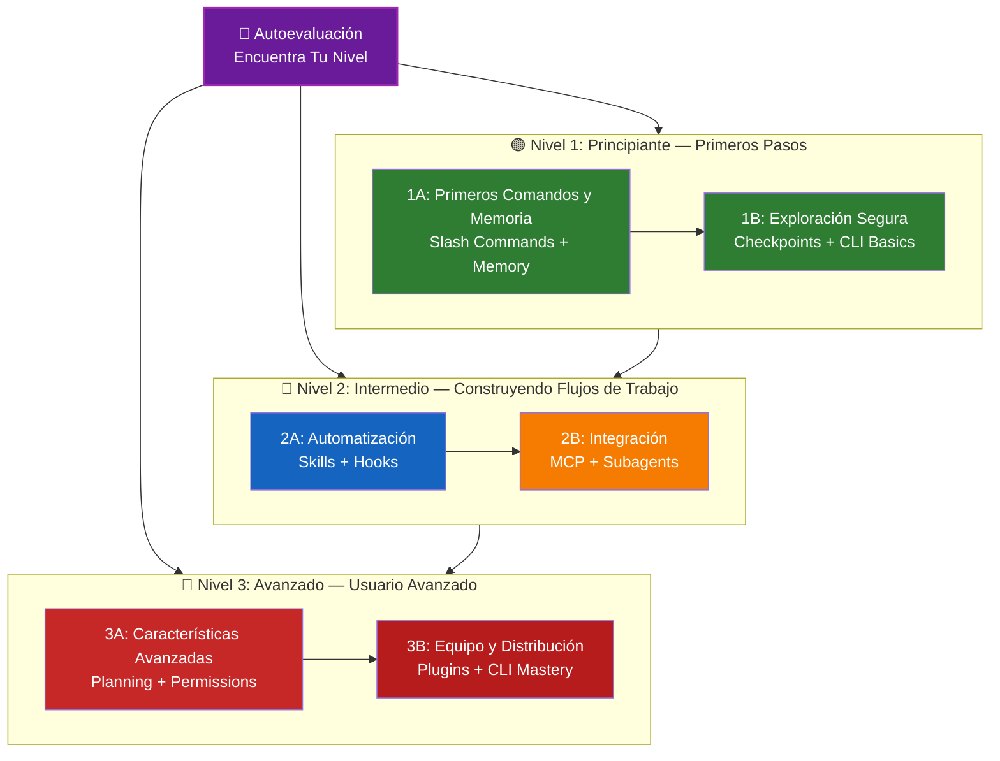

<picture>
  <source media="(prefers-color-scheme: dark)" srcset="resources/logos/domina-claude-code-logo-dark.svg">
  
</picture>

# 📚 Ruta de Aprendizaje de Claude Code

**¿Eres nuevo en Claude Code?** Esta guía te ayuda a dominar las características de Claude Code a tu propio ritmo. Ya seas un principiante completo o un desarrollador experimentado, comienza con la autoevaluación a continuación para encontrar el camino adecuado para ti.

---

## 🧭 Encuentra Tu Nivel

No todos comienzan desde el mismo lugar. Toma esta rápida autoevaluación para encontrar el punto de entrada adecuado.

**Responde estas preguntas honestamente:**

- [ ] Puedo iniciar Claude Code y tener una conversación (`claude`)
- [ ] He creado o editado un archivo CLAUDE.md
- [ ] He usado al menos 3 Slash Commands integrados (por ejemplo, /help, /compact, /model)
- [ ] He creado un Slash Command personalizado o Skill (SKILL.md)
- [ ] He configurado un servidor MCP (por ejemplo, GitHub, base de datos)
- [ ] He configurado hooks en ~/.claude/settings.json
- [ ] He creado o usado Subagents personalizados (.claude/agents/)
- [ ] He usado el modo print (`claude -p`) para scripting o CI/CD

**Tu Nivel:**

| Verificaciones | Nivel | Comienza Aquí | Tiempo para Completar |
|--------|-------|----------|------------------|
| 0-2 | **Nivel 1: Principiante** — Primeros Pasos | [Hito 1A](#milestone-1a-primeros-comandos--memoria) | ~3 horas |
| 3-5 | **Nivel 2: Intermedio** — Construyendo Flujos de Trabajo | [Hito 2A](#milestone-2a-automatización-skills--hooks) | ~5 horas |
| 6-8 | **Nivel 3: Avanzado** — Usuario Avanzado y Líder de Equipo | [Hito 3A](#milestone-3a-características-avanzadas) | ~5 horas |

> **Consejo**: Si no estás seguro, comienza un nivel más abajo. Es mejor repasar material familiar rápidamente que perderse conceptos fundamentales.

> **Versión interactiva**: Ejecuta `/self-assessment` en Claude Code para una evaluación interactiva guiada que califica tu competencia en las 10 áreas de características y genera una ruta de aprendizaje personalizada.

---

## 🎯 Filosofía de Aprendizaje

Las carpetas en este repositorio están numeradas en el **orden de aprendizaje recomendado** basado en tres principios clave:

1. **Dependencias** - Los conceptos fundamentales van primero
2. **Complejidad** - Características más fáciles antes que las avanzadas
3. **Frecuencia de Uso** - Las características más comunes se enseñan temprano

Este enfoque asegura que construyas una base sólida mientras obtienes beneficios de productividad inmediatos.

---

## 🗺️ Tu Ruta de Aprendizaje



**Leyenda de Colores:**
- 💜 Morado: Autoevaluación
- 🟢 Verde: Nivel 1 — Camino de principiante
- 🔵 Azul / 🟡 Dorado: Nivel 2 — Camino intermedio
- 🔴 Rojo: Nivel 3 — Camino avanzado

---

## 📊 Tabla Completa de la Ruta de Aprendizaje

| Paso | Característica | Complejidad | Tiempo | Nivel | Dependencias | Por Qué Aprender Esto | Beneficios Clave |
|------|---------|-----------|------|-------|--------------|----------------|--------------|
| **1** | [Slash Commands](01-slash-commands/) | ⭐ Principiante | 30 min | Nivel 1 | Ninguna | Ventajas rápidas de productividad (55+ integrados + 5 Skills empaquetados) | Automatización instantánea, estándares de equipo |
| **2** | [Memory](02-memory/) | ⭐⭐ Principiante+ | 45 min | Nivel 1 | Ninguna | Esencial para todas las características | Contexto persistente, preferencias |
| **3** | [Checkpoints](08-checkpoints/) | ⭐⭐ Intermedio | 45 min | Nivel 1 | Session management | Exploración segura | Experimentación, recuperación |
| **4** | [CLI Basics](10-cli/) | ⭐⭐ Principiante+ | 30 min | Nivel 1 | Ninguna | Uso básico de CLI | Modo interactivo y print |
| **5** | [Skills](03-skills/) | ⭐⭐ Intermedio | 1 hora | Nivel 2 | Slash Commands | Experiencia automática | Capacidades reutilizables, consistencia |
| **6** | [Hooks](06-hooks/) | ⭐⭐ Intermedio | 1 hora | Nivel 2 | Tools, Commands | Automatización de flujo de trabajo (25 eventos, 4 tipos) | Validación, puertas de calidad |
| **7** | [MCP](05-mcp/) | ⭐⭐⭐ Intermedio+ | 1 hora | Nivel 2 | Configuración | Acceso a datos en vivo | Integración en tiempo real, APIs |
| **8** | [Subagents](04-subagents/) | ⭐⭐⭐ Intermedio+ | 1.5 horas | Nivel 2 | Memory, Commands | Manejo de tareas complejas (6 integrados incluyendo Bash) | Delegación, experiencia especializada |
| **9** | [Advanced Features](09-advanced-features/) | ⭐⭐⭐⭐⭐ Avanzado | 2-3 horas | Nivel 3 | Todas las anteriores | Herramientas de usuario avanzado | Planning, Auto Mode, Channels, Dictado por Voz, permisos |
| **10** | [Plugins](07-plugins/) | ⭐⭐⭐⭐ Avanzado | 2 horas | Nivel 3 | Todas las anteriores | Soluciones completas | Incorporación de equipo, distribución |
| **11** | [CLI Mastery](10-cli/) | ⭐⭐⭐ Avanzado | 1 hora | Nivel 3 | Recomendado: Todas | Dominio del uso de línea de comandos | Scripting, CI/CD, automatización |

**Tiempo Total de Aprendizaje**: ~11-13 horas (o salta a tu nivel y ahorra tiempo)

---

## 🟢 Nivel 1: Principiante — Primeros Pasos

**Para**: Usuarios con 0-2 verificaciones en el cuestionario
**Tiempo**: ~3 horas
**Enfoque**: Productividad inmediata, comprensión de fundamentos
**Resultado**: Usuario diario cómodo, listo para Nivel 2

### Hito 1A: Primeros Comandos y Memoria

**Temas**: Slash Commands + Memory
**Tiempo**: 1-2 horas
**Complejidad**: ⭐ Principiante
**Objetivo**: Aumento inmediato de productividad con comandos personalizados y contexto persistente

#### Lo Que Lograrás
✅ Crear Slash Commands personalizados para tareas repetitivas
✅ Configurar memoria del proyecto para estándares de equipo
✅ Configurar preferencias personales
✅ Comprender cómo Claude carga el contexto automáticamente

#### Ejercicios Prácticos

```bash
# Ejercicio 1: Instala tu primer Slash Command
mkdir -p .claude/commands
cp 01-slash-commands/optimize.md .claude/commands/

# Ejercicio 2: Crea memoria del proyecto
cp 02-memory/project-CLAUDE.md ./CLAUDE.md

# Ejercicio 3: Pruébalo
# En Claude Code, escribe: /optimize
```

#### Criterios de Éxito
- [ ] Invocar exitosamente el comando `/optimize`
- [ ] Claude recuerda los estándares de tu proyecto desde CLAUDE.md
- [ ] Comprendes cuándo usar Slash Commands vs. memoria

#### Próximos Pasos
Una vez que te sientas cómodo, lee:
- [01-slash-commands/README.md](01-slash-commands/README.md)
- [02-memory/README.md](02-memory/README.md)

> **Verifica tu comprensión**: Ejecuta `/lesson-quiz slash-commands` o `/lesson-quiz memory` en Claude Code para poner a prueba lo que has aprendido.

---

### Hito 1B: Exploración Segura

**Temas**: Checkpoints + CLI Basics
**Tiempo**: 1 hora
**Complejidad**: ⭐⭐ Principiante+
**Objetivo**: Aprender a experimentar de forma segura y usar comandos básicos de CLI

#### Lo Que Lograrás
✅ Crear y restaurar Checkpoints para experimentación segura
✅ Comprender el modo interactivo vs. print mode
✅ Usar banderas y opciones básicas de CLI
✅ Procesar archivos mediante tuberías (piping)

#### Ejercicios Prácticos

```bash
# Ejercicio 1: Prueba el flujo de trabajo de Checkpoints
# En Claude Code:
# Realiza algunos cambios experimentales, luego presiona Esc+Esc o usa /rewind
# Selecciona el checkpoint antes de tu experimento
# Elige "Restore code and conversation" para regresar

# Ejercicio 2: Modo interactivo vs Print mode
claude "explain this Project"           # Modo interactivo
claude -p "explain this function"       # Print mode (no interactivo)

# Ejercicio 3: Procesar contenido de archivo mediante tuberías
cat error.log | claude -p "explain this error"
```

#### Criterios de Éxito
- [ ] Creado y revertido a un checkpoint
- [ ] Usado tanto modo interactivo como print mode
- [ ] Enviado un archivo a Claude para análisis mediante tubería
- [ ] Comprendes cuándo usar Checkpoints para experimentación segura

#### Próximos Pasos
- Lee: [08-checkpoints/README.md](08-checkpoints/README.md)
- Lee: [10-cli/README.md](10-cli/README.md)
- **¡Listo para Nivel 2!** Continúa en [Hito 2A](#milestone-2a-automatización-skills--hooks)

> **Verifica tu comprensión**: Ejecuta `/lesson-quiz checkpoints` o `/lesson-quiz cli` para verificar que estás listo para Nivel 2.

---

## 🔵 Nivel 2: Intermedio — Construyendo Flujos de Trabajo

**Para**: Usuarios con 3-5 verificaciones en el cuestionario
**Tiempo**: ~5 horas
**Enfoque**: Automatización, integración, delegación de tareas
**Resultado**: Flujos de trabajo automatizados, integraciones externas, listo para Nivel 3

### Verificación de Prerrequisitos

Antes de comenzar el Nivel 2, asegúrate de sentirte cómodo con estos conceptos del Nivel 1:

- [ ] Puedes crear y usar Slash Commands ([01-slash-commands/](01-slash-commands/))
- [ ] Has configurado memoria del proyecto vía CLAUDE.md ([02-memory/](02-memory/))
- [ ] Sabes cómo crear y restaurar Checkpoints ([08-checkpoints/](08-checkpoints/))
- [ ] Puedes usar `claude` y `claude -p` desde la línea de comandos ([10-cli/](10-cli/))

> **¿Brechas?** Revisa los tutoriales enlazados arriba antes de continuar.

---

### Hito 2A: Automatización (Skills + Hooks)

**Temas**: Skills + Hooks
**Tiempo**: 2-3 horas
**Complejidad**: ⭐⭐ Intermedio
**Objetivo**: Automatizar flujos de trabajo comunes y verificaciones de calidad

#### Lo Que Lograrás
✅ Auto-invocar capacidades especializadas con frontmatter YAML (incluyendo campos `effort` y `shell`)
✅ Configurar automatización basada en eventos en 25 eventos de hook
✅ Usar los 4 tipos de hooks (command, http, prompt, agent)
✅ Aplicar estándares de calidad de código
✅ Crear hooks personalizados para tu flujo de trabajo

#### Ejercicios Prácticos

```bash
# Ejercicio 1: Instala un Skill
cp -r 03-skills/code-review ~/.claude/skills/

# Ejercicio 2: Configura hooks
mkdir -p ~/.claude/hooks
cp 06-hooks/pre-tool-check.sh ~/.claude/hooks/
chmod +x ~/.claude/hooks/pre-tool-check.sh

# Ejercicio 3: Configura hooks en settings
# Agrega a ~/.claude/settings.json:
{
  "hooks": {
    "PreToolUse": [
      {
        "matcher": "Bash",
        "hooks": [
          {
            "type": "command",
            "command": "~/.claude/hooks/pre-tool-check.sh"
          }
        ]
      }
    ]
  }
}
```

#### Criterios de Éxito
- [ ] Skill de revisión de código invocado automáticamente cuando es relevante
- [ ] Hook PreToolUse se ejecuta antes de la ejecución de herramientas
- [ ] Comprendes la diferencia entre auto-invocación de Skills y activadores de eventos de hooks

#### Próximos Pasos
- Crea tu propio Skill personalizado
- Configura hooks adicionales para tu flujo de trabajo
- Lee: [03-skills/README.md](03-skills/README.md)
- Lee: [06-hooks/README.md](06-hooks/README.md)

> **Verifica tu comprensión**: Ejecuta `/lesson-quiz skills` o `/lesson-quiz hooks` para poner a prueba tu conocimiento antes de continuar.

---

### Hito 2B: Integración (MCP + Subagents)

**Temas**: MCP + Subagents
**Tiempo**: 2-3 horas
**Complejidad**: ⭐⭐⭐ Intermedio+
**Objetivo**: Integrar servicios externos y delegar tareas complejas

#### Lo Que Lograrás
✅ Acceder a datos en vivo desde GitHub, bases de datos, etc.
✅ Delegar trabajo a agentes de IA especializados
✅ Comprender cuándo usar MCP vs. Subagents
✅ Construir flujos de trabajo integrados

#### Ejercicios Prácticos

```bash
# Ejercicio 1: Configura GitHub MCP
export GITHUB_TOKEN="your_github_token"
claude mcp add github -- npx -y @modelcontextprotocol/server-github

# Ejercicio 2: Prueba la integración MCP
# En Claude Code: /mcp__github__list_prs

# Ejercicio 3: Instala Subagents
mkdir -p .claude/agents
cp 04-subagents/*.md .claude/agents/
```

#### Ejercicio de Integración
Prueba este flujo de trabajo completo:
1. Usa MCP para obtener un PR de GitHub
2. Deja que Claude delegue la revisión al Subagent code-reviewer
3. Usa hooks para ejecutar pruebas automáticamente

#### Criterios de Éxito
- [ ] Consultar exitosamente datos de GitHub vía MCP
- [ ] Claude delega tareas complejas a Subagents
- [ ] Comprendes la diferencia entre MCP y Subagents
- [ ] Combinado MCP + Subagents + hooks en un flujo de trabajo

#### Próximos Pasos
- Configura servidores MCP adicionales (base de datos, Slack, etc.)
- Crea Subagents personalizados para tu dominio
- Lee: [05-mcp/README.md](05-mcp/README.md)
- Lee: [04-subagents/README.md](04-subagents/README.md)
- **¡Listo para Nivel 3!** Continúa en [Hito 3A](#milestone-3a-características-avanzadas)

> **Verifica tu comprensión**: Ejecuta `/lesson-quiz mcp` o `/lesson-quiz subagents` para verificar que estás listo para Nivel 3.

---

## 🔴 Nivel 3: Avanzado — Usuario Avanzado y Líder de Equipo

**Para**: Usuarios con 6-8 verificaciones en el cuestionario
**Tiempo**: ~5 horas
**Enfoque**: Herramientas de equipo, CI/CD, características empresariales, desarrollo de Plugins
**Resultado**: Usuario avanzado, puede configurar flujos de trabajo de equipo y CI/CD

### Verificación de Prerrequisitos

Antes de comenzar el Nivel 3, asegúrate de sentirte cómodo con estos conceptos del Nivel 2:

- [ ] Puedes crear y usar Skills con auto-invocación ([03-skills/](03-skills/))
- [ ] Has configurado hooks para automatización basada en eventos ([06-hooks/](06-hooks/))
- [ ] Puedes configurar servidores MCP para datos externos ([05-mcp/](05-mcp/))
- [ ] Sabes cómo usar Subagents para delegación de tareas ([04-subagents/](04-subagents/))

> **¿Brechas?** Revisa los tutoriales enlazados arriba antes de continuar.

---

### Hito 3A: Características Avanzadas

**Temas**: Advanced Features (Planning, Permissions, Extended Thinking, Auto Mode, Channels, Dictado por Voz, Remoto/Escritorio/Web)
**Tiempo**: 2-3 horas
**Complejidad**: ⭐⭐⭐⭐⭐ Avanzado
**Objetivo**: Dominar flujos de trabajo avanzados y herramientas de usuario avanzado

#### Lo Que Lograrás
✅ Planning mode para características complejas
✅ Control de permisos granular con 6 modos (default, acceptEdits, plan, auto, dontAsk, bypassPermissions)
✅ Extended Thinking vía alternancia Alt+T / Option+T
✅ Gestión de tareas en segundo plano (Background Tasks)
✅ Auto Memory para preferencias aprendidas
✅ Auto Mode con clasificador de seguridad en segundo plano
✅ Channels para flujos de trabajo estructurados multi-sesión
✅ Dictado por Voz para interacción manos libres
✅ Control remoto, aplicación de escritorio y sesiones web
✅ Agent Teams para colaboración multi-agente

#### Ejercicios Prácticos

```bash
# Ejercicio 1: Usa planning mode
/plan Implement user authentication system

# Ejercicio 2: Prueba los modos de permisos (6 disponibles: default, acceptEdits, plan, auto, dontAsk, bypassPermissions)
claude --permission-mode plan "analyze this codebase"
claude --permission-mode acceptEdits "refactor the auth module"
claude --permission-mode auto "implement the feature"

# Ejercicio 3: Habilita extended thinking
# Presiona Alt+T (Option+T en macOS) durante una sesión para alternar

# Ejercicio 4: Flujo de trabajo avanzado de Checkpoints
# 1. Crea checkpoint "Clean state"
# 2. Usa planning mode para diseñar una característica
# 3. Implementa con delegación a Subagent
# 4. Ejecuta pruebas en segundo plano
# 5. Si las pruebas fallan, rebobina al checkpoint
# 6. Prueba un enfoque alternativo

# Ejercicio 5: Prueba auto mode (clasificador de seguridad en segundo plano)
claude --permission-mode auto "implement user settings page"

# Ejercicio 6: Habilita agent teams
export CLAUDE_AGENT_TEAMS=1
# Pregunta a Claude: "Implement feature X using a team approach"

# Ejercicio 7: Tareas programadas
/loop 5m /check-status
# O usa CronCreate para tareas programadas persistentes

# Ejercicio 8: Channels para flujos de trabajo multi-sesión
# Usa channels para organizar el trabajo entre sesiones

# Ejercicio 9: Dictado por Voz
# Usa entrada de voz para interacción manos libres con Claude Code
```

#### Criterios de Éxito
- [ ] Usado planning mode para una característica compleja
- [ ] Configurado modos de permisos (plan, acceptEdits, auto, dontAsk)
- [ ] Alternado extended thinking con Alt+T / Option+T
- [ ] Usado auto mode con clasificador de seguridad en segundo plano
- [ ] Usado Background Tasks para operaciones largas
- [ ] Explorado Channels para flujos de trabajo multi-sesión
- [ ] Probado Dictado por Voz para entrada manos libres
- [ ] Comprendes Remote Control, Desktop App, y Web sessions
- [ ] Habilitado y usado Agent Teams para tareas colaborativas
- [ ] Usado `/loop` para tareas recurrentes o monitoreo programado

#### Próximos Pasos
- Lee: [09-advanced-features/README.md](09-advanced-features/README.md)

> **Verifica tu comprensión**: Ejecuta `/lesson-quiz advanced` para poner a prueba tu dominio de las características de usuario avanzado.

---

### Hito 3B: Equipo y Distribución (Plugins + CLI Mastery)

**Temas**: Plugins + CLI Mastery + CI/CD
**Tiempo**: 2-3 horas
**Complejidad**: ⭐⭐⭐⭐ Avanzado
**Objetivo**: Construir herramientas de equipo, crear Plugins, dominar la integración CI/CD

#### Lo Que Lograrás
✅ Instalar y crear Plugins empaquetados completos
✅ Dominar CLI para scripting y automatización
✅ Configurar integración CI/CD con `claude -p`
✅ Salida JSON para pipelines automatizados
✅ Session management y procesamiento por lotes

#### Ejercicios Prácticos

```bash
# Ejercicio 1: Instala un Plugin completo
# En Claude Code: /plugin install pr-review

# Ejercicio 2: Print mode para CI/CD
claude -p "Run all tests and generate report"

# Ejercicio 3: Salida JSON para scripts
claude -p --output-format json "list all functions"

# Ejercicio 4: Session management y reanudación
claude -r "feature-auth" "continue implementation"

# Ejercicio 5: Integración CI/CD con restricciones
claude -p --max-turns 3 --output-format json "review code"

# Ejercicio 6: Procesamiento por lotes
for file in *.md; do
  claude -p --output-format json "summarize this: $(cat $file)" > ${file%.md}.summary.json
done
```

#### Ejercicio de Integración CI/CD
Crea un script simple de CI/CD:
1. Usa `claude -p` para revisar archivos modificados
2. Genera resultados como JSON
3. Procesa con `jq` para problemas específicos
4. Integra en un flujo de trabajo de GitHub Actions

#### Criterios de Éxito
- [ ] Instalado y usado un Plugin
- [ ] Construido o modificado un Plugin para tu equipo
- [ ] Usado print mode (`claude -p`) en CI/CD
- [ ] Generado salida JSON para scripting
- [ ] Reanudado una sesión previa exitosamente
- [ ] Creado un script de procesamiento por lotes
- [ ] Integrado Claude en un flujo de trabajo CI/CD

#### Casos de Uso del Mundo Real para CLI
- **Automatización de Revisión de Código**: Ejecuta revisiones de código en pipelines CI/CD
- **Análisis de Logs**: Analiza logs de errores y salidas del sistema
- **Generación de Documentación**: Genera documentación por lotes
- **Informes de Pruebas**: Analiza fallos de pruebas
- **Análisis de Rendimiento**: Revisa métricas de rendimiento
- **Procesamiento de Datos**: Transforma y analiza archivos de datos

#### Próximos Pasos
- Lee: [07-plugins/README.md](07-plugins/README.md)
- Lee: [10-cli/README.md](10-cli/README.md)
- Crea atajos de CLI y Plugins para todo el equipo
- Configura scripts de procesamiento por lotes

> **Verifica tu comprensión**: Ejecuta `/lesson-quiz plugins` o `/lesson-quiz cli` para confirmar tu dominio.

---

## 🧪 Pon a Prueba Tu Conocimiento

Este repositorio incluye dos Skills interactivos que puedes usar en cualquier momento en Claude Code para evaluar tu comprensión:

| Skill | Comando | Propósito |
|-------|---------|---------|
| **Autoevaluación** | `/self-assessment` | Evalúa tu competencia general en las 10 características. Elige modo Rápido (2 min) o Profundo (5 min) para obtener un perfil de habilidad personalizado y ruta de aprendizaje. |
| **Lesson Quiz** | `/lesson-quiz [lesson]` | Pon a prueba tu comprensión de una lección específica con 10 preguntas. Usa antes de una lección (pre-test), durante (verificación de progreso) o después (verificación de dominio). |

**Ejemplos:**
```
/self-assessment                  # Encuentra tu nivel general
/lesson-quiz hooks                # Cuestionario sobre Lección 06: Hooks
/lesson-quiz 03                   # Cuestionario sobre Lección 03: Skills
/lesson-quiz advanced-features    # Cuestionario sobre Lección 09
```

---

## ⚡ Rutas de Inicio Rápido

### Si Solo Tienes 15 Minutos
**Objetivo**: Obtener tu primer éxito

1. Copia un Slash Command: `cp 01-slash-commands/optimize.md .claude/commands/`
2. Pruébalo en Claude Code: `/optimize`
3. Lee: [01-slash-commands/README.md](01-slash-commands/README.md)

**Resultado**: Tendrás un Slash Command funcional y comprenderás los conceptos básicos

---

### Si Tienes 1 Hora
**Objetivo**: Configurar herramientas esenciales de productividad

1. **Slash Commands** (15 min): Copia y prueba `/optimize` y `/pr`
2. **Memoria del proyecto** (15 min): Crea CLAUDE.md con los estándares de tu proyecto
3. **Instala un Skill** (15 min): Configura el Skill de revisión de código
4. **Pruébalos juntos** (15 min): Observa cómo funcionan en armonía

**Resultado**: Aumento básico de productividad con Commands, memoria y auto-skills

---

### Si Tienes un Fin de Semana
**Objetivo**: Volverte competente con la mayoría de las características

**Sábado por la Mañana** (3 horas):
- Completa Hito 1A: Slash Commands + Memory
- Completa Hito 1B: Checkpoints + CLI Basics

**Sábado por la Tarde** (3 horas):
- Completa Hito 2A: Skills + Hooks
- Completa Hito 2B: MCP + Subagents

**Domingo** (4 horas):
- Completa Hito 3A: Advanced Features
- Completa Hito 3B: Plugins + CLI Mastery + CI/CD
- Construye un Plugin personalizado para tu equipo

**Resultado**: Serás un usuario avanzado de Claude Code listo para entrenar a otros y automatizar flujos de trabajo complejos

---

## 💡 Consejos de Aprendizaje

### ✅ Haz

- **Toma el cuestionario primero** para encontrar tu punto de partida
- **Completa los ejercicios prácticos** para cada hito
- **Comienza simple** y agrega complejidad gradualmente
- **Prueba cada característica** antes pasar a la siguiente
- **Toma notas** sobre lo que funciona para tu flujo de trabajo
- **Regresa** a conceptos anteriores mientras aprendes temas avanzados
- **Experimenta de forma segura** usando Checkpoints
- **Comparte conocimiento** con tu equipo

### ❌ No

- **Saltes la verificación de prerrequisitos** cuando saltes a un nivel superior
- **Intentes aprender todo a la vez** - es abrumador
- **Copies configuraciones sin entenderlas** - no sabrás cómo depurar
- **Olvides probar** - siempre verifica que las características funcionen
- **Atravieses los hitos apresuradamente** - tómate tiempo para entender
- **Ignore la documentación** - cada README tiene detalles valiosos
- **Trabajes en aislamiento** - discute con tus compañeros de equipo

---

## 🎓 Estilos de Aprendizaje

### Aprendices Visuales
- Estudia los diagramas mermaid en cada README
- Observa el flujo de ejecución de comandos
- Dibuja tus propios diagramas de flujo de trabajo
- Usa la ruta de aprendizaje visual de arriba

### Aprendices Prácticos
- Completa cada ejercicio práctico
- Experimenta con variaciones
- Rompe cosas y arréglalas (¡usa Checkpoints!)
- Crea tus propios ejemplos

### Aprendices de Lectura
- Lee cada README a fondo
- Estudia los ejemplos de código
- Revisa las tablas comparativas
- Lee las publicaciones de blog enlazadas en recursos

### Aprendices Sociales
- Configura sesiones de programación en pareja
- Enseña conceptos a compañeros de equipo
- Únete a discusiones de la comunidad de Claude Code
- Comparte tus configuraciones personalizadas

---

## 📈 Seguimiento de Progreso

Usa estas listas de verificación para rastrear tu progreso por nivel. Ejecuta `/self-assessment` en cualquier momento para obtener un perfil de habilidad actualizado, o `/lesson-quiz [lesson]` después de cada tutorial para verificar tu comprensión.

### 🟢 Nivel 1: Principiante
- [ ] Completado [01-slash-commands](01-slash-commands/)
- [ ] Completado [02-memory](02-memory/)
- [ ] Creado primer Slash Command personalizado
- [ ] Configurado memoria del proyecto
- [ ] **Hito 1A logrado**
- [ ] Completado [08-checkpoints](08-checkpoints/)
- [ ] Completado [10-cli](10-cli/) básico
- [ ] Creado y revertido a un checkpoint
- [ ] Usado modo interactivo y print mode
- [ ] **Hito 1B logrado**

### 🔵 Nivel 2: Intermedio
- [ ] Completado [03-skills](03-skills/)
- [ ] Completado [06-hooks](06-hooks/)
- [ ] Instalado primer Skill
- [ ] Configurado hook PreToolUse
- [ ] **Hito 2A logrado**
- [ ] Completado [05-mcp](05-mcp/)
- [ ] Completado [04-subagents](04-subagents/)
- [ ] Conectado GitHub MCP
- [ ] Creado Subagent personalizado
- [ ] Combinado integraciones en un flujo de trabajo
- [ ] **Hito 2B logrado**

### 🔴 Nivel 3: Avanzado
- [ ] Completado [09-advanced-features](09-advanced-features/)
- [ ] Usado planning mode exitosamente
- [ ] Configurado modos de permisos (6 modos incluyendo auto)
- [ ] Usado auto mode con clasificador de seguridad
- [ ] Usado alternancia de extended thinking
- [ ] Explorado Channels y Dictado por Voz
- [ ] **Hito 3A logrado**
- [ ] Completado [07-plugins](07-plugins/)
- [ ] Completado [10-cli](10-cli/) uso avanzado
- [ ] Configurado print mode (`claude -p`) CI/CD
- [ ] Creado salida JSON para automatización
- [ ] Integrado Claude en pipeline CI/CD
- [ ] Creado Plugin de equipo
- [ ] **Hito 3B logrado**

---

## 🆘 Desafíos Comunes de Aprendizaje

### Desafío 1: "Demasiados conceptos a la vez"
**Solución**: Enfócate en un hito a la vez. Completa todos los ejercicios antes de avanzar.

### Desafío 2: "No sé qué característica usar cuándo"
**Solución**: Consulta la [Matriz de Casos de Uso](README.md#use-case-matrix) en el README principal.

### Desafío 3: "La configuración no funciona"
**Solución**: Revisa la sección [Solución de Problemas](README.md#troubleshooting) y verifica las ubicaciones de archivos.

### Desafío 4: "Los conceptos parecen superponerse"
**Solución**: Revisa la tabla [Comparación de Características](README.md#feature-comparison) para entender las diferencias.

### Desafío 5: "Difícil recordar todo"
**Solución**: Crea tu propia hoja de trucos. Usa Checkpoints para experimentar de forma segura.

### Desafío 6: "Tengo experiencia pero no estoy seguro por dónde empezar"
**Solución**: Toma la [Autoevaluación](#-encuentra-tu-nivel) de arriba. Salta a tu nivel y usa la verificación de prerrequisitos para identificar brechas.

---

## 🎯 ¿Qué Sigue Después de Completar?

Una vez que hayas completado todos los hitos:

1. **Crea documentación de equipo** - Documenta la configuración de Claude Code de tu equipo
2. **Construye Plugins personalizados** - Empaqueta los flujos de trabajo de tu equipo
3. **Explora Remote Control** - Controla Claude Code remotamente
4. **Prueba Web Sessions** - Usa Claude Code a través de interfaces basadas en navegador para desarrollo remoto
5. **Usa la Desktop App** - Accede a las características de Claude Code a través de la aplicación de escritorio nativa
6. **Usa Auto Mode** - Deja que Claude trabaje autónomamente con un clasificador de seguridad en segundo plano
7. **Aprovecha Auto Memory** - Deja que Claude aprenda tus preferencias automáticamente con el tiempo
8. **Configura Agent Teams** - Coordina múltiples agentes en tareas complejas y multifacéticas
9. **Usa Channels** - Organiza el trabajo en flujos de trabajo estructurados multi-sesión
10. **Prueba Dictado por Voz** - Usa entrada de voz manos libres para interacción con Claude Code
11. **Usa Tareas Programadas** - Automatiza verificaciones recurrentes con `/loop` y herramientas cron
12. **Contribuye ejemplos** - Comparte con la comunidad
13. **Mentorea a otros** - Ayuda a los compañeros de equipo a aprender
14. **Optimiza flujos de trabajo** - Mejora continuamente basado en el uso
15. **Mantente actualizado** - Sigue los lanzamientos de Claude Code y nuevas características

---

## 📚 Recursos Adicionales

### Documentación Oficial
- [Documentación de Claude Code](https://code.claude.com/docs/en/overview)
- [Documentación de Anthropic](https://docs.anthropic.com)
- [Especificación del Protocolo MCP](https://modelcontextprotocol.io)

### Publicaciones de Blog
- [Discovering Claude Code Slash Commands](https://medium.com/@luongnv89/discovering-claude-code-slash-commands-cdc17f0dfb29)

### Comunidad
- [Anthropic Cookbook](https://github.com/anthropics/anthropic-cookbook)
- [Repositorio de Servidores MCP](https://github.com/modelcontextprotocol/servers)

---

## 💬 Comentarios y Soporte

- **¿Encontraste un problema?** Crea un issue en el repositorio
- **¿Tienes una sugerencia?** Envía un pull request
- **¿Necesitas ayuda?** Revisa la documentación o pregunta a la comunidad

---

**Última Actualización**: Marzo 2026
**Mantenido por**: Contribuyentes de Claude How-To
**Licencia**: Propósitos educativos, libre uso y adaptación

---

[← Volver al README Principal](README.md)
