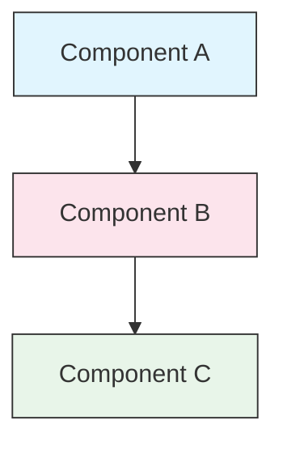

<picture>
  <source media="(prefers-color-scheme: dark)" srcset="resources/logos/domina-claude-code-logo-dark.svg">
  
</picture>

# Guía de Estilo

> Convenciones y reglas de formato para contribuir a Claude How To. Sigue esta guía para mantener el contenido consistente, profesional y fácil de mantener.

---

## Tabla de Contenidos

- [Nomenclatura de Archivos y Carpetas](#file-and-folder-naming)
- [Estructura del Documento](#document-structure)
- [Encabezados](#headings)
- [Formato de Texto](#text-formatting)
- [Listas](#lists)
- [Tablas](#tables)
- [Bloques de Código](#code-blocks)
- [Enlaces y Referencias Cruzadas](#links-and-cross-references)
- [Diagramas](#diagrams)
- [Uso de Emojis](#emoji-usage)
- [Frontmatter YAML](#yaml-frontmatter)
- [Imágenes y Multimedia](#images-and-media)
- [Tono y Voz](#tone-and-voice)
- [Mensajes de Commit](#commit-messages)
- [Lista de Verificación para Autores](#checklist-for-authors)

---

## Nomenclatura de Archivos y Carpetas

### Carpetas de Lecciones

Las carpetas de lecciones usan un **prefijo numérico de dos dígitos** seguido de un descriptor en **kebab-case**:

```
01-slash-commands/
02-memory/
03-skills/
04-subagents/
05-mcp/
```

El número refleja el orden de la ruta de aprendizaje de principiante a avanzado.

### Nombres de Archivos

| Tipo | Convención | Ejemplos |
|------|-----------|----------|
| **README de lección** | `README.md` | `01-slash-commands/README.md` |
| **Archivo de característica** | Kebab-case `.md` | `code-reviewer.md`, `generate-api-docs.md` |
| **Script de shell** | Kebab-case `.sh` | `format-code.sh`, `validate-input.sh` |
| **Archivo de configuración** | Nombres estándar | `.mcp.json`, `settings.json` |
| **Archivo de memoria** | Prefijo de alcance | `project-CLAUDE.md`, `personal-CLAUDE.md` |
| **Documentos de nivel superior** | UPPER_CASE `.md` | `CATALOG.md`, `QUICK_REFERENCE.md`, `CONTRIBUTING.md` |
| **Recursos de imagen** | Kebab-case | `pr-slash-command.png`, `domina-claude-code-logo.svg` |

### Reglas

- Usa **minúsculas** para todos los nombres de archivos y carpetas (excepto documentos de nivel superior como `README.md`, `CATALOG.md`)
- Usa **guiones** (`-`) como separadores de palabras, nunca guiones bajos o espacios
- Mantén los nombres descriptivos pero concisos

---

## Estructura del Documento

### README Raíz

El `README.md` raíz sigue este orden:

1. Logo (elemento `<picture>` con variantes oscura/clara)
2. Título H1
3. Bloque de cita introductorio (proposición de valor de una línea)
4. Sección "¿Por Qué Esta Guía?" con tabla comparativa
5. Regla horizontal (`---`)
6. Tabla de Contenidos
7. Catálogo de Características
8. Navegación Rápida
9. Ruta de Aprendizaje
10. Secciones de características
11. Primeros Pasos
12. Mejores Prácticas / Solución de Problemas
13. Contribución / Licencia

### README de Lección

Cada `README.md` de lección sigue este orden:

1. Título H1 (ej. `# Slash Commands`)
2. Párrafo de visión general breve
3. Tabla de referencia rápida (opcional)
4. Diagrama de arquitectura (Mermaid)
5. Secciones detalladas (H2)
6. Ejemplos prácticos (numerados, 4-6 ejemplos)
7. Mejores prácticas (tablas de Do's y Don'ts)
8. Solución de Problemas
9. Guías relacionadas / Documentación oficial
10. Pie de página de metadatos del documento

### Archivo de Característica/Ejemplo

Archivos de características individuales (ej. `optimize.md`, `pr.md`):

1. Frontmatter YAML (si aplica)
2. Título H1
3. Propósito / descripción
4. Instrucciones de uso
5. Ejemplos de código
6. Consejos de personalización

### Separadores de Sección

Usa reglas horizontales (`---`) para separar regiones principales del documento:

```markdown
---

## Nueva Sección Principal
```

Colócalas después del bloque de cita introductorio y entre partes lógicamente distintas del documento.

---

## Encabezados

### Jerarquía

| Nivel | Uso | Ejemplo |
|-------|-----|---------|
| `#` H1 | Título de página (uno por documento) | `# Slash Commands` |
| `##` H2 | Secciones principales | `## Best Practices` |
| `###` H3 | Subsecciones | `### Adding a Skill` |
| `####` H4 | Sub-subsecciones (raro) | `#### Configuration Options` |

### Reglas

- **Un H1 por documento** — solo el título de la página
- **Nunca saltes niveles** — no saltes de H2 a H4
- **Mantén los encabezados concisos** — apunta a 2-5 palabras
- **Usa oración case** — capitaliza solo la primera palabra y nombres propios (excepción: los nombres de características se mantienen como están)
- **Añade prefijos de emoji solo en los encabezados de sección del README raíz** (ver [Uso de Emojis](#emoji-usage))

---

## Formato de Texto

### Énfasis

| Estilo | Cuándo Usar | Ejemplo |
|-------|------------|---------|
| **Negrita** (`**texto**`) | Términos clave, etiquetas en tablas, conceptos importantes | `**Instalación**:` |
| *Cursiva* (`*texto*`) | Primer uso de un término técnico, títulos de libros/doc | `*frontmatter*` |
| `Código` (`` `texto` ``) | Nombres de archivos, comandos, valores de configuración, referencias de código | `` `CLAUDE.md` `` |

### Blockquotes para Llamadas

Usa blockquotes con prefijos en negrita para notas importantes:

```markdown
> **Note**: Custom slash commands have been merged into skills since v2.0.

> **Important**: Never commit API keys or credentials.

> **Tip**: Combine memory with skills for maximum effectiveness.
```

Tipos de llamada soportados: **Note**, **Important**, **Tip**, **Warning**.

### Párrafos

- Mantén los párrafos cortos (2-4 oraciones)
- Añade una línea en blanco entre párrafos
- Comienza con el punto clave, luego proporciona contexto
- Explica el "por qué" no solo el "qué"

---

## Listas

### Listas No Ordenadas

Usa guiones (`-`) con indentación de 2 espacios para anidamiento:

```markdown
- First item
- Second item
  - Nested item
  - Another nested item
    - Deep nested (avoid going deeper than 3 levels)
- Third item
```

### Listas Ordenadas

Usa listas numeradas para pasos secuenciales, instrucciones y elementos clasificados:

```markdown
1. First step
2. Second step
   - Sub-point detail
   - Another sub-point
3. Third step
```

### Listas Descriptivas

Usa etiquetas en negrita para listas estilo clave-valor:

```markdown
- **Performance bottlenecks** - identify O(n^2) operations, inefficient loops
- **Memory leaks** - find unreleased resources, circular references
- **Algorithm improvements** - suggest better algorithms or data structures
```

### Reglas

- Mantén indentación consistente (2 espacios por nivel)
- Añade una línea en blanco antes y después de una lista
- Mantén los elementos de la lista paralelos en estructura (todos comienzan con verbo, o todos son sustantivos, etc.)
- Evita anidar más profundo de 3 niveles

---

## Tablas

### Formato Estándar

```markdown
| Column 1 | Column 2 | Column 3 |
|----------|----------|----------|
| Data     | Data     | Data     |
```

### Patrones Comunes de Tablas

**Comparación de características (3-4 columnas):**

```markdown
| Feature | Invocation | Persistence | Best For |
|---------|-----------|------------|----------|
| **Slash Commands** | Manual (`/cmd`) | Session only | Quick shortcuts |
| **Memory** | Auto-loaded | Cross-session | Long-term learning |
```

**Do's y Don'ts:**

```markdown
| Do | Don't |
|----|-------|
| Use descriptive names | Use vague names |
| Keep files focused | Overload a single file |
```

**Referencia rápida:**

```markdown
| Aspect | Details |
|--------|---------|
| **Purpose** | Generate API documentation |
| **Scope** | Project-level |
| **Complexity** | Intermediate |
```

### Reglas

- **Encabezados de tabla en negrita** cuando son etiquetas de fila (primera columna)
- Alinea las barras verticales para legibilidad en el fuente (opcional pero preferido)
- Mantén el contenido de las celdas conciso; usa enlaces para detalles
- Usa `formato de código` para comandos y rutas de archivos dentro de las celdas

---

## Bloques de Código

### Etiquetas de Idioma

Especifica siempre una etiqueta de idioma para resaltado de sintaxis:

| Idioma | Etiqueta | Usar Para |
|----------|-----|---------|
| Shell | `bash` | Comandos CLI, scripts |
| Python | `python` | Código Python |
| JavaScript | `javascript` | Código JS |
| TypeScript | `typescript` | Código TS |
| JSON | `json` | Archivos de configuración |
| YAML | `yaml` | Frontmatter, configuración |
| Markdown | `markdown` | Ejemplos de Markdown |
| SQL | `sql` | Consultas de base de datos |
| Texto plano | (sin etiqueta) | Salida esperada, árboles de directorio |

### Convenciones

```bash
# Comment explaining what the command does
claude mcp add notion --transport http https://mcp.notion.com/mcp
```

- Añade una **línea de comentario** antes de comandos no obvios
- Haz todos los ejemplos **listos para copiar y pegar**
- Muestra versiones **simples y avanzadas** cuando sea relevante
- Incluye **salida esperada** cuando ayude a la comprensión (usa bloque de código sin etiqueta)

### Bloques de Instalación

Usa este patrón para instrucciones de instalación:

```bash
# Copy files to your project
cp 01-slash-commands/*.md .claude/commands/
```

### Flujos de Trabajo Multi-paso

```bash
# Step 1: Create the directory
mkdir -p .claude/commands

# Step 2: Copy the templates
cp 01-slash-commands/*.md .claude/commands/

# Step 3: Verify installation
ls .claude/commands/
```

---

## Enlaces y Referencias Cruzadas

### Enlaces Internos (Relativos)

Usa rutas relativas para todos los enlaces internos:

```markdown
[Slash Commands](01-slash-commands/)
[Skills Guide](03-skills/)
[Memory Architecture](02-memory/#memory-architecture)
```

Desde una carpeta de lección de vuelta a la raíz o hermano:

```markdown
[Back to main guide](../README.md)
[Related: Skills](../03-skills/)
```

### Enlaces Externos (Absolutos)

Usa URLs completas con texto de anclaje descriptivo:

```markdown
[Anthropic's official documentation](https://code.claude.com/docs/en/overview)
```

- Nunca uses "haz clic aquí" o "este enlace" como texto de anclaje
- Usa texto descriptivo que tenga sentido fuera de contexto

### Anclas de Sección

Enlaza a secciones dentro del mismo documento usando anclas estilo GitHub:

```markdown
[Feature Catalog](#-feature-catalog)
[Best Practices](#best-practices)
```

### Patrón de Guías Relacionadas

Termina las lecciones con una sección de guías relacionadas:

```markdown
## Related Guides

- [Slash Commands](../01-slash-commands/) - Quick shortcuts
- [Memory](../02-memory/) - Persistent context
- [Skills](../03-skills/) - Reusable capabilities
```

---

## Diagramas

### Mermaid

Usa Mermaid para todos los diagramas. Tipos soportados:

- `graph TB` / `graph LR` — arquitectura, jerarquía, flujo
- `sequenceDiagram` — flujos de interacción
- `timeline` — secuencias cronológicas

### Convenciones de Estilo

Aplica colores consistentes usando bloques de estilo:



**Paleta de colores:**

| Color | Hex | Usar Para |
|-------|-----|---------|
| Azul claro | `#e1f5fe` | Componentes principales, entradas |
| Rosa claro | `#fce4ec` | Procesamiento, middleware |
| Verde claro | `#e8f5e9` | Salidas, resultados |
| Amarillo claro | `#fff9c4` | Configuración, opcional |
| Púrpura claro | `#f3e5f5` | UI, orientado al usuario |

### Reglas

- Usa `["Texto de etiqueta"]` para etiquetas de nodo (habilita caracteres especiales)
- Usa `<br/>` para saltos de línea dentro de etiquetas
- Mantén los diagramas simples (máx 10-12 nodos)
- Añade una breve descripción de texto debajo del diagrama para accesibilidad
- Usa top-to-bottom (`TB`) para jerarquías, left-to-right (`LR`) para flujos de trabajo

---

## Uso de Emojis

### Dónde Se Usan los Emojis

Los emojis se usan **con moderación y propósito** — solo en contextos específicos:

| Contexto | Emojis | Ejemplo |
|---------|--------|---------|
| Encabezados de sección del README raíz | Iconos de categoría | `## 📚 Learning Path` |
| Indicadores de nivel de habilidad | Círculos de colores | 🟢 Beginner, 🔵 Intermediate, 🔴 Advanced |
| Do's y Don'ts | Marcas de verificación/cruz | ✅ Do this, ❌ Don't do this |
| Clasificaciones de complejidad | Estrellas | ⭐⭐⭐ |

### Conjunto Estándar de Emojis

| Emoji | Significado |
|-------|---------|
| 📚 | Aprendizaje, guías, documentación |
| ⚡ | Primeros pasos, referencia rápida |
| 🎯 | Características, referencia rápida |
| 🎓 | Rutas de aprendizaje |
| 📊 | Estadísticas, comparaciones |
| 🚀 | Instalación, comandos rápidos |
| 🟢 | Nivel principiante |
| 🔵 | Nivel intermedio |
| 🔴 | Nivel avanzado |
| ✅ | Práctica recomendada |
| ❌ | Evitar / anti-patrón |
| ⭐ | Unidad de clasificación de complejidad |

### Reglas

- **Nunca uses emojis en el cuerpo del texto** o párrafos
- **Solo usa emojis en encabezados** en el README raíz (no en READMEs de lecciones)
- **No añadas emojis decorativos** — cada emoji debe transmitir significado
- Mantén el uso de emojis consistente con la tabla anterior

---

## Frontmatter YAML

### Archivos de Características (Skills, Commands, Agents)

```yaml
---
name: unique-identifier
description: What this feature does and when to use it
allowed-tools: Bash, Read, Grep
---
```

### Campos Opcionales

```yaml
---
name: my-feature
description: Brief description
argument-hint: "[file-path] [options]"
allowed-tools: Bash, Read, Grep, Write, Edit
model: opus                        # opus, sonnet, or haiku
disable-model-invocation: true     # User-only invocation
user-invocable: false              # Hidden from user menu
context: fork                      # Run in isolated subagent
agent: Explore                     # Agent type for context: fork
---
```

### Reglas

- Coloca el frontmatter en la parte superior del archivo
- Usa **kebab-case** para el campo `name`
- Mantén `description` en una oración
- Solo incluye campos que sean necesarios

---

## Imágenes y Multimedia

### Patrón de Logo

Todos los documentos que comienzan con un logo usan el elemento `<picture>` para soporte de modo oscuro/claro:

```html
<picture>
  <source media="(prefers-color-scheme: dark)" srcset="resources/logos/domina-claude-code-logo-dark.svg">
  
</picture>
```

### Capturas de Pantalla

- Almacena en la carpeta de lección relevante (ej. `01-slash-commands/pr-slash-command.png`)
- Usa nombres de archivo en kebab-case
- Incluye texto alt descriptivo
- Prefiere SVG para diagramas, PNG para capturas de pantalla

### Reglas

- Proporciona siempre texto alt para imágenes
- Mantén los tamaños de archivo de imagen razonables (< 500KB para PNGs)
- Usa rutas relativas para referencias de imágenes
- Almacena imágenes en el mismo directorio que el documento que las referencia, o en `assets/` para imágenes compartidas

---

## Tono y Voz

### Estilo de Escritura

- **Profesional pero accesible** — precisión técnica sin exceso de jerga
- **Voz activa** — "Crea un archivo" no "Un archivo debería ser creado"
- **Instrucciones directas** — "Ejecuta este comando" no "Podrías querer ejecutar este comando"
- **Amigable para principiantes** — asume que el lector es nuevo en Claude Code, no nuevo en programación

### Principios de Contenido

| Principio | Ejemplo |
|-----------|---------|
| **Show, don't tell** | Proporciona ejemplos funcionales, no descripciones abstractas |
| **Complejidad progresiva** | Comienza simple, añade profundidad en secciones posteriores |
| **Explica el "por qué"** | "Usa memoria para... porque..." no solo "Usa memoria para..." |
| **Listo para copiar y pegar** | Cada bloque de código debería funcionar al pegarlo directamente |
| **Contexto del mundo real** | Usa escenarios prácticos, no ejemplos inventados |

### Vocabulario

- Usa "Claude Code" (no "Claude CLI" o "la herramienta")
- Usa "skill" (no "custom command" — término legado)
- Usa "lesson" o "guide" para las secciones numeradas
- Usa "example" para archivos de características individuales

---

## Mensajes de Commit

Sigue [Conventional Commits](https://www.conventionalcommits.org/):

```
type(scope): description
```

### Tipos

| Tipo | Usar Para |
|------|---------|
| `feat` | Nueva característica, ejemplo o guía |
| `fix` | Corrección de bug, corrección, enlace roto |
| `docs` | Mejoras de documentación |
| `refactor` | Reestructuración sin cambiar comportamiento |
| `style` | Solo cambios de formato |
| `test` | Adiciones o cambios de tests |
| `chore` | Build, dependencias, CI |

### Alcances

Usa el nombre de la lección o área del archivo como alcance:

```
feat(slash-commands): Add API documentation generator
docs(memory): Improve personal preferences example
fix(README): Correct table of contents link
docs(skills): Add comprehensive code review skill
```

---

## Pie de Página de Metadatos del Documento

Los READMEs de lecciones terminan con un bloque de metadatos:

```markdown
---
**Last Updated**: March 2026
**Claude Code Version**: 2.1+
**Compatible Models**: Claude Sonnet 4.6, Claude Opus 4.6, Claude Haiku 4.5
```

- Usa formato de mes + año (ej. "March 2026")
- Actualiza la versión cuando las características cambien
- Lista todos los modelos compatibles

---

## Lista de Verificación para Autores

Antes de enviar contenido, verifica:

- [ ] Los nombres de archivo/carpeta usan kebab-case
- [ ] El documento comienza con título H1 (uno por archivo)
- [ ] La jerarquía de encabezados es correcta (sin niveles saltados)
- [ ] Todos los bloques de código tienen etiquetas de idioma
- [ ] Los ejemplos de código están listos para copiar y pegar
- [ ] Los enlaces internos usan rutas relativas
- [ ] Los enlaces externos tienen texto de anclaje descriptivo
- [ ] Las tablas están formateadas correctamente
- [ ] Los emojis siguen el conjunto estándar (si se usan)
- [ ] Los diagramas Mermaid usan la paleta de colores estándar
- [ ] No hay información sensible (claves API, credenciales)
- [ ] El frontmatter YAML es válido (si aplica)
- [ ] Las imágenes tienen texto alt
- [ ] Los párrafos son cortos y enfocados
- [ ] La sección de guías relacionadas enlaza a lecciones relevantes
- [ ] El mensaje de commit sigue el formato de conventional commits
