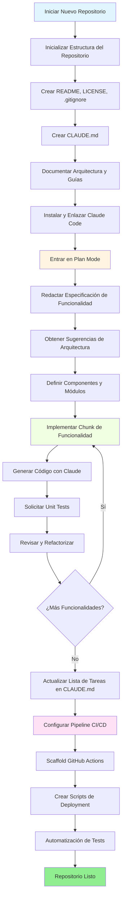
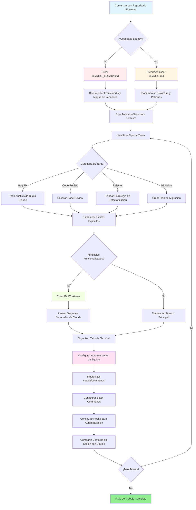

<picture>
  <source media="(prefers-color-scheme: dark)" srcset="resources/logos/domina-claude-code-logo-dark.svg">
  
</picture>

# Lista de buenos recursos

## Documentación Oficial

| Recurso | Descripción | Enlace |
|----------|-------------|------|
| Claude Code Docs | Documentación oficial de Claude Code | [code.claude.com/docs/en/overview](https://code.claude.com/docs/en/overview) |
| Anthropic Docs | Documentación completa de Anthropic | [docs.anthropic.com](https://docs.anthropic.com) |
| MCP Protocol | Especificación del Protocolo Model Context | [modelcontextprotocol.io](https://modelcontextprotocol.io) |
| MCP Servers | Implementaciones oficiales de servidores MCP | [github.com/modelcontextprotocol/servers](https://github.com/modelcontextprotocol/servers) |
| Anthropic Cookbook | Ejemplos de código y tutoriales | [github.com/anthropics/anthropic-cookbook](https://github.com/anthropics/anthropic-cookbook) |
| Claude Code Skills | Repositorio de skills de la comunidad | [github.com/anthropics/skills](https://github.com/anthropics/skills) |
| Agent Teams | Coordinación y colaboración multi-agente | [code.claude.com/docs/en/agent-teams](https://code.claude.com/docs/en/agent-teams) |
| Scheduled Tasks | Tareas recurrentes con /loop y cron | [code.claude.com/docs/en/scheduled-tasks](https://code.claude.com/docs/en/scheduled-tasks) |
| Chrome Integration | Automatización del navegador | [code.claude.com/docs/en/chrome](https://code.claude.com/docs/en/chrome) |
| Keybindings | Personalización de atajos de teclado | [code.claude.com/docs/en/keybindings](https://code.claude.com/docs/en/keybindings) |
| Desktop App | Aplicación de escritorio nativa | [code.claude.com/docs/en/desktop](https://code.claude.com/docs/en/desktop) |
| Remote Control | Control remoto de sesiones | [code.claude.com/docs/en/remote-control](https://code.claude.com/docs/en/remote-control) |
| Auto Mode | Gestión automática de permisos | [code.claude.com/docs/en/auto-mode](https://code.claude.com/docs/en/auto-mode) |
| Channels | Comunicación multi-canal | [code.claude.com/docs/en/channels](https://code.claude.com/docs/en/channels) |
| Voice Dictation | Entrada de voz para Claude Code | [code.claude.com/docs/en/voice-dictation](https://code.claude.com/docs/en/voice-dictation) |

## Blog de Ingeniería de Anthropic

| Artículo | Descripción | Enlace |
|---------|-------------|------|
| Code Execution with MCP | Cómo resolver la sobrecarga de contexto de MCP usando ejecución de código — 98.7% de reducción de tokens | [anthropic.com/engineering/code-execution-with-mcp](https://www.anthropic.com/engineering/code-execution-with-mcp) |

---

## Dominando Claude Code en 30 Minutos

_Video_: https://www.youtube.com/watch?v=6eBSHbLKuN0

_**Todos los Consejos**_
- **Explora Funcionalidades Avanzadas y Atajos**
  - Revisa regularmente las nuevas funcionalidades de edición de código y contexto de Claude en sus notas de lanzamiento.
  - Aprende atajos de teclado para cambiar rápidamente entre vistas de chat, archivo y editor.

- **Configuración Eficiente**
  - Crea sesiones específicas por proyecto con nombres/descripciones claros para fácil recuperación.
  - Fija los archivos o carpetas más usados para que Claude pueda acceder a ellos en cualquier momento.
  - Configura las integraciones de Claude (ej. GitHub, IDEs populares) para optimizar tu proceso de codificación.

- **Q&A Efectivo del Codebase**
  - Hazle a Claude preguntas detalladas sobre arquitectura, patrones de diseño y módulos específicos.
  - Usa referencias de archivos y líneas en tus preguntas (ej. "¿Qué logra la lógica en `app/models/user.py`?").
  - Para codebases grandes, proporciona un resumen o manifiesto para ayudar a Claude a enfocarse.
  - **Ejemplo de prompt**: _"¿Puedes explicar el flujo de autenticación implementado en src/auth/AuthService.ts:45-120? ¿Cómo se integra con el middleware en src/middleware/auth.ts?"_

- **Edición y Refactorización de Código**
  - Usa comentarios en línea o solicitudes en bloques de código para obtener ediciones enfocadas ("Refactoriza esta función para mayor claridad").
  - Pide comparaciones lado a lado de antes/después.
  - Deja que Claude genere tests o documentación después de ediciones importantes para aseguramiento de calidad.
  - **Ejemplo de prompt**: _"Refactoriza la función getUserData en api/users.js para usar async/await en lugar de promesas. Muéstrame una comparación antes/después y genera unit tests para la versión refactorizada."_

- **Gestión de Contexto**
  - Limita tu código/contexto pegado solo a lo relevante para la tarea actual.
  - Usa prompts estructurados ("Aquí está el archivo A, aquí está la función B, mi pregunta es X") para mejor rendimiento.
  - Elimina o colapsa archivos grandes en la ventana de prompt para evitar exceder los límites de contexto.
  - **Ejemplo de prompt**: _"Aquí está el modelo User de models/User.js y la función validateUser de utils/validation.js. Mi pregunta es: ¿cómo puedo agregar validación de email manteniendo la compatibilidad hacia atrás?"_

- **Integra Herramientas de Equipo**
  - Conecta sesiones de Claude a los repositorios y documentación de tu equipo.
  - Usa plantillas incorporadas o crea personalizadas para tareas de ingeniería recurrentes.
  - Colabora compartiendo transcripciones de sesiones y prompts con compañeros de equipo.

- **Impulsando el Rendimiento**
  - Dale a Claude instrucciones claras y orientadas a objetivos (ej. "Resume esta clase en cinco puntos clave").
  - Recorta comentarios innecesarios y boilerplate de las ventanas de contexto.
  - Si el output de Claude se desvía, reinicia el contexto o reformula preguntas para mejor alineación.
  - **Ejemplo de prompt**: _"Resume la clase DatabaseManager en src/db/Manager.ts en cinco puntos clave, enfocándote en sus responsabilidades principales y métodos clave."_

- **Ejemplos de Uso Práctico**
  - Debugging: Pega errores y stack traces, luego pide posibles causas y soluciones.
  - Generación de Tests: Solicita tests property-based, unit o integration para lógica compleja.
  - Code Reviews: Pide a Claude identificar cambios riesgosos, edge cases o code smells.
  - **Ejemplos de prompts**:
    - _"Estoy obteniendo este error: 'TypeError: Cannot read property 'map' of undefined at line 42 in components/UserList.jsx'. Aquí está el stack trace y el código relevante. ¿Qué está causando esto y cómo puedo solucionarlo?"_
    - _"Genera unit tests comprehensivos para la clase PaymentProcessor, incluyendo edge cases para transacciones fallidas, timeouts e inputs inválidos."_
    - _"Revisa este diff de pull request e identifica posibles problemas de seguridad, cuellos de botella de rendimiento y code smells."_

- **Automatización de Flujo de Trabajo**
  - Scriptea tareas repetitivas (como formateo, limpiezas y renombrados repetitivos) usando prompts de Claude.
  - Usa Claude para redactar descripciones de PR, notas de lanzamiento o documentación basadas en diffs de código.
  - **Ejemplo de prompt**: _"Basado en el git diff, crea una descripción detallada de PR con un resumen de cambios, lista de archivos modificados, pasos de testing e impactos potenciales. También genera release notes para la versión 2.3.0."_

**Tip**: Para mejores resultados, combina varias de estas prácticas—comienza fijando archivos críticos y resumiendo tus objetivos, luego usa prompts enfocados y las herramientas de refactorización de Claude para mejorar incrementalmente tu codebase y automatización.

**Flujo de trabajo recomendado con Claude Code**

### Flujo de Trabajo Recomendado con Claude Code

#### Para un Repositorio Nuevo

1. **Inicializa el Repo e Integración de Claude**
   - Configura tu nuevo repositorio con estructura esencial: README, LICENSE, .gitignore, configs raíz.
   - Crea un archivo `CLAUDE.md` describiendo la arquitectura, objetivos de alto nivel y guías de codificación.
   - Instala Claude Code y enlázalo a tu repositorio para sugerencias de código, scaffolding de tests y automatización de flujo de trabajo.

2. **Usa Plan Mode y Specs**
   - Usa plan mode (`shift-tab` o `/plan`) para redactar una especificación detallada antes de implementar funcionalidades.
   - Pide a Claude sugerencias de arquitectura y layout inicial del proyecto.
   - Mantén una secuencia de prompts clara y orientada a objetivos—pide esquemas de componentes, módulos principales y responsabilidades.

3. **Desarrollo Iterativo y Revisión**
   - Implementa funcionalidades principales en pequeños chunks, pidiendo a Claude generación de código, refactorización y documentación.
   - Solicita unit tests y ejemplos después de cada incremento.
   - Mantén una lista de tareas en ejecución en CLAUDE.md.

4. **Automatiza CI/CD y Deployment**
   - Usa Claude para scaffold GitHub Actions, scripts npm/yarn, o flujos de trabajo de deployment.
   - Adapta pipelines fácilmente actualizando tu CLAUDE.md y solicitando comandos/scripts correspondientes.

#### Para un Repositorio Existente

1. **Configuración de Repositorio y Contexto**
   - Agrega o actualiza `CLAUDE.md` para documentar estructura del repo, patrones de codificación y archivos clave. Para repos legacy, usa `CLAUDE_LEGACY.md` cubriendo frameworks, mapas de versiones, instrucciones, bugs y notas de upgrade.
   - Fija o resalta archivos principales que Claude debería usar para contexto.

2. **Q&A Contextual de Código**
   - Pide a Claude code reviews, explicaciones de bugs, refactorizaciones o planes de migración referenciando archivos/funciones específicas.
   - Dale a Claude límites explícitos (ej. "modifica solo estos archivos" o "sin nuevas dependencias").

3. **Gestión de Branch, Worktree y Multi-Sesión**
   - Usa múltiples git worktrees para funcionalidades aisladas o bug fixes y lanza sesiones separadas de Claude por worktree.
   - Mantén tabs/ventanas de terminal organizadas por branch o funcionalidad para flujos de trabajo paralelos.

4. **Herramientas de Equipo y Automatización**
   - Sincroniza comandos personalizados vía `.claude/commands/` para consistencia cross-team.
   - Automatiza tareas repetitivas, creación de PR y formateo de código vía slash commands o hooks de Claude.
   - Comparte sesiones y contexto con miembros del equipo para troubleshooting y review colaborativo.

**Consejos**:
- Comienza cada nueva funcionalidad o fix con un spec y prompt de plan mode.
- Para repos legacy y complejos, almacena guías detalladas en CLAUDE.md/CLAUDE_LEGACY.md.
- Da instrucciones claras y enfocadas y divide el trabajo complejo en planes multi-fase.
- Limpia regularmente sesiones, poda contexto y elimina worktrees completados para evitar desorden.

Estos pasos capturan las recomendaciones principales para flujos de trabajo fluidos con Claude Code tanto en codebases nuevos como existentes.

---

## Nuevas Funcionalidades y Capacidades (Marzo 2026)

### Recursos de Funcionalidades Clave

| Funcionalidad | Descripción | Saber Más |
|---------|-------------|------------|
| **Auto Memory** | Claude automáticamente aprende y recuerda tus preferencias a través de sesiones | [Guía de Memoria](02-memory/) |
| **Remote Control** | Controla programáticamente sesiones de Claude Code desde herramientas y scripts externos | [Funcionalidades Avanzadas](09-advanced-features/) |
| **Web Sessions** | Accede a Claude Code a través de interfaces basadas en navegador para desarrollo remoto | [Referencia CLI](10-cli/) |
| **Desktop App** | Aplicación de escritorio nativa para Claude Code con UI mejorada | [Claude Code Docs](https://code.claude.com/docs/en/desktop) |
| **Extended Thinking** | Toggle de razonamiento profundo vía `Alt+T`/`Option+T` o variable de entorno `MAX_THINKING_TOKENS` | [Funcionalidades Avanzadas](09-advanced-features/) |
| **Permission Modes** | Control fino: default, acceptEdits, plan, auto, dontAsk, bypassPermissions | [Funcionalidades Avanzadas](09-advanced-features/) |
| **7-Tier Memory** | Memoria gestionada, Proyecto, Reglas de Proyecto, Usuario, Reglas de Usuario, Local, Auto Memory | [Guía de Memoria](02-memory/) |
| **Hook Events** | 25 eventos: PreToolUse, PostToolUse, PostToolUseFailure, Stop, StopFailure, SubagentStart, SubagentStop, Notification, Elicitation y más | [Guía de Hooks](06-hooks/) |
| **Agent Teams** | Coordina múltiples agentes trabajando juntos en tareas complejas | [Guía de Subagents](04-subagents/) |
| **Scheduled Tasks** | Configura tareas recurrentes con `/loop` y herramientas cron | [Funcionalidades Avanzadas](09-advanced-features/) |
| **Chrome Integration** | Automatización de navegador con Chromium headless | [Funcionalidades Avanzadas](09-advanced-features/) |
| **Keyboard Customization** | Personaliza keybindings incluyendo secuencias chord | [Funcionalidades Avanzadas](09-advanced-features/) |
